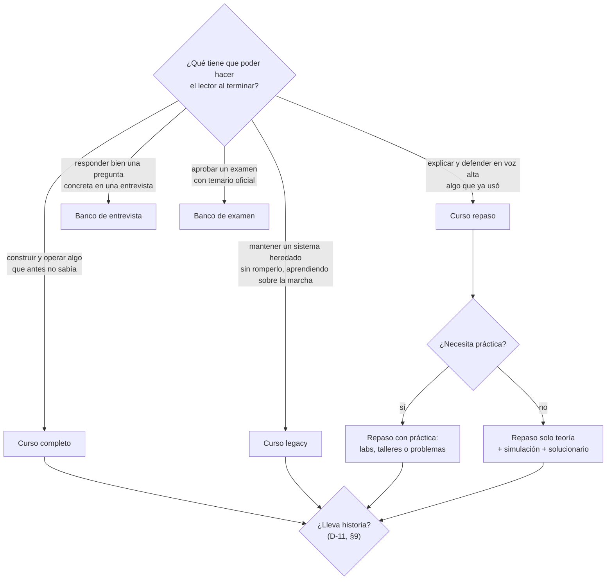
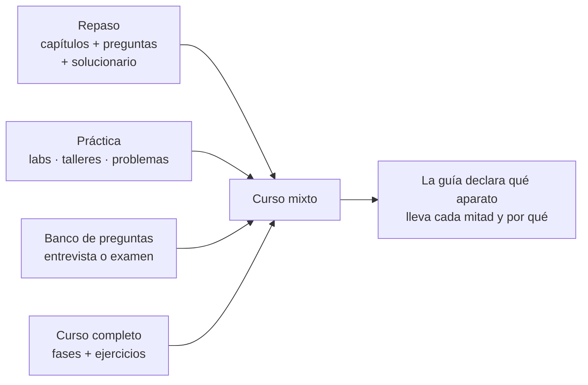

# 🧩 Los tipos de curso

> **Qué es este documento:** las cinco formas de partida que puede tener un curso, qué documentos
> lleva cada una, qué aparato de evaluación usa y con qué cantidades por defecto. Se lee en la etapa
> E0 para elegir, y en E2 y E4 para saber qué plantillas copiar.
> **Los tipos no son rígidos** (§8): son puntos de partida que se combinan según la idea, y todas las
> cantidades de este documento son **valores por defecto** que la guía de cada curso puede cambiar,
> declarándolo.
> **Vigencia:** 2026-10-07.

**Salto rápido:** [1](#1--cómo-se-elige) · [2](#2-️-curso-completo) · [3](#3-️-curso-legacy) · [4](#4--curso-repaso) · [5](#5--banco-de-preguntas-de-entrevista) · [6](#6--banco-de-preguntas-de-examen) · [7](#7-️-la-matriz-de-documentos) · [8](#8--los-tipos-no-son-rígidos) · [9](#9--con-historia-o-sin-historia) · [10](#10--cursos-extensos-bloques-y-pistas)

---

## 1. 🧭 Cómo se elige

La pregunta que decide es **qué tiene que poder hacer el lector al terminar**:



| | Curso completo | Curso legacy | Curso repaso | Banco de entrevista | Banco de examen |
|---|---|---|---|---|---|
| **Lector** | sabe programar, no conoce el tema | dev con oficio que entra a un proyecto heredado en una tecnología o versión que no domina | ya usó el tema, necesita ordenarlo | prepara un proceso concreto | prepara una certificación |
| **Unidad** | fase (o lección) | fase que levanta una pieza del sistema heredado | capítulo dentro de un bloque | pregunta con respuesta | pregunta de opción múltiple |
| **Evaluación** | ejercicios graduados 🟢🟡🟠🔴 | ejercicios por fase + cuaderno de incidentes (tickets vagos) | preguntas sin respuesta visible + solucionario | la respuesta va pegada a la pregunta | clave separada + simulacros cronometrados |
| **Laboratorio** | casi siempre, y es el camino base | siempre: el sistema heredado, que el lector construye | opcional (labs o talleres) | no | no, salvo prácticas guiadas |
| **Tamaño típico** | 15–30 fases + apéndices | 12–15 fases en horas (≈100 h) + apéndices + 15–25 incidentes | 4–6 bloques de 4–7 capítulos | 100 preguntas por archivo | 200–400 preguntas + 2–4 simulacros |
| **Ejemplo en el repositorio** | `lab-docker-kubernetes`, `ruta-sql`, los de lenguajes para devs Java | `cursos-legacy/*` (React 16, Angular 8, Angular 16, Vue 2) | `repaso-entrevistas/*` | `preguntas-entrevista/*` | ninguno todavía |

---

## 2. 🏗️ Curso completo

**Forma.** Partes con fases numeradas `00-…`, `01-…`; apéndices `a01-…`; un proyecto de código que
crece fase a fase (un solo `src/` con tags de git) o una carpeta de `src/` por fase. En cualquier tipo de
curso, el código global va en `src/` o en una carpeta con nombre propio (`laboratorio/`, `taller/`) que
el README del curso nombra (opcional; ver `03-lecciones-de-produccion` §2). Cada fase declara
su **peso** (ligera, media, densa) o sus horas, y ahí termina la promesa de esfuerzo.
Si el tema es bastante extenso, las partes pasan a ser **bloques** con directorio propio, o el curso
se abre en pistas paralelas (§10).

**Aparato de evaluación.** Ejercicios graduados al final de cada fase:

| Peso | Palabras de cuerpo | Ejercicios |
|---|---|---|
| ligera | 2.500–3.500 | 12 |
| media | 3.500–4.500 | 20 |
| densa | 4.500–6.000 | 24 |
| cierre | 3.500–4.500 + el enunciado del proyecto | 12 |

Reparto ≈ 30 % 🟢, 30 % 🟡, 25 % 🟠, 15 % 🔴, y 🔥 fuera del conteo. Al menos un tercio de diagnóstico o
de medición. Cada ejercicio cierra con `**Criterio:**` verificable. Los 🟢 y 🟡 llevan solución plegada
en `<details>`; los 🟠 y 🔴, una rúbrica.

**Documentos que lleva.** Alcance, propuesta de fases, propuesta de apéndices, guía, diccionario,
contrato de nombres, plantillas de capítulo, prompts de fase y de apéndice, plan de producción. Según
el curso, además: **historia de una empresa ficticia** si el alcance la decide (§8; fuente de verdad de todo lo
narrativo, vive en la raíz del curso porque el lector la lee), **documentos vivos** (`BENCHMARKS.md`, `INSTINTOS.md`,
`cuaderno-incidentes.md`), **formato de mediciones**, **formato de miniproyectos**, **convención de git
y tags**.

**Recursos pedagógicos propios** que los cursos completos del repositorio usan y que la guía puede
adoptar: 🪞 la apuesta escrita antes de ejecutar, 🧨 la rotura provocada, ⚰️ la autopsia de una
decisión, ⚖️ el veredicto honesto de cuándo **no** usar lo que la fase enseñó, 📏 la medición con
hipótesis, condiciones, resultado y veredicto.

---

## 3. 🏚️ Curso legacy

**Para quién.** Un dev con oficio —casi siempre senior, de otra capa o de otro stack— que tiene que
**entrar a un proyecto heredado** escrito en una tecnología o una versión que no domina (React 16 con
class components, Angular 8 con NgRx de 2019, Vue 2) y que va a aprender **sobre la marcha**, con
tickets entrando. No quiere un curso de la tecnología: quiere sobrevivir al lunes.

**La promesa** es distinta de la del curso completo, y conviene escribirla igual de explícita en el
README: al terminar, el lector **lee código ajeno y viejo, reproduce un bug desde un ticket vago, lo
localiza en su capa, escribe la prueba de regresión antes del fix y aplica la corrección mínima** sin
romper otras tres cosas. Lo que **no** promete: formar arquitectos, promover patrones modernos
idealizados ni migrar el sistema. Lo moderno aparece solo como comparación, en apéndices o en
secciones 🔥.

**Forma.** La de un curso completo, con piezas propias que los cursos de `cursos-legacy/` ya fijaron:

- **Un sistema con nombre propio, ficticio, que el lector construye** fase a fase con la deuda puesta
  adrede (*LabCore*, el laboratorio clínico del curso de Angular 8; *Rifas y Chances S.A.S.* en el de
  React 16). Al terminar la última fase el lector tiene un legacy completo en su disco y conoce cada
  atajo porque lo escribió. El dominio se elige porque concentra lo difícil del stack (concurrencia,
  tiempo, dinero, reactividad) y porque cualquiera lo entiende sin explicación.
- **La historia del sistema** (`00-historia-del-sistema.md`): sus eras, quién escribió cada parte, en
  qué año, con qué prisa y con qué mala idea. Se lee antes de la Fase 0 y es lo que evita que el
  lector juzgue el código en vez de entenderlo. Por eso en este tipo `D-11` es **con historia** por
  defecto (§9).
- **Versiones congeladas de la época**, en un documento de decisiones y versiones que es la fuente de
  verdad (`00-decisiones-y-versiones.md` o `a01`), verificadas a la fecha: que todavía instalen, y en
  qué plataforma no (los apéndices de arm64 y Colima existen por eso).
- **Un mock del backend que falla a propósito** (latencia, `401`, errores intermitentes), con un
  inyector de caos que los incidentes encienden.
- **Fases en horas** (el de React 16 suma 96 h; el de Angular 8, 122 h) con una plantilla de nueve
  secciones: propósito · qué queda listo · qué no entra todavía · concepto mínimo · código mínimo
  comentado · **errores comunes y pieza forense** · ejercicios · referencias · cierre.
- **El cuaderno de incidentes** (`cuaderno-incidentes.md`), el otro eje del curso y donde se entrena el
  músculo central: 15–25 **tickets vagos, como llegan en la vida real**, cada uno con su preparación
  (un flag del caos, un archivo de datos o una rama `incidente/NN`, siempre la más barata que sirva),
  tres pistas escalonadas, la solución colapsada y un post-mortem sin culpables. Los IDs los reserva la
  fase que los produce y nunca se reasignan. **Alrededor de un cuarto no termina en un commit**:
  termina en un diagnóstico, un "no se reproduce, y aquí está la evidencia", una declaración por
  escrito o una decisión de equipo, porque así terminan muchos tickets reales.
- **Piezas forenses** por fase (`forense-fase-NN.md`, o la sección 6 de cada fase): un recorrido guiado
  por las herramientas de depuración, desde un síntoma hasta la causa (Network, breakpoints
  condicionales, el log del servidor, el bundle minificado con sus source maps).
- **"Entrar por el síntoma"**: una tabla que va de la frase del ticket (*"a veces no carga"*, *"verde
  en mi máquina, rojo en la de al lado"*) a la primera herramienta que hay que abrir. Se usa más que el
  índice, porque nadie llega a un incidente sabiendo de qué fase es.
- **La convención de git** (`00-convencion-de-git-y-tags.md`): un tag anotado por fase cerrada y los
  pares `-roto`/`-fix` que convierten cada incidente resuelto en un `git diff` legible.
- **Apéndices de consulta** para lo que ya nadie explica (la librería vieja, el build oculto, el
  operador de RxJS que toca), un **mapa de deuda** (qué está feo a propósito y qué lo vuelve
  exigible) y, como 🔥, el puente a las versiones modernas.
- *(Opcional)* **Un track del otro lado del cable** (el backend, con prefijos `beNN-`/`bea-NN-` y su
  propio cuaderno de incidentes; ver los nombres en el `CLAUDE.md`), con una regla que lo ordena: **se
  apaga el mock, se levanta el sistema real en el mismo puerto, y la aplicación no cambia ni un
  archivo**. No viene a redimir nada: es la escena del crimen.

**Aparato de evaluación.** Ejercicios graduados por fase, como el curso completo, más el cuaderno de
incidentes con su propia escala 🟢🟡🟠🔴 (el de Angular 8 quedó en 2/8/9/2 sobre 21) y sus propias
horas, declaradas aparte de las de las fases. Cada incidente cierra con criterio verificable: el fix con su
prueba de regresión, o el documento que lo reemplaza.

**Lo que no se negocia:**

- **El código viejo se escribe como lo habría escrito el equipo de entonces**, con la deuda que tenía,
  y el mapa de deuda dice qué es deuda a propósito. Un error del curso no se esconde detrás de "es
  legacy".
- **Reproducir antes de corregir, y la prueba de regresión antes del fix.** Ningún incidente se
  resuelve con un fix que no se vio fallar.
- **El curso no migra el sistema.** Si una fase o un incidente termina en "habría que migrar", lo dice
  como decisión de equipo con su costo, no como ejercicio.
- **Todo se ejecutó**: las versiones viejas tienen trampas de instalación que solo aparecen corriendo.

**Documentos que lleva.** Los del curso completo, más: `00-historia-del-sistema.md` (raíz del curso),
el documento de decisiones y versiones, `formato-cuaderno-incidentes.md`, `formato-piezas-forenses.md`,
`preparaciones-de-incidentes.md` (cómo llega roto el sistema a la máquina del lector), la convención de
git y tags, y, si hay track opcional, sus propios prompts de fase y de apéndice con el sufijo del track.

**Ejemplos en el repositorio.** `cursos-legacy/angular-8-legacy-for-backend-devs` (el más completo:
fases, piezas forenses, cuaderno de 21 incidentes y track BE en Java 8 sobre MongoDB) y
`cursos-legacy/react-16-legacy-for-backend-devs` (fases, trece apéndices, veinte incidentes, la tabla
de entrada por el síntoma y track BE en Go contra PostgreSQL). Sus `prompts/` son el mejor punto de
partida para un curso legacy nuevo (etapa E1b).

---

## 4. 📚 Curso repaso

**Forma.** Bloques temáticos (`01-fundamentos/`, `02-…/`), cada uno con capítulos `NN-tema.md`, una
**simulación de entrevista** y un **solucionario** (`NN-respuestas.md`). Opcionalmente, un bloque de
**labs o talleres** con su propio solucionario. El README de cada bloque se escribe al final.
Las reglas de los bloques —troncal, grafo, numeración, apéndices, git— son las de §10, que valen
para cualquier tipo.

**Aparato de evaluación.**

```text
capítulo teórico   → preguntas 🧠 sin respuesta visible, nunca ejercicios
                     10–15 si el corpus tiene laboratorio; 20–30 si no lo tiene
lab o taller       → 10–15 preguntas + 6–8 ejercicios 🟢🟡🟠🔴 (+🔥 y 💀 fuera del conteo)
simulación         → 30–45 preguntas S# transversales + 4–6 escenarios de 15 minutos
solucionario       → todas las respuestas, enunciado copiado literal, en tres capas:
                     ⏱️ 30 segundos · 🗣️ 2 minutos · 🔬 el detalle
```

Dificultad de las preguntas al final del enunciado: 🟢 definición, 🟡 distinción, 🟠 decisión,
🔴 diseño o diagnóstico (pide un artefacto o una secuencia, no una opinión). Reparto orientativo
25/25/30/20, **distinto en capítulos vecinos**. La **regla de sincronía**: quien toca una pregunta
actualiza el solucionario en la misma edición.

**Documentos que lleva.** Guía (normativa, manda sobre todo lo de forma), `prompt-base.md` con la
**ficha de cada capítulo** (Objetivo, Cubre, Desmonta, Se toca con), propuesta de fases con horas y
registro de decisiones, prompts de fase (y de taller), plan de producción, diccionario y contrato de
nombres si hay laboratorio.

**Reglas de familia** que los repasos del repositorio ya fijaron: cada repaso es **autocontenido**
(los otros corpus son sugerencias de estudio, nunca prerrequisitos, salvo el troncal declarado); los
capítulos abren con `## 1. 🎯 El problema`; cada patrón sigue *qué es → cómo va → con qué → cuánto →
cuándo sí → cuándo no → veredicto*; `## ⚠️ Errores frecuentes` con tabla "Se dice / Lo preciso".

---

## 5. 🎤 Banco de preguntas de entrevista

**Forma.** Un archivo por tema (`01-poo-solid-patrones.md`), unas 100 preguntas en partes de 20–25,
numeración continua en todo el archivo. Sin capítulos, sin laboratorio, sin plan de producción largo.

**Dos variantes**, y el banco declara cuál usa:

- **A · Respuesta en línea** (la de `preguntas-entrevista/`). La pregunta en negrita, numerada y con
  su dificultad; la respuesta en el párrafo siguiente. Sirve para leer de corrido la víspera.

  ```markdown
  **7. 🟠 Explica el principio de sustitución de Liskov con un ejemplo que lo rompa.**
  El clásico: `Square extends Rectangle`. …
  ```

- **B · Respuesta separada.** Las preguntas en un archivo y las respuestas en otro, en tres capas
  ⏱️ 🗣️ 🔬. Sirve para practicar en voz alta sin ver la respuesta. Es la forma del solucionario de los
  repasos aplicada a un banco suelto.

**Lo que no se negocia en ninguna de las dos:** la respuesta evalúa **criterio**, no definición; toda
respuesta que tenga una versión corta equivocada que suena bien lo dice; las 🔴 son abiertas o
adversariales; y el banco no reproduce preguntas de un proceso real con datos de la empresa (eso es
material personal y vive fuera de los cursos).

**Documentos que lleva.** Una guía corta (puede ser una sección del README del banco: tono, formato,
dificultad, reparto), el diccionario compartido y [`plantillas/banco-de-preguntas.md`](plantillas/banco-de-preguntas.md).
Si son varios bancos de una misma familia, un plan de producción mínimo con una tanda por banco.

---

## 6. 📝 Banco de preguntas de examen

**Forma.** Preparación para un examen con **temario oficial publicado** (una certificación de nube, de
Java, de Kubernetes). Se organiza por los **dominios del examen oficial**, con el peso que la guía del
examen les da, y cierra con simulacros cronometrados.

```text
00-guia-del-examen.md         dominios, pesos, formato, duración, nota de corte, con enlace oficial
01-dominio-<slug>.md          preguntas del dominio 1 (cantidad proporcional a su peso)
…
NN-simulacro-1.md             examen completo, mismo número de preguntas y tiempo que el real
NN-respuestas.md              clave + explicación por opción
```

**Aparato de evaluación.** Preguntas de opción múltiple con una respuesta (A–D) o varias ("elige
DOS"), con **escenario** cuando el examen real los usa. La clave va **separada** y cada respuesta
explica **por qué cada distractor es incorrecto**, no solo por qué la correcta lo es: es la parte que
enseña. Dificultad 🟢🟡🟠🔴 como en los repasos.

**Lo que no se negocia:**

- **Ninguna pregunta reproduce una pregunta real del examen.** Los acuerdos de confidencialidad de
  las certificaciones lo prohíben, y un banco de "dumps" enseña a reconocer, no a razonar. Las
  preguntas se escriben desde la guía oficial del examen y la documentación.
- **Los pesos de los dominios salen de la guía oficial**, con fecha y versión del examen (los
  exámenes cambian de versión y de código).
- **Cada respuesta cita la documentación oficial** del concepto que evalúa.

**Documentos que lleva.** Alcance (con el examen, su código y versión), guía, diccionario, la plantilla
de banco en su variante de examen, plan de producción con una tanda por dominio y una por simulacro.

---

## 7. 🗂️ La matriz de documentos

✅ obligatorio · ⚪ según el curso · — no aplica

| Documento de `prompts/` | Completo | Legacy | Repaso | Entrevista | Examen |
|---|---|---|---|---|---|
| `alcance-del-proyecto.md` | ✅ | ✅ | ⚪ (puede vivir en la guía §1) | — | ✅ |
| `propuesta-fases-y-alcance.md` | ✅ | ✅ | ✅ (horas y decisiones) | — | ⚪ |
| `propuesta-apendices-y-alcance.md` | ✅ | ✅ | ⚪ | — | — |
| `prompt-base.md` (fichas de capítulo) | ⚪ (las fichas viven en la propuesta) | ⚪ | ✅ | — | ⚪ |
| `plan-de-produccion.md` | ✅ | ✅ | ✅ | ⚪ | ✅ |
| `guia-de-estilo-y-convenciones.md` | ✅ | ✅ | ✅ | ✅ (corta) | ✅ |
| `diccionario-de-terminos.md` | ✅ | ✅ | ✅ | ✅ | ✅ |
| `contrato-de-nombres.md` | ✅ si hay código | ✅ | ⚪ si hay laboratorio | — | — |
| `plantillas-de-capitulo.md` | ✅ | ✅ | ✅ | — | — |
| `banco-de-preguntas.md` | — | — | ⚪ (simulación y solucionario) | ✅ | ✅ |
| `prompts-de-fase.md` | ✅ | ✅ (y los del track opcional) | ✅ | ⚪ | ✅ |
| `prompts-de-apendice.md` | ✅ | ✅ | ⚪ | — | — |
| `00-historia-de-….md` (raíz del curso) | ⚪ (`D-11`) | ✅ (`00-historia-del-sistema.md`; `D-11` con historia por defecto) | ⚪ (`D-11`) | — | — |
| formatos propios (incidentes, mediciones, miniproyectos) | ⚪ | ✅ (cuaderno de incidentes, piezas forenses, preparaciones) | ⚪ | — | — |
| `readme-de-prompts.md` | ✅ | ✅ | ⚪ | — | ⚪ |

---

## 8. 🔀 Los tipos no son rígidos

Los cinco tipos son **puntos de partida**, no casillas. El autor puede pedir cualquier mezcla, y la
sesión no corrige el pedido hacia el tipo "puro": toma de cada tipo el aparato que sirve y la guía
declara dónde termina una mitad y empieza la otra. Las mezclas que el repositorio ya tiene:

- **Repaso de entrevistas con práctica de laboratorio**: capítulos de repaso con sus preguntas, más
  labs y apéndices con ejercicios graduados y un solucionario único (como el repaso de Spring Boot).
  Los labs se rigen por las reglas de curso completo: ejecución obligatoria, teardown junto al recurso,
  el error reproducido antes de corregirlo.
- **Repaso de entrevistas con práctica de problemas**: cada capítulo, además de sus preguntas, trae
  problemas propios con pistas graduadas y listas de práctica externa, y ningún problema lleva solución
  publicada (como el repaso de algoritmos y estructuras de datos).
- **Repaso con talleres opcionales**: teoría de repaso más un bloque `06-talleres/` con laboratorio
  local. El corpus teórico **se sostiene sin los talleres**.
- **Curso completo con banco de entrevista al final**: el banco se escribe en la tanda de cierre y
  cada pregunta enlaza la fase que la responde.
- **Curso legacy con track opcional**: el camino base contra el mock y un track del otro lado del
  cable (`beNN-`) con su propio cuaderno de incidentes, sus horas aparte y sus prompts propios, como los
  de `cursos-legacy/`.



Dos reglas para cualquier mezcla:

- **Cada mitad conserva el aparato de su tipo** (ejercicios en las fases y en los labs, preguntas sin
  respuesta en los capítulos teóricos), salvo que la guía declare otra cosa.
- **Las cantidades son valores por defecto.** Si el `CLAUDE.md` o este documento dicen 20–30 preguntas
  y el curso necesita 50, la guía lo declara en sus excepciones —regla, valor nuevo y porqué— y manda
  la guía.

---

## 9. 🎭 Con historia o sin historia

La historia —una empresa ficticia que ancla cada fase en un dolor concreto— es **opcional** y es una
decisión del alcance (`D-11`), independiente del tipo:

| | Sin historia | Con historia |
|---|---|---|
| **Sistema de ejemplo** | neutro, declarado en la guía | la empresa, su gente y sus sistemas, en `00-historia-de-….md` |
| **Tamaño** | el que pide el tema | suele ser más largo y completo |
| **Para qué** | estudiar, repasar antes de una entrevista | además, generar contenido para YouTube o TikTok: la historia es lo que atrae |
| **Costo de producción** | bajo | varias rondas de ajuste fino con el autor; cifras reales verificadas |
| **Típico en** | repasos y bancos | cursos completos pensados para publicar |

Si el curso lleva historia, la plantilla es
[`plantillas/historia-de-la-empresa.md`](plantillas/historia-de-la-empresa.md), y la historia pasa a
ser la fuente de verdad de todo lo narrativo: ninguna fase inventa un dato.

---

## 10. 🧱 Cursos extensos: bloques y pistas

Cuando el tema es bastante extenso, la propuesta de E2 puede **dividir el curso en bloques**, cada uno
con sus propios capítulos o fases, en vez de estirar una sola secuencia numerada. La división es
independiente del tipo: el repaso la trae de fábrica (§4), pero un curso completo o un legacy también
pueden pedirla.

Dos palabras que este documento y las plantillas distinguen desde ahora:

- **Parte**: una agrupación **dentro de una sola secuencia**. No tiene directorio, la numeración no
  se reinicia (`00`–`05` son la Parte 0, `06`–`11` la Parte I) y vive en el arco de la propuesta y en
  el encabezado de cada fase.
- **Bloque**: un **directorio propio** (`NN-slug/`) con sus capítulos numerados desde el principio,
  su `README.md` y su propio cierre (veredicto, simulación o boss). Un bloque puede tener partes por
  dentro.

### 10.1 Cuándo se propone dividir

La sesión de E2 lo propone —no lo impone— cuando se cumple **al menos uno** de estos criterios, y
dice cuál:

- **El tamaño no cabe en una secuencia legible**: más de unas 25 fases o capítulos, o más de unas
  100 horas, o un índice que ya no se recorre de un vistazo.
- **El tema se parte en preguntas que se pueden estudiar por separado**: cada bloque responde una
  sub-pregunta de la pregunta que ordena el curso, y un lector puede entrar por el bloque que necesita.
- **Hay un troncal y ramas**: un bloque que todos leen primero y otros que lo dan por leído y bajan de
  altitud cada uno en su dirección.
- **Hay ritmos distintos**: una práctica que corre en paralelo a la teoría durante un tramo y luego se
  cierra (eso es una pista, §10.3).
- **La producción pide cortes**: cada bloque se puede cerrar, revisar y publicar sin esperar al resto.

Si ninguno se cumple, el curso sigue en una sola secuencia, con partes si hacen falta. Y si los
bloques necesitan **guías distintas** (otra audiencia, otro tipo, otro stack que cambia las reglas),
no son bloques: son cursos hermanos dentro de la familia, cada uno con su `prompts/`.

### 10.2 Bloques

El modelo es `repaso-entrevistas/arquitectura/01-bases` (en `job-interview-sept-2026`): cinco
bloques (`01-bases/`, `02-eventos/`, `03-datos/`, `04-seguridad/`, `05-banca/`) de 8 a 12 documentos
cada uno, una guía **compartida por los cinco**, un troncal declarado y la regla de que los demás lo
asumen leído.

```text
<curso>/
├── README.md              el índice de bloques: qué cubre cada uno, estado, por dónde empezar
├── prompts/               UNO para todo el curso: guía, diccionario, contrato, propuesta, plan
├── 01-<slug>/             bloque troncal
│   ├── README.md          índice, orden de lectura y mapa mental del bloque
│   ├── 01-<tema>.md       capítulos o fases, numerados desde el principio en cada bloque
│   ├── …
│   └── NN-<cierre>.md     simulación y solucionario, veredicto o boss del bloque
├── 02-<slug>/
└── …
```

**Lo que los bloques comparten**: el `prompts/` entero (alcance, guía, diccionario, contrato de
nombres, propuesta, plan, verificador), la historia si la hay, el código intermedio en `zz-code/` y la
pregunta que ordena el curso. **Lo que cada bloque tiene propio**: su sub-pregunta, su numeración, su
`README.md`, su cierre y, si la propuesta lo decide, sus apéndices.

Las reglas que fija la propuesta, en su §3 y su §7:

- **El grafo entre bloques**: cuál es el troncal, de cuál depende cada uno y cuáles son opcionales.
  Sin troncal declarado, cada bloque es autocontenido.
- **Numeración**: los bloques `NN-slug/` con dos dígitos; los documentos dentro de cada bloque
  arrancan donde arranca el tipo (`00-` en curso completo, `01-` en repaso). Una referencia cruzada
  se escribe `bloque/NN` (`03-datos/06`).
- **Apéndices**: los que usa un solo bloque viven en ese bloque (`aNN-` desde `a01`); los
  transversales, en la raíz del curso. Se decide por apéndice, en la propuesta de apéndices.
- **Git**: los tags llevan el bloque (`fase-BB-NN-slug`), para que `git tag -l 'fase-02-*'` sea el
  índice de un bloque; los commits, el prefijo `BB/fNN:`.
- **Evaluación**: cada bloque cierra su propio aparato (sus ejercicios, su simulación, su
  solucionario). Un banco o boss transversal a varios bloques va en el último bloque o en un bloque de
  cierre propio.
- **Producción**: el plan agrupa las tandas por bloque, ninguna tanda cruza bloques y el troncal se
  escribe primero. Los `README.md` siguen `D-10` (al final); si los bloques se publican uno a uno, el
  de cada bloque cierra ese bloque y solo el del curso queda para la tanda final.

### 10.3 Pistas paralelas

Una **pista** es un camino de bloques con su propio ritmo. El germen está en
`cursos-ia/maestria-ia` (en `courses-ia-generated`): una pista A, el eje secuencial de once
fases donde cada fase es un bloque con directorio propio, y una pista B, práctica, de seis bloques que
corren **en paralelo solo durante la fase 0** y se cierran antes de la fase 1, con una regla de
convergencia (la fase 9 retoma la pista B con rigor).

```text
<curso>/
├── README.md              las pistas, cuándo corre cada una y cómo convergen
├── prompts/
├── pista-a-<slug>/        el eje: bloques NN-slug/ en secuencia
│   └── 00-<slug>/ …
└── pista-b-<slug>/        la práctica: bloques NN-slug/ que corren junto a un tramo del eje
    └── 00-<slug>/ …
```

La propuesta declara, además de lo de §10.2, **en qué tramo del eje corre cada bloque de la pista
paralela**, el reparto de horas mientras conviven (por ejemplo, 4 h de eje y 2 h de práctica), dónde
se cierra la pista y **dónde converge** con el eje. Una pista paralela no es un track opcional: el
track opcional (`beNN-`, §3) es otro lado del mismo sistema, vive en el mismo directorio y se puede
saltar; la pista es parte del camino y tiene sus propios bloques.

> 📝 `maestria-ia` es un germen escrito antes de este método: sus nombres (`track_a/`, directorios con
> tilde) no siguen esta convención. Cuando se lleve al método, la propuesta decide si se renombra.

### 10.4 Dónde queda escrita la decisión

| Documento | Qué recoge |
|---|---|
| Ficha de arranque, pregunta 14 | la intuición del autor: una secuencia, bloques o pistas, o "me lo sugieres tú" |
| Alcance §9 y `D-02` | la forma: tipo **y** organización (una secuencia · N bloques · pistas) |
| Propuesta de fases §3 y §7 | el arco por bloques, el grafo, la numeración, los apéndices y el git |
| Propuesta de fases §5 y §8 | las fichas agrupadas por bloque y la tabla resumen con la columna Bloque |
| Plan de producción | las tandas agrupadas por bloque, el troncal primero |
| Plantillas de capítulo, A y G | el bloque en el encabezado de cada fase y un README por bloque |
