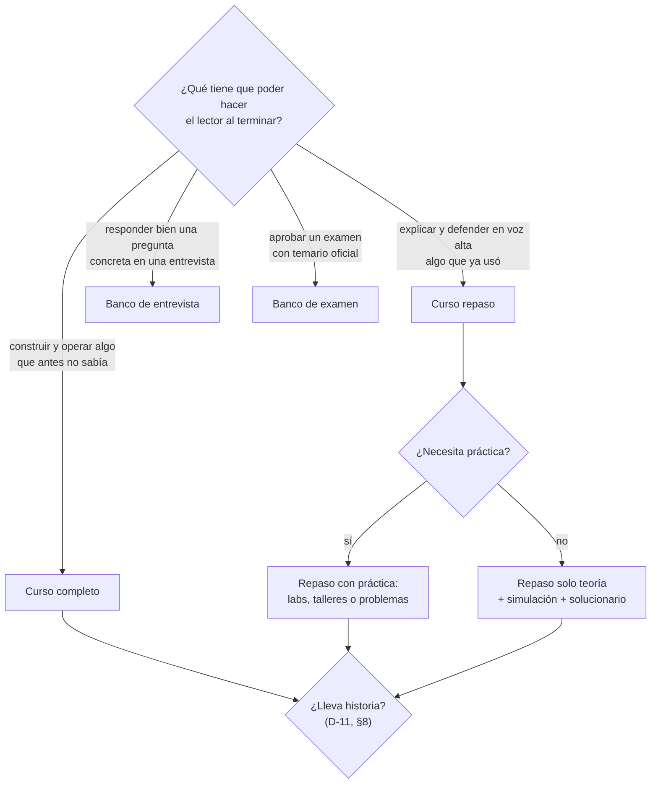
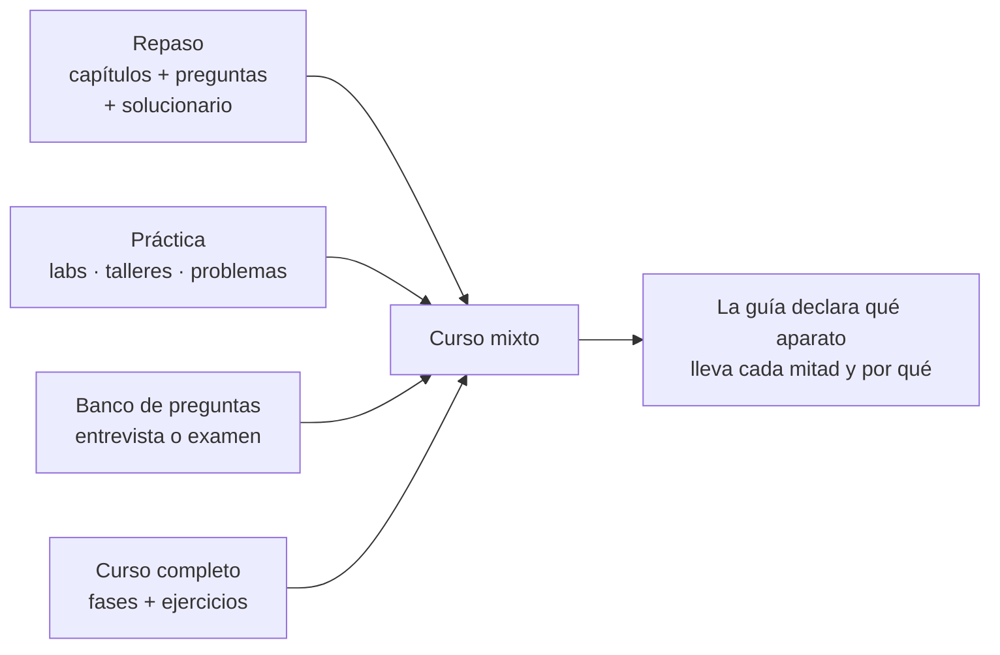

# 🧩 Los tipos de curso

> **Qué es este documento:** las cuatro formas de partida que puede tener un curso, qué documentos
> lleva cada una, qué aparato de evaluación usa y con qué cantidades por defecto. Se lee en la etapa
> E0 para elegir, y en E2 y E4 para saber qué plantillas copiar.
> **Los tipos no son rígidos** (§7): son puntos de partida que se combinan según la idea, y todas las
> cantidades de este documento son **valores por defecto** que la guía de cada curso puede cambiar,
> declarándolo.
> **Vigencia:** 2026-10-04.

**Salto rápido:** [1](#1--cómo-se-elige) · [2](#2-️-curso-completo) · [3](#3--curso-repaso) · [4](#4--banco-de-preguntas-de-entrevista) · [5](#5--banco-de-preguntas-de-examen) · [6](#6-️-la-matriz-de-documentos) · [7](#7--los-tipos-no-son-rígidos) · [8](#8--con-historia-o-sin-historia)

---

## 1. 🧭 Cómo se elige

La pregunta que decide es **qué tiene que poder hacer el lector al terminar**:



| | Curso completo | Curso repaso | Banco de entrevista | Banco de examen |
|---|---|---|---|---|
| **Lector** | sabe programar, no conoce el tema | ya usó el tema, necesita ordenarlo | prepara un proceso concreto | prepara una certificación |
| **Unidad** | fase (o lección) | capítulo dentro de un bloque | pregunta con respuesta | pregunta de opción múltiple |
| **Evaluación** | ejercicios graduados 🟢🟡🟠🔴 | preguntas sin respuesta visible + solucionario | la respuesta va pegada a la pregunta | clave separada + simulacros cronometrados |
| **Laboratorio** | casi siempre, y es el camino base | opcional (labs o talleres) | no | no, salvo prácticas guiadas |
| **Tamaño típico** | 15–30 fases + apéndices | 4–6 bloques de 4–7 capítulos | 100 preguntas por archivo | 200–400 preguntas + 2–4 simulacros |
| **Ejemplo en el repositorio** | `lab-docker-kubernetes`, `ruta-sql`, los de lenguajes para devs Java | `repaso-entrevistas/*` | `preguntas-entrevista/*` | ninguno todavía |

---

## 2. 🏗️ Curso completo

**Forma.** Partes con fases numeradas `00-…`, `01-…`; apéndices `a01-…`; un proyecto de código que
crece fase a fase (un solo `src/` con tags de git) o una carpeta de `src/` por fase. En cualquier tipo de
curso, el código global va en `src/` o en una carpeta con nombre propio (`laboratorio/`, `taller/`) que
el README del curso nombra (opcional; ver `03-lecciones-de-produccion` §2). Cada fase declara
su **peso** (ligera, media, densa) o sus horas, y ahí termina la promesa de esfuerzo.

**Aparato de evaluación.** Ejercicios graduados al final de cada fase:

| Peso | Palabras de cuerpo | Ejercicios |
|---|---|---|
| ligera | 2.500–3.500 | 12 |
| media | 3.500–4.500 | 20 |
| densa | 4.500–6.000 | 24 |
| cierre | 3.500–4.500 + el enunciado del proyecto | 12 |

Reparto ≈ 30 % 🟢, 30 % 🟡, 25 % 🟠, 15 % 🔴, y 🔥 fuera del conteo. Al menos un tercio de diagnóstico o
de medición. Cada ejercicio cierra con `**Criterio:**` verificable. Los 🟢 y 🟡 llevan solución plegada
en `<details>`; los 🟠 y 🔴, una rúbrica.

**Documentos que lleva.** Alcance, propuesta de fases, propuesta de apéndices, guía, diccionario,
contrato de nombres, plantillas de capítulo, prompts de fase y de apéndice, plan de producción. Según
el curso, además: **historia de una empresa ficticia** si el alcance la decide (§8; fuente de verdad de todo lo
narrativo, vive en la raíz del curso porque el lector la lee), **documentos vivos** (`BENCHMARKS.md`, `INSTINTOS.md`,
`cuaderno-incidentes.md`), **formato de mediciones**, **formato de miniproyectos**, **convención de git
y tags**.

**Recursos pedagógicos propios** que los cursos completos del repositorio usan y que la guía puede
adoptar: 🪞 la apuesta escrita antes de ejecutar, 🧨 la rotura provocada, ⚰️ la autopsia de una
decisión, ⚖️ el veredicto honesto de cuándo **no** usar lo que la fase enseñó, 📏 la medición con
hipótesis, condiciones, resultado y veredicto.

---

## 3. 📚 Curso repaso

**Forma.** Bloques temáticos (`01-fundamentos/`, `02-…/`), cada uno con capítulos `NN-tema.md`, una
**simulación de entrevista** y un **solucionario** (`NN-respuestas.md`). Opcionalmente, un bloque de
**labs o talleres** con su propio solucionario. El README de cada bloque se escribe al final.

**Aparato de evaluación.**

```text
capítulo teórico   → preguntas 🧠 sin respuesta visible, nunca ejercicios
                     10–15 si el corpus tiene laboratorio; 20–30 si no lo tiene
lab o taller       → 10–15 preguntas + 6–8 ejercicios 🟢🟡🟠🔴 (+🔥 y 💀 fuera del conteo)
simulación         → 30–45 preguntas S# transversales + 4–6 escenarios de 15 minutos
solucionario       → todas las respuestas, enunciado copiado literal, en tres capas:
                     ⏱️ 30 segundos · 🗣️ 2 minutos · 🔬 el detalle
```

Dificultad de las preguntas al final del enunciado: 🟢 definición, 🟡 distinción, 🟠 decisión,
🔴 diseño o diagnóstico (pide un artefacto o una secuencia, no una opinión). Reparto orientativo
25/25/30/20, **distinto en capítulos vecinos**. La **regla de sincronía**: quien toca una pregunta
actualiza el solucionario en la misma edición.

**Documentos que lleva.** Guía (normativa, manda sobre todo lo de forma), `prompt-base.md` con la
**ficha de cada capítulo** (Objetivo, Cubre, Desmonta, Se toca con), propuesta de fases con horas y
registro de decisiones, prompts de fase (y de taller), plan de producción, diccionario y contrato de
nombres si hay laboratorio.

**Reglas de familia** que los repasos del repositorio ya fijaron: cada repaso es **autocontenido**
(los otros corpus son sugerencias de estudio, nunca prerrequisitos, salvo el troncal declarado); los
capítulos abren con `## 1. 🎯 El problema`; cada patrón sigue *qué es → cómo va → con qué → cuánto →
cuándo sí → cuándo no → veredicto*; `## ⚠️ Errores frecuentes` con tabla "Se dice / Lo preciso".

---

## 4. 🎤 Banco de preguntas de entrevista

**Forma.** Un archivo por tema (`01-poo-solid-patrones.md`), unas 100 preguntas en partes de 20–25,
numeración continua en todo el archivo. Sin capítulos, sin laboratorio, sin plan de producción largo.

**Dos variantes**, y el banco declara cuál usa:

- **A · Respuesta en línea** (la de `preguntas-entrevista/`). La pregunta en negrita, numerada y con
  su dificultad; la respuesta en el párrafo siguiente. Sirve para leer de corrido la víspera.

  ```markdown
  **7. 🟠 Explica el principio de sustitución de Liskov con un ejemplo que lo rompa.**
  El clásico: `Square extends Rectangle`. …
  ```

- **B · Respuesta separada.** Las preguntas en un archivo y las respuestas en otro, en tres capas
  ⏱️ 🗣️ 🔬. Sirve para practicar en voz alta sin ver la respuesta. Es la forma del solucionario de los
  repasos aplicada a un banco suelto.

**Lo que no se negocia en ninguna de las dos:** la respuesta evalúa **criterio**, no definición; toda
respuesta que tenga una versión corta equivocada que suena bien lo dice; las 🔴 son abiertas o
adversariales; y el banco no reproduce preguntas de un proceso real con datos de la empresa (eso es
material personal y vive fuera de los cursos).

**Documentos que lleva.** Una guía corta (puede ser una sección del README del banco: tono, formato,
dificultad, reparto), el diccionario compartido y [`plantillas/banco-de-preguntas.md`](plantillas/banco-de-preguntas.md).
Si son varios bancos de una misma familia, un plan de producción mínimo con una tanda por banco.

---

## 5. 📝 Banco de preguntas de examen

**Forma.** Preparación para un examen con **temario oficial publicado** (una certificación de nube, de
Java, de Kubernetes). Se organiza por los **dominios del examen oficial**, con el peso que la guía del
examen les da, y cierra con simulacros cronometrados.

```text
00-guia-del-examen.md         dominios, pesos, formato, duración, nota de corte, con enlace oficial
01-dominio-<slug>.md          preguntas del dominio 1 (cantidad proporcional a su peso)
…
NN-simulacro-1.md             examen completo, mismo número de preguntas y tiempo que el real
NN-respuestas.md              clave + explicación por opción
```

**Aparato de evaluación.** Preguntas de opción múltiple con una respuesta (A–D) o varias ("elige
DOS"), con **escenario** cuando el examen real los usa. La clave va **separada** y cada respuesta
explica **por qué cada distractor es incorrecto**, no solo por qué la correcta lo es: es la parte que
enseña. Dificultad 🟢🟡🟠🔴 como en los repasos.

**Lo que no se negocia:**

- **Ninguna pregunta reproduce una pregunta real del examen.** Los acuerdos de confidencialidad de
  las certificaciones lo prohíben, y un banco de "dumps" enseña a reconocer, no a razonar. Las
  preguntas se escriben desde la guía oficial del examen y la documentación.
- **Los pesos de los dominios salen de la guía oficial**, con fecha y versión del examen (los
  exámenes cambian de versión y de código).
- **Cada respuesta cita la documentación oficial** del concepto que evalúa.

**Documentos que lleva.** Alcance (con el examen, su código y versión), guía, diccionario, la plantilla
de banco en su variante de examen, plan de producción con una tanda por dominio y una por simulacro.

---

## 6. 🗂️ La matriz de documentos

✅ obligatorio · ⚪ según el curso · — no aplica

| Documento de `prompts/` | Completo | Repaso | Entrevista | Examen |
|---|---|---|---|---|
| `alcance-del-proyecto.md` | ✅ | ⚪ (puede vivir en la guía §1) | — | ✅ |
| `propuesta-fases-y-alcance.md` | ✅ | ✅ (horas y decisiones) | — | ⚪ |
| `propuesta-apendices-y-alcance.md` | ✅ | ⚪ | — | — |
| `prompt-base.md` (fichas de capítulo) | ⚪ (las fichas viven en la propuesta) | ✅ | — | ⚪ |
| `plan-de-produccion.md` | ✅ | ✅ | ⚪ | ✅ |
| `guia-de-estilo-y-convenciones.md` | ✅ | ✅ | ✅ (corta) | ✅ |
| `diccionario-de-terminos.md` | ✅ | ✅ | ✅ | ✅ |
| `contrato-de-nombres.md` | ✅ si hay código | ⚪ si hay laboratorio | — | — |
| `plantillas-de-capitulo.md` | ✅ | ✅ | — | — |
| `banco-de-preguntas.md` | — | ⚪ (simulación y solucionario) | ✅ | ✅ |
| `prompts-de-fase.md` | ✅ | ✅ | ⚪ | ✅ |
| `prompts-de-apendice.md` | ✅ | ⚪ | — | — |
| `00-historia-de-….md` (raíz del curso) | ⚪ (`D-11`) | ⚪ (`D-11`) | — | — |
| formatos propios (incidentes, mediciones, miniproyectos) | ⚪ | ⚪ | — | — |
| `readme-de-prompts.md` | ✅ | ⚪ | — | ⚪ |

---

## 7. 🔀 Los tipos no son rígidos

Los cuatro tipos son **puntos de partida**, no casillas. El autor puede pedir cualquier mezcla, y la
sesión no corrige el pedido hacia el tipo "puro": toma de cada tipo el aparato que sirve y la guía
declara dónde termina una mitad y empieza la otra. Las mezclas que el repositorio ya tiene:

- **Repaso de entrevistas con práctica de laboratorio**: capítulos de repaso con sus preguntas, más
  labs y apéndices con ejercicios graduados y un solucionario único (como el repaso de Spring Boot).
  Los labs se rigen por las reglas de curso completo: ejecución obligatoria, teardown junto al recurso,
  el error reproducido antes de corregirlo.
- **Repaso de entrevistas con práctica de problemas**: cada capítulo, además de sus preguntas, trae
  problemas propios con pistas graduadas y listas de práctica externa, y ningún problema lleva solución
  publicada (como el repaso de algoritmos y estructuras de datos).
- **Repaso con talleres opcionales**: teoría de repaso más un bloque `06-talleres/` con laboratorio
  local. El corpus teórico **se sostiene sin los talleres**.
- **Curso completo con banco de entrevista al final**: el banco se escribe en la tanda de cierre y
  cada pregunta enlaza la fase que la responde.



Dos reglas para cualquier mezcla:

- **Cada mitad conserva el aparato de su tipo** (ejercicios en las fases y en los labs, preguntas sin
  respuesta en los capítulos teóricos), salvo que la guía declare otra cosa.
- **Las cantidades son valores por defecto.** Si el `CLAUDE.md` o este documento dicen 20–30 preguntas
  y el curso necesita 50, la guía lo declara en sus excepciones —regla, valor nuevo y porqué— y manda
  la guía.

---

## 8. 🎭 Con historia o sin historia

La historia —una empresa ficticia que ancla cada fase en un dolor concreto— es **opcional** y es una
decisión del alcance (`D-11`), independiente del tipo:

| | Sin historia | Con historia |
|---|---|---|
| **Sistema de ejemplo** | neutro, declarado en la guía | la empresa, su gente y sus sistemas, en `00-historia-de-….md` |
| **Tamaño** | el que pide el tema | suele ser más largo y completo |
| **Para qué** | estudiar, repasar antes de una entrevista | además, generar contenido para YouTube o TikTok: la historia es lo que atrae |
| **Costo de producción** | bajo | varias rondas de ajuste fino con el autor; cifras reales verificadas |
| **Típico en** | repasos y bancos | cursos completos pensados para publicar |

Si el curso lleva historia, la plantilla es
[`plantillas/historia-de-la-empresa.md`](plantillas/historia-de-la-empresa.md), y la historia pasa a
ser la fuente de verdad de todo lo narrativo: ninguna fase inventa un dato.
