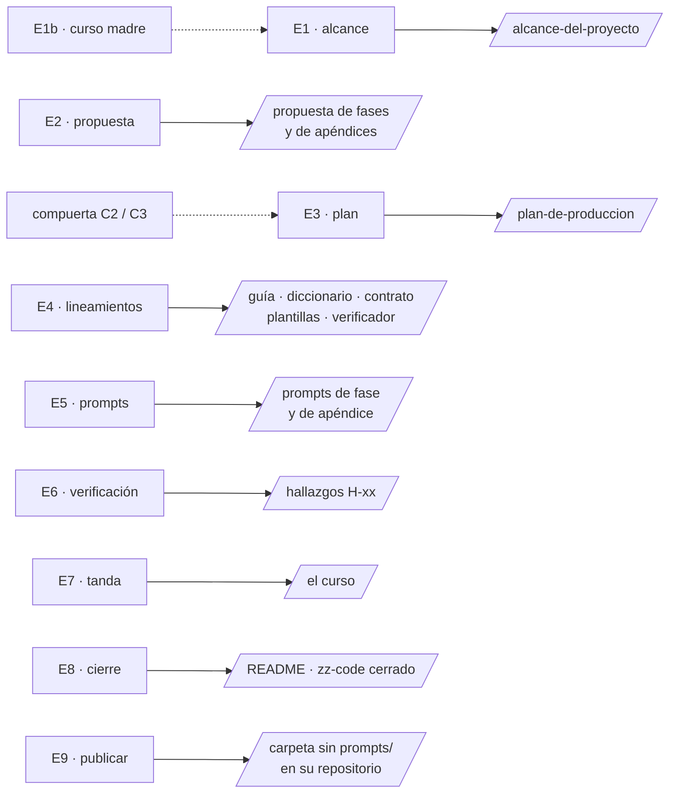

# 🗣️ Prompts de etapa

> **Qué es este documento:** el prompt que abre cada etapa del
> [workflow](00-workflow-de-un-curso.md), listo para pegar en una sesión nueva. Se rellenan los
> `{{…}}` y se pega el bloque entero.
> **Regla de uso:** una etapa, una sesión. Si la etapa produce varios documentos (E4), una sesión por
> documento, con el mismo prompt y otro entregable.
> **Vigencia:** 2026-10-06.

**Salto rápido:** [E1](#e1--idea-y-alcance) · [E1b](#e1b--basarse-en-un-curso-existente) · [E2](#e2--propuesta-de-fases-capítulos-y-apéndices) · [Compuerta](#revisión-de-compuerta) · [E3](#e3--plan-de-producción) · [E4](#e4--lineamientos) · [E5](#e5--prompts-de-sesión) · [E6](#e6--verificación-previa) · [E7](#e7--abrir-una-tanda-de-escritura) · [E8](#e8--revisión-total-y-cierre) · [E9](#e9--publicar)

Qué prompt abre cada etapa y qué plantilla usa:



---

## 🧱 El bloque común

Va al final de todos los prompts de este documento. Las reglas son las del workflow §2 y las de
[`03-lecciones-de-produccion.md`](03-lecciones-de-produccion.md); aquí está la forma corta que la
sesión necesita.

```markdown
## Reglas de la sesión (no las repitas, aplícalas)

Lee antes `zz-instrucciones/03-lecciones-de-produccion.md`: son reglas, no sugerencias.

- Narrativa en español latinoamericano neutro, con tuteo. Código, comandos, nombres de archivo e
  identificadores en inglés; comentarios dentro del código en español.
- **Por defecto, todo secuencial y sin subagentes**, salvo que yo pida lo contrario. Esta sesión no
  escribe nada del curso fuera de su entregable.
- **Nada se nombra sin comprobarlo en esta sesión**: versión (desde la fuente primaria), librería,
  flag, URL (por código de estado; la portada de la documentación cuenta como rota), libro con
  edición y año. Lo que no puedas comprobar, dilo con esas palabras.
- **No inventes URLs, cifras ni salidas de terminal.** Todo ejemplo numérico, calculado antes.
- **Propón, no decidas.** Toda decisión abierta va como `D-xx` con dos a cuatro opciones, la
  recomendada primero, y su consecuencia; la cierro yo. Si tienes que asumir algo para seguir,
  regístralo como "por defecto, a revisar" y dímelo al cerrar.
- **Si encuentras una contradicción con un documento de más autoridad, dímela; no la resuelvas.**
- **No instales nada, no crees cuentas ni recursos que cobren.** Si hace falta algo en mi máquina,
  dime qué instalar y cómo.
- **Docker:** inventario inicial a un log antes de tocar nada; contenedores etiquetados
  `curso={{slug}}`; en tus pruebas, **puertos altos y aleatorios** (`-p 127.0.0.1::PUERTO` y
  `docker port`), nunca los de por defecto, que pueden estar en uso por otro contenedor (el curso sí
  puede publicar los de por defecto: si su Compose los fija, lo levantas con un override propio); al terminar, borra **tus
  contenedores con sus volúmenes** (`docker rm -v`, `compose down -v`) y nada más. Nunca `prune` sin
  filtro ni nada que ya existía.
- **Código intermedio:** todo el código que escribas va a tu directorio de `zz-code/`
  (`python3 zz-code/nuevo.py <curso>`), con su `MANIFIESTO.md`, y lo registras en el plan §9. Todas
  las pruebas van ahí, también lo efímero (logs, salidas, copias), en `salidas/`; nada en el
  scratchpad ni en `/tmp`. Un comando suelto que produce algo citable se copia a un archivo. Llena el
  `README.md` del directorio **mientras pruebas**: cómo correr y medir cada prueba, los comandos bash
  en orden y los intermedios que amasan la salida hasta la cifra publicada. El curso nunca cita `zz-code/`.
- **Git lo manejo yo**: ni commits, ni `git add/rm/mv`. Borra solo archivos nombrados, nunca
  directorios ni `rm -rf`, tampoco en el scratchpad.
- No toques nada fuera de `{{carpeta-del-curso}}/prompts/` salvo que el entregable lo diga.
- Antes de cerrar: el verificador (`verificador_base.py`, o `prompts/verificar-corpus.py` si ya
  existe) sin `RESTO`, `ROTO` ni `ANCLA` en el entregable, y la bitácora del plan al día si el plan ya existe.
```

---

## E1 — Idea y alcance

````markdown
Vamos a diseñar un curso nuevo. Esta sesión **no escribe ninguna fase**: su entregable es
`{{carpeta-del-curso}}/prompts/alcance-del-proyecto.md`, a partir de la plantilla
`zz-instrucciones/plantillas/alcance-del-proyecto.md`, y lo vamos a discutir antes de cerrarlo.

## La idea

{{Si existe `{{carpeta-del-curso}}/prompts/ficha-de-arranque.md` (la discusión de E0), basta con:
"La idea está en `prompts/ficha-de-arranque.md`; sus decisiones `D-xx` ya están confirmadas". Si no,
la lista:}}

- **Tema:** {{de qué va, en una frase}}
- **Tipo tentativo:** {{curso completo | curso legacy | curso repaso | banco de entrevista | banco de examen}}
  (ver `zz-instrucciones/01-tipos-de-curso.md`)
- **Lector:** {{quién es, qué sabe ya, qué no se le explica}}
- **Disparador:** {{por qué ahora}}
- **Lo que ya tengo claro:** {{restricciones, stack, plataforma, tiempo disponible, lo que NO quiero}}
- **Diagramas:** {{a criterio | Mermaid obligatorio}} (si no lo digo, a criterio: `D-12`)
- **Material de partida:** {{rutas a notas, cursos vecinos, temarios oficiales; o "ninguno"}}

## Cómo quiero que trabajes

**Paso 1 — Antes de escribir.** Lee `zz-instrucciones/00-workflow-de-un-curso.md`,
`01-tipos-de-curso.md` y la plantilla del alcance. Devuélveme, sin redactar el documento:
(a) el problema que crees que resuelve el curso, en un párrafo, y el "villano" (la confusión que
ataca); (b) la pregunta que ordena el curso, en una línea; (c) cinco o seis capacidades verificables
que el lector tendrá al terminar; (d) qué se da por sabido y qué se explica con cero ambigüedad;
(e) una primera lista de dentro y fuera del alcance; (f) si el tipo que propuse es el correcto, y si
no, cuál y por qué; (g) las decisiones `D-xx` que ves abiertas, con valor propuesto; (h) preguntas
bloqueantes numeradas, marcando cuáles puedes asumir con un valor por defecto.

**Paso 2 — Redacción**, cuando yo responda: el alcance completo sobre la plantilla, con las `D-xx`
cerradas marcadas ✅ y las abiertas ⏳.

**Paso 3 — Cierre:** lista corta de lo que queda ⏳ y de lo que la etapa E2 (propuesta) necesita
saber del alcance.

{{bloque común}}
````

---

## E1b — Basarse en un curso existente

Se usa **antes** de E1 (o como su primera parte) cuando el curso nuevo hereda la forma de otro.

````markdown
El curso nuevo **{{nombre}}** se basa en el curso existente **{{ruta del curso madre}}**. Esta sesión
no escribe ningún documento del curso nuevo: su entregable es un **informe de herencia** en el chat,
que después usaremos en E1 (alcance) y en E4 (guía de estilo).

## Qué quiero heredar

{{forma de los capítulos | tono | aparato de preguntas | laboratorio | plantillas | todo lo que se pueda}}

## Qué sé que cambia

{{el tema, el lector, el stack, el tamaño, la plataforma…}}

## Cómo quiero que trabajes

**Paso 1 — Inventario de la madre.** Lee entero su `prompts/` (empezando por el encabezado de la
guía, que dice de quién desciende ella a su vez) y su README. Devuélveme:

1. **Inventario**: cada documento de su `prompts/`, qué es y si aplica al curso nuevo
   (✅ se hereda · ✏️ se adapta · ❌ no aplica).
2. **Lo que se hereda en silencio**: reglas de forma que valen tal cual (tono, idioma, callouts,
   anclas, enlaces, checklist).
3. **Las divergencias**: cada regla de la madre que el curso nuevo tiene que cambiar, con la sección
   donde vive y **por qué** cambia. Esta lista es la que irá en el encabezado de la guía nueva
   ("Diverge en N puntos declarados: §…").
4. **Lo que NO se puede heredar**: nombres fijos del laboratorio, el sistema de ejemplo, el dominio,
   los dueños de concepto, las decisiones `D-xx` propias de la madre. Se redeclaran enteros en el
   curso nuevo aunque coincidan.
5. **El modo de autocontención** que propones (decisión `D-03` del alcance):
   - *editorial*: el `prompts/` del curso nuevo puede citar la guía madre como herencia de forma, pero
     ningún documento publicado la cita ni la exige;
   - *total*: ni el `prompts/` ni el curso citan a la madre ni al `CLAUDE.md` raíz; la carpeta se
     puede copiar a otro proyecto y funciona sola. La herencia se copia, no se enlaza.
6. **Lo que la madre aprendió a golpes**: excepciones, errores documentados, bitácora de su plan si
   todavía existe. Lo que deba ser regla en el curso nuevo, márcalo.

**Paso 2**, cuando yo responda: ajusta el informe y déjalo listo para pegar en E1 y E4.

{{bloque común}}
````

---

## E2 — Propuesta de fases, capítulos y apéndices

````markdown
Sesión de **propuesta** del curso **{{nombre}}**. Entregables:
`prompts/propuesta-fases-y-alcance.md` y, si el tipo lleva apéndices,
`prompts/propuesta-apendices-y-alcance.md`, sobre las plantillas de `zz-instrucciones/plantillas/`.

Fuentes de verdad, en orden: `prompts/alcance-del-proyecto.md` (cerrado en C1),
{{el informe de herencia de E1b, si existe}}, `zz-instrucciones/01-tipos-de-curso.md` para las
cantidades por defecto del tipo **{{tipo}}**.

## Cómo quiero que trabajes — en dos vueltas

**Vuelta 1 — El arco, sin fichas.** Devuélveme:
(a) las partes o bloques, con la pregunta que responde cada uno;
(b) la lista numerada de fases o capítulos con título provisional y una línea de qué hace cada uno;
(c) los apéndices, clasificados en de laboratorio, de consulta que crece y ampliaciones 🔥;
(d) el peso o las horas de cada fase y el número de ejercicios o preguntas, con el total;
(e) **qué difiere cada fase a otra posterior** (lo que no entra todavía y dónde llega);
(f) el orden de aprendizaje y, si es distinto, el orden "para una entrevista que es esta semana";
(g) las `D-xx` nuevas que salen del arco.
No escribas fichas hasta que apruebe el arco.

**Vuelta 2 — Las fichas**, con el arco aprobado: cada fase con su ficha completa según la plantilla
({{Construye · Trae · Mide · Rompe · Difiere}} para curso completo, {{Objetivo · Cubre · Desmonta ·
Se toca con}} para repaso), nombres de archivo canónicos, la tabla resumen y el registro de
decisiones con la columna "Manda en".

**Cierre:** lista de lo que el plan de producción (E3) necesita: grupos de fases que comparten
laboratorio o se enlazan entre sí, y qué tiene que estar verificado antes de cada grupo.

{{bloque común}}
````

---

## Revisión de compuerta

Se usa al final de E2 (C2) y al final de E5 (C3), cuando hay que decidir si se puede seguir.

````markdown
Revisa la preparación del curso **{{nombre}}** para pasar la compuerta **{{C2 | C3}}**. No escribas
nada nuevo: solo lee `prompts/` entero y responde.

1. **Continuidad y coherencia** entre todos los documentos de `prompts/`: cifras (fases, ejercicios,
   preguntas, horas) que no cuadran entre la propuesta, la guía, las plantillas y los prompts; nombres
   que difieren; decisiones citadas con otro valor.
2. **Decisiones**: cada `D-xx` con su estado; las ⏳ que bloquean y las que no.
3. **Referencias cruzadas**: toda mención a otro documento con enlace, y todo enlace y ancla válidos.
4. **Autocontención**: ninguna referencia a otros cursos del repositorio ni al `CLAUDE.md` raíz
   {{si D-03 = total}}; ningún ejercicio ni dato que dependa de un ente externo que el lector no tenga.
5. **Omisiones**: algo que el alcance promete y ninguna ficha cubre, o una ficha que ningún prompt
   cita.

Termina con **una línea: "Sí, se puede pasar {{C2 | C3}}" o "No"**, y si es no, la lista mínima de
lo que falta, en orden de bloqueo. Corrige solo lo que yo apruebe.
````

---

## E3 — Plan de producción

````markdown
Sesión del **plan de producción** del curso **{{nombre}}**. Entregable: `prompts/plan-de-produccion.md`
sobre la plantilla `zz-instrucciones/plantillas/plan-de-produccion.md`.

Fuentes: `prompts/alcance-del-proyecto.md`, `prompts/propuesta-fases-y-alcance.md` (su tabla resumen
y lo que su cierre dice de los grupos), {{propuesta de apéndices}}.

## Qué tiene que salir

- **Las tandas de preparación `P`** que faltan, en orden de dependencia: guía, diccionario, contrato
  de nombres, plantillas, formatos propios, prompts, decisiones, verificación previa, traslado. Las
  que ya están hechas (alcance, propuesta, este plan) se marcan ✅ con su fecha.
- **Las tandas de escritura `T`**: `T0` de esqueletos (solucionarios, documentos vivos, apéndices que
  crecen), una tanda por grupo de fases que se enlazan o comparten laboratorio, los apéndices, los
  README al final y el cierre.
- **El peso de cada tanda** (ligera, normal, densa) y por qué.
- **Qué preparación exige cada tanda de escritura** (regla "ninguna tanda empieza con su preparación
  abierta").
- **Las verificaciones** que se corren al cerrar cada tanda, adaptadas al tipo de curso.
- **La prioridad si el tiempo aprieta**: qué tandas hacen el curso utilizable por sí solo.
- **El checklist final**, con una línea por entregable; en cursos con laboratorio, dos casillas:
  escrita y corrida.

## Cómo quiero que trabajes

Paso 1: propónme la lista de tandas en una tabla, sin escribir el plan. Paso 2: el plan completo
cuando la apruebe. Paso 3: deja la bitácora con su primera entrada (fecha de hoy, qué se cerró).

{{bloque común}}
````

---

## E4 — Lineamientos

Un prompt, cuatro usos. Se cambia el entregable y la sección "Qué vigilar".

````markdown
Sesión de lineamientos del curso **{{nombre}}**. Entregable: `prompts/{{guia-de-estilo-y-convenciones.md
| diccionario-de-terminos.md | contrato-de-nombres.md | plantillas-de-capitulo.md | formato-…}}`,
sobre la plantilla correspondiente de `zz-instrucciones/plantillas/`. Es la tanda **{{P-n}}** del
plan de producción.

Fuentes, en orden: `prompts/alcance-del-proyecto.md`, `prompts/propuesta-fases-y-alcance.md`,
{{los lineamientos ya escritos}}, {{el informe de herencia de E1b y la guía madre, si existen}}.

## Qué vigilar

{{Elige el bloque del entregable y borra los otros.}}

**Guía de estilo:**
- Si deriva de otra, el encabezado dice de cuál y **enumera las divergencias** con su sección. Lo
  heredado sin cambios se hereda en silencio.
- Las cantidades (preguntas, ejercicios, longitud) se copian de la propuesta, no se inventan.
- Cada excepción al `CLAUDE.md` del repositorio va en su sección de excepciones, con el porqué.
- El checklist de §12 tiene que poder recorrerse en cinco minutos: una línea por regla verificable.

**Diccionario de términos:**
- Parte de la semilla de la plantilla; agrega los términos del tema del curso y marca ⚖️ los que
  admiten dos formas, con la propuesta de cuál fijar.
- El diccionario de código del dominio (español → inglés) se llena con el sistema de ejemplo o la
  empresa de la historia, entidad por entidad.

**Contrato de nombres:**
- Todo nombre que más de una fase va a usar: recursos, servicios, archivos, tablas, puertos, tags.
- Lo que no se puede congelar todavía se marca ⏳ con la fase que lo fija.

**Plantillas de capítulo:**
- Las rígidas se siguen literal; la de apéndice es laxa a propósito.
- Cada plantilla trae el encabezado completo y la sección final de recordatorios.

## Cómo quiero que trabajes

Protocolo de tres pasos: preguntas y esbozo sin redactar → redacción cuando responda → checklist de
la plantilla y lista de lo que este documento obliga a cambiar en los demás de `prompts/`.

{{bloque común}}
````

---

## E5 — Prompts de sesión

````markdown
Sesión de los **prompts de sesión** del curso **{{nombre}}**. Entregables:
`prompts/prompts-de-fase.md`{{, prompts/prompts-de-apendice.md, prompts/prompts-de-taller.md}}, sobre
las plantillas de `zz-instrucciones/plantillas/`. Tanda **{{P-n}}** del plan.

Fuentes: todo `prompts/`. La propuesta manda sobre el alcance de cada fase; la guía, sobre la forma.

## Qué vigilar

- **El marco común** lista las fuentes de verdad en orden y solo las reglas que no se negocian. Va
  entero en el primer prompt y los demás lo citan.
- **El alcance de cada fase no se copia**: el prompt cita la ficha. Lo que el prompt agrega es lo que
  la ficha no dice: qué vigilar, qué riesgo tiene, qué tiene que estar hecho antes.
- **Un prompt por tanda o por fase**, lo que diga el plan.
- Si el curso tiene una historia o un dominio narrativo, una tabla de escenas por fase, para que
  ninguna sesión la invente ni la repita.
- El cierre de cada prompt es el protocolo de tres pasos.

{{bloque común}}
````

---

## E6 — Verificación previa

````markdown
Sesión de **verificación previa** del curso **{{nombre}}**, tanda **{{P-n}}** del plan. Entregable:
`prompts/verificacion/hallazgos.md` (IDs `H1`, `H2`… con fecha) {{y los logs o borradores que
necesite}}. No se escribe ninguna fase.

## Qué se verifica

- **Versiones** de todo lo que el curso instala o nombra, según la política de versiones de la guía
  {{(última LTS, o última estable donde no haya LTS)}}, con la fecha de comprobación y la fuente.
- **Libros base**: edición, año y editorial; si hay una edición nueva en preparación, se nombra como
  tal.
- **URL de documentación oficial**, una por concepto, por código de estado; las que redirigen a la
  portada cuentan como rotas.
- {{Laboratorio: que el entorno levanta en la plataforma del autor, cuánta memoria pide, y un
  prototipo del método (un servicio, una sesión, un taller) que pase de punta a punta.}}
- {{Cifras y hechos de la historia o del dominio que una fase va a citar.}}

**Terminada cuando** todo tiene un hallazgo con fecha, y lo que no funciona tiene alternativa
propuesta como `D-xx`. Después, la tanda de traslado lleva cada hallazgo al documento que lo cita.

{{bloque común}}
````

---

## E7 — Abrir una tanda de escritura

El prompt de cada fase vive en el `prompts-de-fase.md` del curso. Este es solo el envoltorio para
abrir una tanda con varias fases.

````markdown
Trabaja en esta sesión la tanda **{{T-n}}** del curso **{{nombre}}**: {{fases o capítulos}}, en
secuencia, una a una.

Antes de empezar, lee `prompts/plan-de-produccion.md` §3 (estado), §6 (deuda de enlaces), §7
(bitácora, la entrada más reciente) y §8 (checklist), y confirma que la preparación que exige esta
tanda está cerrada.

Para cada documento, pega mentalmente su prompt de `prompts/prompts-de-fase.md` y sigue su protocolo
de tres pasos. Al cerrar la tanda: verificaciones del plan §4, y el plan al día (§3, §6, §7 y §8),
con los tags que tengo que crear.
````

---

## E8 — Revisión total y cierre

````markdown
Revisión total del curso **{{nombre}}** antes de cerrarlo. Lee el curso entero y su `prompts/`.

1. **Continuidad y coherencia** entre todas las fases, capítulos y apéndices: una fase que contradice
   a otra, un nombre que cambia, una cifra que no coincide, un "como vimos en…" que no se vio.
2. **Referencias cruzadas**: toda mención a otro documento lleva enlace; ningún enlace ni ancla roto;
   ninguna deuda de enlaces abierta en el plan.
3. **Omisiones**: algo de las fichas de la propuesta que ninguna fase cubrió; preguntas sin respuesta
   en el solucionario; ejercicios sin criterio.
4. **Autocontención**: cero referencias a otros cursos del repositorio y {{si D-03 = total}} al
   `CLAUDE.md` raíz; ningún ejercicio ni dato que dependa de un ente externo; la carpeta se puede
   copiar a otro proyecto y funciona sola.
5. **Restos de producción**: ningún documento publicado cita `prompts/`, un `_desechable-*` ni el plan.
6. **README y estructura**: describen lo que existe, con el estado real.
7. {{Solo si lo pido: **diagramas en Mermaid**, convirtiendo los que estén en otro formato.}}

8. **`zz-code/`**: cada directorio del curso en el plan §9 con estado *extraído* o *archivado*, ninguno
   *vigente*; cada uno con su `README.md` completo (sin secciones `{{…}}` y con cada cifra publicada
   rastreable hasta su prueba); y la vista previa de `python3 zz-code/limpiar.py <ids>` con sus tamaños.

Devuélveme el informe en orden de gravedad y **una línea final: "Sí, se puede cerrar" o "No"**.
Cuando apruebe las correcciones, aplícalas. `prompts/` se conserva entero como referencia: solo borra
(archivo por archivo, sin borrar directorios) los `_desechable-*` y lo que yo pida, y limpia sus
menciones en la misma edición. El `--borrar` de `limpiar.py` lo doy yo. Termina con la lista de lo que
queda para commit (lo hago yo), lo efímero que queda por borrar y los recursos de Docker del curso que
siguen levantados.
````

---

## E9 — Publicar

````markdown
Prepara el curso **{{nombre}}** para publicarlo en su propio repositorio público. Yo copio la carpeta
del curso **sin `prompts/`**; tú la dejas lista. No toques nada fuera de la carpeta del curso.

1. Corre `python3 zz-instrucciones/herramientas/verificador_base.py {{carpeta-del-curso}} --perfil=publicacion`
   y devuélveme los errores agrupados: `FUERA` (enlaces a otros cursos o al repositorio), `PROMPTS`
   (enlaces a `prompts/`, que no viaja), `ZZ-CODE` y `PRIVADO` (menciones a material privado).
2. Propón cómo resolver cada grupo: los enlaces a otros cursos, con la herramienta de conversión si ya
   existe o pasados a prosa; los enlaces a `prompts/`, quitados o reemplazados por lo que el lector
   necesita saber; las menciones privadas, quitadas.
3. Revisa que el `README.md` se sostenga solo: qué es, para quién, cómo se sigue, qué hace falta
   instalar, y sin rutas del repositorio privado.
4. Busca secretos y datos personales en el código y en los ejemplos.
5. Propón la licencia y el `.gitignore` de la raíz del repositorio público (sistema operativo y
   editores). El del curso ya existe y viaja tal cual: comprueba que es el único y que se sostiene sin
   el de la raíz del repositorio privado.

No apliques nada hasta que apruebe. Termina con **una línea: "Sí, se puede publicar" o "No"**, y la
lista de lo que tengo que copiar.
````
