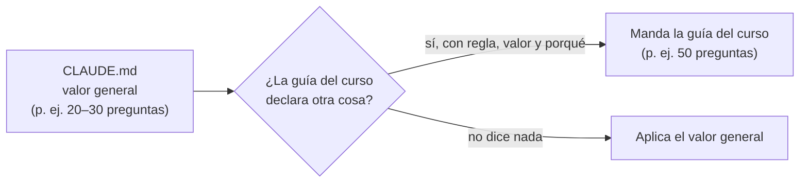

# 🩺 Lecciones de producción

> **Qué es este documento:** las reglas operativas que salieron de producir los cursos de los dos
> repositorios (`job-interview-sept-2026` y `courses-ia-generated`), destiladas de la memoria de
> trabajo de esas sesiones. No son reglas de estilo —esas están en la guía de cada curso— sino de
> **cómo se trabaja en una sesión**: qué se toca, qué no, cómo se ejecuta y cómo se deja el estado.
> **Cómo se usa:** el [bloque común](02-prompts-de-etapa.md#-el-bloque-común) de los prompts de etapa
> y el marco común de [`plantillas/prompts-de-fase.md`](plantillas/prompts-de-fase.md) citan este
> documento. Al copiar las plantillas a un curso, las reglas que apliquen se copian al marco común del
> curso (el curso no enlaza aquí: es autocontenido).
> **Vigencia:** 2026-10-04.

**Salto rápido:** [1](#1--forma-de-trabajo) · [2](#2-️-git-y-sistema-de-archivos) · [3](#3--ejecutar-sin-romper-la-máquina-del-autor) · [4](#4--lo-que-no-se-puede-ejecutar) · [5](#5--verificar-lo-que-se-nombra) · [6](#6--narrativa-y-datos) · [7](#7--el-estado-entre-sesiones) · [8](#8--trampas-de-herramientas) · [9](#9--cierre-de-un-curso)

---

## 1. 🧭 Forma de trabajo

- **Por defecto, todo secuencial y sin agentes, a menos que el autor pida lo contrario.** Un documento
  tras otro, en el hilo principal, sin subagentes ni forks, aunque el trabajo sea paralelizable. Nació
  de que se lanzaran agentes en paralelo para escribir documentos de `prompts/` sin que se pidiera; si
  el autor pide agentes para una tarea, se usan para esa tarea y se vuelve al valor por defecto.
- **La sesión de preparación no escribe el curso.** Una sesión que trabaja `prompts/` termina en
  `prompts/`; la tanda `T0` empieza en una sesión nueva.
- **Ritmo por defecto: parar al cerrar cada tanda** y esperar al autor. Si el autor pide varias tandas
  seguidas ("trabaja T6–T10 secuencialmente"), se encadenan, pero cada una se cierra completa (plan al
  día, verificaciones corridas) antes de abrir la siguiente.
- **Decisiones tomadas por defecto se marcan para revisión.** Si la sesión tiene que decidir algo para
  no bloquearse, lo registra como `D-xx` con estado "por defecto, a revisar por el autor" y lo dice en
  el cierre. Nunca se presenta como decidido por el autor.
- **Las decisiones abiertas se presentan como preguntas cerradas**: dos a cuatro opciones, la
  recomendada primero y marcada, con su consecuencia en una línea. El autor elige; la sesión traslada.
- **No se expande el alcance.** Lo que aparece al escribir y no cabe va a 📌 Pendientes con destino
  explícito, no al documento.
- **Mermaid no es obligatorio en los cursos.** Solo cuando el autor lo pide de forma explícita al crear
  el curso (queda en `D-12`) o en una solicitud de revisión. Sin ese pedido, un diagrama puede ir en
  ASCII o en Mermaid, y ninguna sesión convierte diagramas por su cuenta. Los documentos de
  `zz-instrucciones/` sí usan Mermaid, porque así se pidió para esa carpeta.
- **Los tipos de curso no son rígidos.** Los cuatro de `01-tipos-de-curso.md` son puntos de partida:
  el autor puede pedir un repaso de entrevistas con práctica (labs y apéndices, o listas de problemas
  de práctica), un curso completo con banco de preguntas al final, o cualquier otra mezcla. La sesión
  no corrige el pedido hacia el tipo "puro": toma de cada tipo el aparato que sirve y lo declara en la
  guía.

### 1.1 Lineamientos generales y lineamientos del curso

El `CLAUDE.md` del repositorio trae **lineamientos generales**, que son valores por defecto, no
techos. Cada curso los puede sobrescribir con reglas más específicas en su `prompts/`: si el
`CLAUDE.md` dice 20–30 preguntas por capítulo y un curso necesita 50, el curso usa 50. Dos
condiciones lo mantienen en orden:

- **La excepción se declara**: la guía del curso nombra la regla general, el valor nuevo y por qué.
  Sin esa declaración, una sesión futura lo "arreglaría" de vuelta al valor general.
- **El silencio aplica el general**: lo que el curso no menciona se hereda tal cual.



## 2. 🗂️ Git y sistema de archivos

- **Git lo maneja el autor.** Nada de commits, `git add`, `git rm` ni `git mv`; tampoco se ofrecen
  mensajes de commit salvo los **tags** que el plan pide dejar escritos en la bitácora. Leer con
  `git status`, `git log` y `git diff` está bien.
- **Mover y borrar con el sistema de archivos** (`mv`, `rm`), y borrar solo **archivos nombrados uno a
  uno** que sean el objetivo explícito del cambio.
- **Nunca `rm -rf` ni borrar directorios completos, tampoco en el scratchpad.** Un `cd` fallido
  convierte `cd x && rm -rf *` en el borrado del directorio actual. Para rehacer algo, se crea un
  directorio nuevo con sufijo numérico o fecha.
- **El código intermedio de las pruebas va a `zz-code/`, nunca dentro del curso.** Todo lo que la
  sesión escribe para probar una idea y que no forma parte del curso —prototipos, conductores de
  terminal, sincronizadores, proyectos de ensayo, contextos de build— va a un directorio propio de la
  sesión, creado con `python3 zz-code/nuevo.py <curso>`: `zz-code/<curso>-<AAAAMMDD>-<hash>/`, con su
  `MANIFIESTO.md`. Está en el repositorio privado, así que sobrevive entre sesiones; nunca viaja al
  repositorio público del curso. Las reglas completas están en `zz-code/README.md`.
- **El plan de producción registra cada directorio de `zz-code/`** (plan §9) con su estado: *vigente*,
  *extraído* (lo útil ya pasó al curso, a su `prompts/` o a `zz-instrucciones/herramientas/`) o
  *archivado* (se conserva como referencia). El curso nunca cita `zz-code/`; el verificador lo marca.
- **Todas las pruebas se hacen en `zz-code/`, también lo efímero** (decisión del 2026-10-05): logs,
  salidas, SVG de prueba y copias para comparar van a `zz-code/<id>/salidas/`, que el `.gitignore` de
  `zz-code/` excluye y `limpiar.py` libera como regenerable. El scratchpad de la sesión ya no se usa
  para pruebas: lo que quedaba allí se perdía o se olvidaba al cerrar.
- **Lo regenerable de `zz-code/` se borra con `zz-code/limpiar.py`**, que solo toca `salidas`,
  `node_modules`, `target`, `.venv` y demás nombres de su lista blanca, dentro de `zz-code/`, y sin `--borrar` solo
  muestra la lista con tamaños. Es la **única excepción** a la regla de no borrar directorios; el
  `--borrar` lo da el autor o lo autoriza de forma explícita.
- **El código global del curso vive en una sola carpeta, y el README del curso la nombra**
  *(opcional)*. Si el curso trae código que no pertenece a un solo capítulo —un laboratorio, un
  proyecto que crece, scripts compartidos—, se sugiere `src/` o una carpeta con nombre propio
  (`laboratorio/`, `taller/`), siempre en la raíz del curso. Cuál se usa lo decide el curso; lo que
  no es opcional es que el `README.md` del curso diga dónde está y qué contiene. Un curso sin código
  global no crea la carpeta.
- **Un solo `.gitignore` por curso, centralizado** (decisión del 2026-10-04). Va en uno de dos
  lugares, y la guía del curso (§14) declara cuál:
  - **la raíz del directorio de talleres o prácticas donde vive el código** (`laboratorio/`,
    `13-laboratorio/`…), cuando todo el código está ahí, que es el caso habitual;
  - **la raíz del curso**, cuando hay código en más de un bloque (por ejemplo, un laboratorio y
    scripts propios, o labs en dos bloques distintos).

  Nunca un `.gitignore` por servicio, por lenguaje ni por `estados/NN/`: los patrones sin `/`
  (`target/`, `node_modules/`, `.venv/`) ya valen en cualquier subcarpeta, y los que solo aplican a
  un sitio llevan la ruta relativa (`nestjs/src/…/generated/`, `**/tools/otel/*.jar`). Cada bloque
  lleva un comentario que dice a qué carpetas cubre. Las reglas que trae un framework (Laravel, Rails,
  `create-*`) se traducen al central con el prefijo de su carpeta (`php/vendor/`, `php/**/*.log`).
- **El `.gitignore` del curso se sostiene solo**, sin contar con el de la raíz del repositorio: el
  curso se publica como repositorio propio (E9) y el de la raíz no viaja. Por eso cubre también las
  dependencias, los builds, las cachés y los secretos de sus lenguajes, aunque la raíz ya los ignore.
- **Las carpetas vacías que un framework necesita se versionan con `.gitkeep`**, no con un
  `.gitignore` de `*` y `!.gitignore` dentro de cada una. El central las vacía con `carpeta/*` (no con
  `carpeta/`, que impide rescatar nada dentro) y las rescata con `!**/.gitkeep`. Si una regla de la
  raíz del repositorio excluye la carpeta entera (`logs/`), el central la re-incluye primero
  (`!php/storage/logs/`): git no rescata un archivo dentro de un directorio excluido.
- **Se exceptúan los `.gitignore` que generan las herramientas** dentro de sus propias cachés
  (`.pytest_cache/`, `.import_linter_cache/`, `.ruff_cache/`): no se versionan ni se tocan.
- **Al centralizar, se comprueba que no cambia nada**: se saca antes y después la lista de
  `git ls-files -oi --exclude-standard`, `git ls-files -o --exclude-standard` y
  `git ls-files -ci --exclude-standard` sobre la carpeta, y las tres deben salir idénticas. En macOS
  `core.ignorecase=true` hace que `Testing/` atrape también `testing/`: con la comparación se ve.

## 3. 🐳 Ejecutar sin romper la máquina del autor

- **No se instala nada sin pedirlo**: ni CLIs, ni paquetes del sistema, ni herramientas. Lo que el
  curso necesita en el host lo instala el autor con las instrucciones que la sesión le da.
- **Nada que pueda generar cargos.** Ninguna cuenta nueva, ningún login de pago, ningún recurso que
  cobre. Consultar precios y URL públicas sí.
- **Las pruebas corren dentro de contenedores**, con imágenes oficiales y etiquetadas con el curso.
- **En las pruebas de la sesión, puertos altos y aleatorios, nunca los de por defecto.** Otro
  contenedor activo puede estar usando ya el 5432, el 3306 o el 8080, y la prueba fallaría por algo
  ajeno al curso. Primero, `docker exec` sin publicar nada; si hace falta un puerto en
  el host, uno **alto y aleatorio** ligado a `127.0.0.1`: o se deja que Docker lo elija
  (`-p 127.0.0.1::5432`, y se lee con `docker port`), o se sortea uno alto y se comprueba libre antes
  de usarlo. Nada de fijar un puerto "porque siempre estuvo libre".

  ```bash
  docker run -d --name inv-lab-pg --label curso=inv-lab -p 127.0.0.1::5432 postgres:18.6
  docker port inv-lab-pg 5432
  ```

  - `--label curso=inv-lab` marca el contenedor como del curso: es lo único que después se borra.
  - `-p 127.0.0.1::5432` publica el 5432 del contenedor en un puerto alto que elige Docker, y solo en
    la interfaz local.
  - `docker port` dice cuál fue (por ejemplo `127.0.0.1:55017`); ese es el que usa la sesión.

- **El curso puede quedarse con los puertos por defecto.** La regla anterior es para las pruebas
  **durante la producción**, en la máquina del autor; el laboratorio que se publica puede usar
  `8080`, `5432` o `6379`, que son los que el lector reconoce. Si la sesión prueba un Compose del
  curso que fija esos puertos, no lo edita: lo levanta con un `compose.override.yaml` propio, en su
  directorio de `zz-code/`, que cambia solo los puertos publicados por altos y aleatorios. Que el curso
  use puertos altos es una decisión del curso (contrato de nombres), no una obligación.

- **Al terminar, se borran los contenedores creados junto con sus volúmenes, y nada más.** `docker rm
  -v` (o `docker compose down -v` sobre el proyecto del curso) borra el contenedor y los volúmenes
  anónimos que creó; los volúmenes con nombre que creó la sesión se borran uno por uno, por nombre o
  por la etiqueta del curso. **Nunca se borra nada que ya existía**: ni contenedores, ni volúmenes, ni
  imágenes, ni redes, ni caché de build ajenos. Por eso, antes de tocar Docker, un **inventario inicial
  a un log**, y al cerrar se compara contra él. Nunca `docker system prune`, `volume prune`,
  `image prune` ni `builder prune` sin filtro: el autor tiene contenedores y volúmenes de otros cursos.

  ```mermaid
  flowchart LR
      I["Inventario inicial<br/>docker ps -a · volume ls<br/>→ log"] --> C["Crear con<br/>--label curso=slug<br/>y puerto aleatorio"]
      C --> P["Probar"]
      P --> B["docker rm -v<br/>o compose down -v<br/>solo lo del curso"]
      B --> V["Comparar contra<br/>el inventario inicial"]
      V --> R["Informe: qué se borró<br/>y qué sigue levantado"]
  ```

- **Si se cambia la configuración de Docker Desktop** (memoria, por ejemplo), se respalda antes y se
  restaura al cerrar la sesión, junto con los contenedores ajenos que se hayan detenido.
- **Las herramientas de una sola fase se instalan en esa fase**, no en el apéndice de laboratorio, que
  solo registra su versión con la nota "solo FNN".
- **Una copia aislada para lo destructivo**: las pruebas que rompen datos o caen procesos se hacen
  sobre una réplica desechable, nunca sobre el entorno que las fases dan por sano.
- **Los laboratorios por etapas congelan su estado** al cerrar cada taller (`estados/NN/`), para que
  el lector pueda empezar en cualquiera.

## 4. 🚧 Lo que no se puede ejecutar

- **Ninguna salida inventada.** Donde iría la salida literal de algo que no se pudo correr va un
  marcador explícito (`[PENDIENTE DE CORRIDA]`, o el que fije la guía) y la casilla **Corrida** del
  plan queda ⬜.
- **Mediciones pendientes ⏳**: la especificación completa (hipótesis, condiciones, competidores,
  comando) se publica, y la tabla lleva ⏳ celda por celda; el veredicto separa la expectativa del
  umbral por determinar. Los números, cuando existan, van al documento de mediciones con fecha y
  máquina, nunca sueltos en las fases.
- **Plataformas que el autor no verifica** se escriben desde la documentación oficial con la marca
  "no verificado por el autor; se confirma al hacer el curso".
- **El checklist de tandas tiene dos casillas: escrita y corrida.** Entre tandas escritas por
  inspección se acumularon errores reales del corpus: aplazar la ejecución no la ahorra, la acumula.
- **"Salida esperada, sin correr"** es una etiqueta válida cuando el curso decide correr todo en una
  tanda de verificación final; entonces la deuda de ejecución se lleva en el plan.

## 5. 🔎 Verificar lo que se nombra

- **URL por código de estado, sin seguir redirecciones a ciegas.** La documentación de AWS y GCP
  responde a una URL muerta con `302` a la portada: cuenta como rota.
- **Las SPA responden `200` a todo**: se verifican por su API o por el repositorio que las alimenta.
  Los sitios que devuelven `403` a un cliente automático no se enlazan (o se declaran sin verificar).
- **Versiones exactas desde la fuente primaria** (Maven Central, releases de GitHub, el registro de
  imágenes, la ficha del paquete), no desde los ejemplos de la documentación, que van atrasados.
- **Libros con edición y año comprobados**; si hay segunda edición reciente, los capítulos se citan de
  esa edición, y la numeración se comprueba en la tanda que los cita. Nunca desde copias no
  autorizadas: si no hay acceso legítimo, la ficha nombra el tema en palabras, no el número de sección.
- **Todo ejemplo numérico se calcula antes de escribirlo** (con Python), no de cabeza.
- **Las APIs de precios se consultan con pausa**: responden `429` si se consultan seguido.
- **Las pruebas mecánicas se corren, no se suponen** (densidad, longitud, conteos): más de una vez se
  declaró denso un capítulo que no lo era.

## 6. 🎭 Narrativa y datos

- **La historia es opcional y depende de la idea.** Hay cursos que van sin historia, con un sistema
  de ejemplo neutro, y cursos que la llevan. Los que la llevan suelen ser más largos y completos,
  porque la idea es **generar contenido para YouTube o TikTok** a partir de ellos, y ahí la historia es
  lo que atrae. Se decide en el alcance (`D-11`), no a mitad de camino.
- **Cuando hay historia, una empresa ficticia creíble es el mejor gancho**, mejor que un planteamiento
  técnico "sacado de la nada". Lo que la hace funcionar son los matices de cómo pasan las cosas en empresas
  latinoamericanas: la consultora que arma el organigrama, el Excel reenviado por correo personal, el
  sistemita de los practicantes que se queda, la compra rápida por contactos en una contingencia, la
  estimación optimista por trimestre.
- **Decisiones de negocio con fecha, autor y razón, nunca villanos.** Verosimilitud plausible, no
  documental. Se proponen detalles de realismo en vez de dramatizar, y se esperan varias rondas de
  ajuste fino del autor.
- **La historia es la fuente de verdad narrativa.** Si una fase necesita un dato que no está, se
  agrega primero a la historia y después se cita.
- **Ninguna cifra de producción real ni nombre de cliente** de las empresas donde trabajó el autor
  (acuerdos de confidencialidad): los clientes se nombran por sector y las cifras salen de
  reproducciones propias, etiquetadas como tales.
- **Los bancos de examen no reproducen preguntas reales** del examen.

## 7. 💾 El estado entre sesiones

- **El estado del curso vive en el plan de producción**, no en git ni en la memoria del chat: §3
  (estado), §6 (deuda de enlaces), §7 (bitácora) y §8 (checklist). Toda sesión que retome un curso
  empieza leyendo esas cuatro secciones.
- **La bitácora registra trampas**, no solo avances: lo que la próxima sesión debe saber para no
  tropezar con lo mismo (una versión que no funciona, un flag que se ignora en silencio, un recurso que
  quedó levantado).
- **La memoria del asistente guarda punteros, no contenido**: dónde está el plan, qué sigue, qué
  decidió el autor que no se deduce de los documentos, y las trampas transversales a varios cursos.
- **Los scripts auxiliares de una sesión** (conductores de terminal, sincronizadores, reparadores)
  viven en `zz-code/<id>/`, no en el scratchpad: antes se perdían al cerrar la sesión y había que
  reescribirlos. Los que el curso necesita de forma permanente pasan a `prompts/` con nombre
  `verificar-*`, y los que sirven a cualquier curso, a `zz-instrucciones/herramientas/`.

## 8. 🪤 Trampas de herramientas

- **`perl -pi` sin `-CSD -Mutf8` corrompe las tildes** de cada línea que toca. Siempre
  `perl -CSD -Mutf8 -pi`, marcadores intermedios solo ASCII, y al cerrar `grep -rl "Ã\|â"` a cero.
- **Heredocs con `<<'EOF'`**: sin comillas, la shell ejecuta las comillas invertidas del texto.
- **Renumerar es caro y frágil** (un renumerado de doce capítulos tocó unas 1.700 referencias, con
  falsos positivos como "`java -version` tiene que decir `21`"). Se prefiere **agregar sin
  renumerar** (secciones nuevas después del checklist, por ejemplo) y documentarlo.
- **En `rg`, `-h` es `--help`**: `rg -o --no-filename`, nunca `rg -oh`.
- **Los scripts de verificación en bash** no corren igual en zsh (los globs sin coincidencia
  abortan): se invocan con `bash`.
- **`grep` puede ser otro programa** (ugrep) y rechazar expresiones como `.{0,200}`: para buscar en
  páginas, Python.
- **Clientes interactivos (psql, redis-cli, mongosh) sin pty no imprimen el prompt**: para pegar
  sesiones con prompt hace falta un conductor con pty.
- **Un verificador que busca "pendiente"** también salta con "independiente": se reformula, no se
  desactiva.
- **Las anclas de encabezados con ⚠️, ⚖️, ⚙️, 🏷️ o 🗂️ llevan un carácter invisible.** Esos emojis
  incluyen el selector de variación U+FE0F, y GitHub lo conserva en el ancla: `## ⚠️ Advertencias` →
  `#️-advertencias`, no `#-advertencias`. La regla de "se borra todo lo que no sea letra o número" no lo
  cubre, y en octubre de 2026 había unos 420 enlaces rotos así en `repaso-entrevistas/` y unos 50 en
  `courses-ia-generated`. El verificador base usa la tabla exacta de `github-slugger` (comparada contra
  22.935 encabezados de los dos repositorios, sin una sola diferencia) y reporta `ANCLA-FE0F` con el
  ancla correcta.
- **Los superíndices desaparecen del ancla.** `²`, `⁸` o `⁶¹` son «otro número», no dígitos decimales, y
  GitHub los borra: `## 4. LIS en O(n²)` → `#4-lis-en-on`. Un verificador con `isalnum()` de Python los da
  por buenos (y tampoco conserva el U+FE0F). En `bases/02-algoritmos` salieron 9 enlaces así al cerrar el
  curso; el verificador base ya los reporta como `ANCLA`.
- **Un generador de solucionarios que copia el enunciado leyendo una sola línea** trunca las preguntas
  que el capítulo parte en dos (y pierde su emoji de dificultad). Comparar la literalidad uniendo las
  líneas de continuación; en `bases/02-algoritmos` había 14 truncadas y 5 con un enlace añadido.

## 9. 🏁 Cierre de un curso

- **`prompts/` se conserva entero como referencia** (decisión del 2026-10-04): guía, diccionario,
  contrato, propuestas, prompts, plan y verificadores. No viaja al repositorio público del curso —el
  autor no lo copia—, así que no hace falta podarlo. Los `_desechable-*` y lo que el autor pida se
  borran archivo por archivo, con su permiso.
- **`zz-code/` del curso se cierra**: ningún directorio suyo queda *vigente* en el plan §9, y
  `limpiar.py` libera lo regenerable.
- **Un curso cerrado no se recrea**: no se rehacen planes borrados ni se renombra nada (bloqueo de
  contenido). Los errores de diseño que se descubren tarde se **documentan** donde mandan, no se
  corrigen en silencio.
- **Cada curso se publica como repositorio independiente** (etapa E9 del workflow): se copia la
  carpeta del curso **sin `prompts/`**, después de que `--perfil=publicacion` del verificador salga
  limpio. Por eso la autocontención es una decisión del alcance (`D-03`) y no un detalle: hoy los
  enlaces entre cursos son locales, y se convertirán con una herramienta cuando se cree el repositorio
  público de cada curso.
