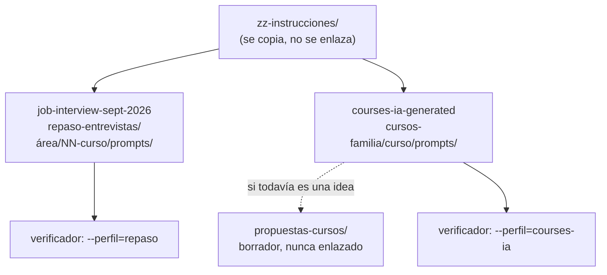

# 🧳 Usar las plantillas en cada repositorio

> **Qué es este documento:** lo que cambia al usar estas plantillas en cada uno de los dos
> repositorios de cursos. Las plantillas son las mismas; lo que difiere son los **valores por
> defecto** de cada `CLAUDE.md` raíz, la ubicación de los cursos y el perfil del verificador.
> **Comprobado el 2026-10-04** contra los 15 corpus de `repaso-entrevistas/` y los 11 cursos con
> `prompts/` de `courses-ia-generated`.
> **Vigencia:** 2026-10-04.

**Salto rápido:** [1](#1-️-los-dos-repositorios-de-un-vistazo) · [2](#2--lo-que-cada-curso-tiene-que-declarar) · [3](#3--el-verificador-en-cada-repositorio) · [4](#4--lo-que-el-barrido-encontró)

---

## 1. 🗺️ Los dos repositorios, de un vistazo



| Valor por defecto | `job-interview-sept-2026` | `courses-ia-generated` |
|---|---|---|
| Dónde vive un curso nuevo | `repaso-entrevistas/<área>/<NN-curso>/` | `cursos-<familia>/<curso>/`; si es una idea, antes en `propuestas-cursos/` |
| Tipo habitual | repaso de entrevistas, con o sin práctica | curso completo, a menudo con historia |
| Comentarios dentro del código | español | **inglés** (los cursos que quieren español lo declaran como excepción) |
| Evaluación | preguntas sin respuesta + solucionario en tres capas | 20–30 ejercicios por sección, de muy fácil a miniproyecto |
| Callouts | ⚠️ 🧠 💡 🩺 💰 📝 📚 | 📝 🧭 🧠 ⚠️ 💡 (y los propios de cada curso) |
| Emoji en `###` | ninguno | con moderación |
| Estructura publicada | README al final | `0-ESTRUCTURA-CURSO.md` **antes** de la primera lección |
| Documentos vivos | no por defecto | `BENCHMARKS.md` e `INSTINTOS.md` |
| Forma de una lección | problema → mecanismo → precio → veredicto | setup → conceptos → antipatrones → traducción → ejercicios → veredicto honesto |
| Tracks opcionales | bloque `06-talleres/` | prefijo de track: `beNN-…`, `bea-NN-…`, con sus propios prompts |
| Cursos extensos | bloques `NN-slug/` con troncal (`arquitectura/01-bases`) | una secuencia con partes; bloques o pistas paralelas cuando el tema lo pide (`01-tipos-de-curso.md` §10) |
| Autocontención | editorial: los otros corpus como sugerencia de estudio | total, declarada curso por curso |
| Material personal | `Entrevistas/`, `REPASO-*`: nunca se cita | `_oskar/`: nunca se edita ni se cita |
| Código intermedio | `zz-code/` en la raíz del repositorio | su propio `zz-code/` en la raíz, cuando se cree (se copia `README.md`, `.gitignore`, `nuevo.py` y `limpiar.py`) |
| Publicación | un repositorio público por curso, sin `prompts/` (E9) | igual |

---

## 2. 📋 Lo que cada curso tiene que declarar

Las plantillas traen valores que coinciden con uno u otro repositorio. Donde la plantilla y el
`CLAUDE.md` del repositorio no coinciden, **la guía del curso declara cuál usa** en su sección de
excepciones (guía §13). Los casos que hay que mirar siempre:

- **`D-01`, idioma de los comentarios.** La plantilla propone español; en `courses-ia-generated` el
  valor por defecto es inglés.
- **`D-10`, README y temario al final.** La plantilla los escribe al final; en `courses-ia-generated`
  el `CLAUDE.md` pide `0-ESTRUCTURA-CURSO.md` antes de la primera lección. El laboratorio de contenedores
  ya declaró esta excepción, con su porqué: el alcance y la propuesta hacen ese papel durante la
  producción.
- **`D-05`, aparato de evaluación.** Un repaso en `courses-ia-generated` declara que cambia ejercicios
  por preguntas; un curso completo en `job-interview-sept-2026` declara que lleva ejercicios.
- **Documentos vivos.** En `courses-ia-generated` se dan por hechos `BENCHMARKS.md` e `INSTINTOS.md`; si
  el curso no los usa, lo dice.
- **Callouts y emoji en `###`.** La guía §11 de la plantilla parte de la lista de
  `job-interview-sept-2026`; en `courses-ia-generated` se cambia por la suya.

---

## 3. 🔧 El verificador en cada repositorio

La base trae dos perfiles con los valores de cada repositorio. Se usan desde la línea de comandos o
como clase madre de la subclase del curso:

```bash
python3 zz-instrucciones/herramientas/verificador_base.py <curso> --perfil=repaso
python3 zz-instrucciones/herramientas/verificador_base.py <curso> --perfil=courses-ia
```

- `--perfil=repaso` desactiva el error de enlaces fuera del curso y a `prompts/`, porque los repasos
  enlazan otros corpus como sugerencia y el README enlaza su guía.
- `--perfil=publicacion` es el de la etapa E9, igual en los dos repositorios: exige autocontención
  total y que ningún documento cite material privado (`zz-code/`, `_desechable-*`, `Entrevistas/`,
  `_oskar/`, `propuestas-cursos/`…).
- `--perfil=courses-ia` deja el emoji en `###` como aviso, admite los callouts que esos cursos usan,
  trata los cuadernos de incidentes como plantillas para el lector y no exige las tres capas.

En la subclase del curso (`prompts/verificar-corpus.py`) se hereda del perfil y se ajusta lo propio:

```python
class VerificadorDelCurso(PerfilCoursesIA):
    AUTOCONTENIDO = True
    CAMPOS_ENCABEZADO = ("Fecha de verificación",)
```

- `PerfilCoursesIA` trae los valores del repositorio; la subclase cambia solo lo que el curso declara
  distinto en su guía.

---

## 4. 🔎 Lo que el barrido encontró

Con su perfil, los cursos de los dos repositorios salen sin errores salvo por estos, que son
**hallazgos reales** de cada curso y no de las plantillas:

| Hallazgo | Dónde | Qué es |
|---|---|---|
| `ANCLA-FE0F` | ~420 enlaces en 12 corpus de `repaso-entrevistas/`; ~50 en 5 cursos de `courses-ia-generated` | enlaces a encabezados con ⚠️, ⚖️, ⚙️… escritos sin el U+FE0F que GitHub conserva (lecciones §8) |
| `ROTO` | `ruta-no-sql-lite`, `lab-docker-kubernetes` | deuda de enlaces de cursos en producción: fases que todavía no existen |
| `FUERA` | `ruta-no-sql-lite`, los dos Angular, `lab-docker-kubernetes` | enlaces a otros cursos o al README raíz, en cursos que se declaran autocontenidos |
| `ANCLA` | `docker-container-legacy` (`a09`), `lab-docker-kubernetes` (`INSTINTOS.md`), `02-algoritmos` | anclas mal calculadas, como `#11--…` para un `### 1.1` |

Ninguno se corrigió en este barrido: son de cursos ajenos a esta carpeta.
