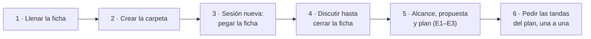

# ⚡ Inicio rápido: un curso nuevo en seis pasos

> **Qué es:** la versión corta de esta carpeta, para arrancar sin leerla entera. Cada paso enlaza el
> documento que lo explica a fondo, para cuando haga falta.
> **Vigencia:** 2026-10-06.



---

> 🧠 **Una sola vez por repositorio:** si todavía no tiene `CLAUDE.md` en la raíz, cópialo del ejemplo
> en inglés: `cp zz-code/CLAUDE-sample-en.md CLAUDE.md` (hay una versión en español para leerlo; ver
> [el README](README.md#-el-claudemd-del-repositorio)).

## 1. 📝 Llena la ficha de arranque

Copia [`plantillas/prompt-de-arranque.md`](plantillas/prompt-de-arranque.md) y llénala: `[x]` en una
opción por pregunta y texto libre donde dice **Explica**. Lo que no tengas claro, márcalo **"Me lo
sugieres tú en la sesión"**; lo que te dé igual, déjalo en blanco. Si quieres ver una llena, el
[ejemplo del README](README.md#-el-prompt-de-arranque) es un curso de Python para dummies con la
historia de [Escapes Houdini](plantillas/ejemplo-historia.md).

## 2. 📁 Crea la carpeta del curso

Dentro de la familia que corresponda, con su `prompts/`, y deja ahí la ficha como borrador:

```text
cursos-<familia>/<slug-del-curso>/prompts/ficha-de-arranque.md
```

Si ninguna familia encaja, se crea una nueva `cursos-<familia>/` (el `CLAUDE.md` lo explica). Si el
curso es todavía solo una idea, puede empezar en `propuestas-cursos/`.

## 3. 💬 Abre una sesión nueva de Claude Code y pega la ficha

Desde la raíz del repositorio, una sesión limpia. Pega la ficha **desde la línea "Vamos a discutir…"**
hasta el final, o pídele que la lea:

```text
Lee cursos-<familia>/<slug>/prompts/ficha-de-arranque.md y sigue sus instrucciones.
```

## 4. 🔁 Discute hasta cerrar la ficha

La sesión no escribe nada todavía. Te devuelve el curso contado en un párrafo, lo que choca entre tus
respuestas, cada respuesta traducida a su decisión `D-xx`, opciones con recomendación para lo que
marcaste "Me lo sugieres tú", y sus preguntas. Respondes, ajusta, y así hasta que digas **"cerrado"**.
Entonces guarda la versión confirmada sobre el borrador y te dice qué etapa sigue.

## 5. 🧭 Alcance, propuesta y plan

Tres sesiones, una por etapa, cada una abierta con su prompt de
[`02-prompts-de-etapa.md`](02-prompts-de-etapa.md):

| Etapa | Qué sale | Prompt |
|---|---|---|
| **E1** · alcance | `prompts/alcance-del-proyecto.md` | [E1](02-prompts-de-etapa.md#e1--idea-y-alcance), o [E1b](02-prompts-de-etapa.md#e1b--basarse-en-un-curso-existente) si el curso hereda la maquinaria de otro |
| **E2** · temario | `prompts/propuesta-fases-y-alcance.md` (y la de apéndices) | [E2](02-prompts-de-etapa.md#e2--propuesta-de-fases-capítulos-y-apéndices) |
| **E3** · plan | `prompts/plan-de-produccion.md`, con todas las tandas | [E3](02-prompts-de-etapa.md#e3--plan-de-producción) |

Con la ficha cerrada, el bloque "La idea" de E1 se reduce a una línea: *"La idea está en
`prompts/ficha-de-arranque.md`"*.

## 6. 🚀 Pide las tandas del plan, una por sesión

Desde aquí manda `prompts/plan-de-produccion.md`. Primero las tandas de preparación (P: guía,
diccionario, contrato, plantillas, prompts, verificación previa) y después las de escritura (T: las
fases). Cada una en una sesión nueva, abierta así:

```text
Trabaja la tanda P4 del curso cursos-<familia>/<slug>, según prompts/plan-de-produccion.md.
```

Para las tandas de escritura está el envoltorio de [E7](02-prompts-de-etapa.md#e7--abrir-una-tanda-de-escritura).
Al cerrar cada tanda la sesión deja el plan al día: qué se escribió, qué se decidió por defecto, las
trampas para la próxima, el código en `zz-code/` y **los tags de git que tienes que crear tú**. Lees la
bitácora (§7 del plan), haces el commit y pides la siguiente.

Cuando no queden tandas: [E8](02-prompts-de-etapa.md#e8--revisión-total-y-cierre), la revisión total y
el cierre; y [E9](02-prompts-de-etapa.md#e9--publicar), si el curso se publica.

---

## 🧷 Lo que conviene saber desde el primer día

- **Git lo manejas tú.** Las sesiones no hacen commits; te dejan escritos los tags.
- **Cada sesión empieza limpia** y lee el plan: no hace falta que recuerde nada de la anterior.
- **Si una sesión pregunta, responde antes de que escriba.** Todos los prompts tienen un paso 1 de
  preguntas, y ahí es donde se evitan las tandas rehechas.
- **El código de las pruebas queda en `zz-code/`**, con un `README.md` para repetirlas
  ([las reglas](../zz-code/README.md)).
- **Para ver los diagramas**, configura VS Code como dice el [README](README.md#️-configurar-vs-code-para-ver-el-curso).
- **El flujo completo**, con sus compuertas y por qué está en este orden:
  [`00-workflow-de-un-curso.md`](00-workflow-de-un-curso.md).
