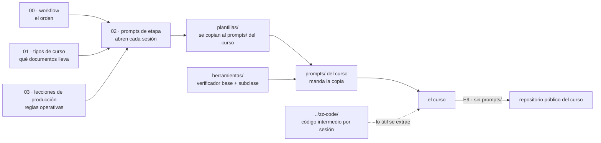

# 🧰 Instrucciones de producción de cursos

> **Qué es esta carpeta:** la maquinaria genérica para **diseñar, preparar y escribir un curso** en
> Markdown con asistencia de un LLM: el flujo de trabajo, los prompts que abren cada etapa y las
> plantillas de los documentos de `prompts/` que todo curso termina necesitando.
> **De dónde sale:** destilada de los `prompts/` de los corpus de `repaso-entrevistas/` y de los cursos
> de `courses-ia-generated` (sobre todo el laboratorio de contenedores y Kubernetes, la Ruta SQL, los
> cursos de lenguajes para devs Java y los cursos legacy). Lo que esos cursos aprendieron a golpes
> está aquí como regla por defecto.
> **Qué no es:** material de ningún curso. Nada de esta carpeta se publica ni se cita desde un curso:
> se **copia** al `prompts/` del curso nuevo, se rellena y desde ese momento manda la copia.
> **Al lado:** [`../zz-code/`](../zz-code/README.md), donde va el código intermedio con el que las
> sesiones prueban las ideas de un curso. Las dos carpetas empiezan por `zz-` para quedar al final del
> listado.
> **Vigencia:** 2026-10-04. **Estado:** primera versión, en uso; se moverá a `courses-ia-generated`,
> que pasará a ser la casa de estos lineamientos.

**Salto rápido:** [Mapa](#️-mapa) · [Cómo se usa](#-cómo-se-usa) · [Convenciones de las plantillas](#-convenciones-de-las-plantillas) · [Lo que queda por discutir](#-lo-que-queda-por-discutir)

---

## 🗺️ Mapa

```text
zz-instrucciones/
├── README.md                          este documento
├── 00-workflow-de-un-curso.md         las etapas E0–E9, sus compuertas y qué sale de cada una
├── 01-tipos-de-curso.md               curso completo, repaso, banco de entrevista, banco de examen
├── 02-prompts-de-etapa.md             el prompt que abre cada etapa, listo para pegar
├── 03-lecciones-de-produccion.md      reglas operativas aprendidas en los cursos ya producidos
├── 04-usar-en-cada-repositorio.md    qué cambia entre job-interview-sept-2026 y courses-ia-generated
├── plantillas/                        se copian al prompts/ del curso nuevo
│   ├── alcance-del-proyecto.md        QUÉ enseña el curso, a quién y con qué límites
│   ├── propuesta-fases-y-alcance.md   el arco, las fichas de fase o capítulo y el registro de decisiones
│   ├── propuesta-apendices-y-alcance.md
│   ├── plan-de-produccion.md          tandas, estado, verificaciones, bitácora y checklist
│   ├── guia-de-estilo-y-convenciones.md   CÓMO se escribe; termina en el checklist de cierre
│   ├── diccionario-de-terminos.md     qué se queda en inglés, qué se traduce y cómo se nombra el código
│   ├── contrato-de-nombres.md         los nombres técnicos congelados antes de escribir
│   ├── plantillas-de-capitulo.md      esqueletos de fase, capítulo, lab, apéndice, simulación y solucionario
│   ├── prompts-de-fase.md             marco común + protocolo de tres pasos + un bloque por fase
│   ├── prompts-de-apendice.md
│   ├── banco-de-preguntas.md          formatos de banco de entrevista y de examen
│   ├── historia-de-la-empresa.md      la empresa ficticia que ancla cada fase (opcional)
│   └── readme-de-prompts.md           el manual de operación del prompts/ de un curso
└── herramientas/
    ├── verificador_base.py            las validaciones base de todo curso, configurables y extensibles
    └── verificar-corpus.py            plantilla: la subclase que cada curso copia a su prompts/ y extiende
```

Cómo se relacionan las piezas:



| Documento | Lo necesitas cuando… |
|---|---|
| [`00-workflow-de-un-curso.md`](00-workflow-de-un-curso.md) | vas a empezar un curso y quieres saber qué viene antes de qué |
| [`01-tipos-de-curso.md`](01-tipos-de-curso.md) | tienes que decidir qué forma tiene el curso y qué documentos lleva |
| [`02-prompts-de-etapa.md`](02-prompts-de-etapa.md) | abres una sesión de etapa (alcance, propuesta, plan, lineamientos, cierre) |
| [`04-usar-en-cada-repositorio.md`](04-usar-en-cada-repositorio.md) | vas a crear el curso en uno de los dos repositorios y necesitas saber qué declarar y con qué perfil verificar |
| [`03-lecciones-de-produccion.md`](03-lecciones-de-produccion.md) | vas a ejecutar algo, tocar archivos o retomar un curso: git, Docker, lo que no se puede correr, trampas |
| [`plantillas/`](plantillas/) | la etapa te pide escribir uno de los documentos de `prompts/` |
| [`herramientas/verificador_base.py`](herramientas/verificador_base.py) y [`verificar-corpus.py`](herramientas/verificar-corpus.py) | preparas el verificador de un curso, o cierras una tanda |

---

## 🚀 Cómo se usa

1. **Lee [`00-workflow-de-un-curso.md`](00-workflow-de-un-curso.md) entero una vez.** Es corto y fija
   el orden: idea y alcance → propuesta de fases y apéndices → plan de producción → lineamientos →
   prompts de sesión → verificación previa → escritura por tandas → cierre.
2. **Elige el tipo de curso** en [`01-tipos-de-curso.md`](01-tipos-de-curso.md). El tipo decide qué
   plantillas copias y cuáles no.
3. **Crea la carpeta del curso con su `prompts/`** y abre la primera sesión pegando el prompt de la
   etapa E1 de [`02-prompts-de-etapa.md`](02-prompts-de-etapa.md). Si el curso se basa en otro que ya
   existe, el prompt es el de E1b.
4. **Copia cada plantilla en el momento en que su etapa la pide**, no todas de golpe: una plantilla
   copiada antes de tiempo se rellena con suposiciones.
5. **Prepara el verificador del curso** en la etapa E4: copia `herramientas/verificador_base.py` y
   `herramientas/verificar-corpus.py` al `prompts/` del curso, y ajusta la subclase de
   `verificar-corpus.py` con los valores de su guía (callouts, bandas, secciones obligatorias,
   autocontención) y sus validaciones propias.
6. **Al cerrar cada tanda**, córrelo desde la raíz del curso:

   ```bash
   python3 prompts/verificar-corpus.py              # todo el curso
   python3 prompts/verificar-corpus.py 04-bloque    # solo un bloque
   ```

   - La base revisa enlaces y anclas, enlaces que salen del curso o citan `prompts/`, restos de
     plantilla (`{{…}}` y `✏️`), codificación rota, emoji en `###`, secciones obligatorias, el
     encabezado, las bandas de líneas y preguntas, el orden de dificultad, los callouts y la
     sincronía pregunta a pregunta con el solucionario, enunciado literal incluido.
   - Antes de tener el curso montado, la base también corre sola:
     `python3 zz-instrucciones/herramientas/verificador_base.py <carpeta-del-curso>`.

---

## 🧷 Convenciones de las plantillas

- **`{{placeholder}}`** — un hueco que se rellena. Si lleva alternativas, van separadas por barras:
  `{{ligera | media | densa}}`; dentro de una tabla, con barra inclinada para no romperla:
  `{{ligera / media / densa}}`. Un `{{…}}` que sobrevive al cierre es un error y el verificador lo
  reporta.
- **`> ✏️ **Plantilla:** …`** — una instrucción para quien rellena, no para el lector. Se borra la
  línea entera al terminar. El verificador busca la marca completa, `✏️ **Plantilla`, así que un ✏️
  suelto en el contenido de un curso (`### ✏️ Edición`) no cuenta como resto.
- **`⚖️ D-xx`** — una decisión que el curso tiene que cerrar, con su valor por defecto. Las plantillas
  traen las decisiones típicas ya escritas como candidatas; el autor las cierra, y la sesión las
  traslada.
- **Los diagramas de esta carpeta están en Mermaid** porque así se pidió para ella. En los cursos no
  es obligatorio: solo cuando se pide de forma explícita al crearlos o al revisarlos (`D-12`).
- **Las secciones opcionales** dicen *(opcional)* en el título de la plantilla y se borran enteras si
  el curso no las usa. Nunca se dejan vacías.
- **La numeración de secciones de las plantillas es la que citan las demás plantillas** (por ejemplo,
  "guía §12" es siempre el checklist de cierre). Si un curso renumera, actualiza las referencias
  cruzadas de sus propios `prompts/` en la misma edición.

---

## 📌 Lo que queda por discutir

Esta es la primera versión. Lo que está escrito como valor por defecto puede cambiar, y estas son las
decisiones que más pesan:

- **El diccionario de términos crece**: hoy trae una semilla de unas 390 entradas en quince áreas.
  Falta agrandarlo y cerrar los ⚖️ marcados (por ejemplo, *librería* contra *biblioteca*, que en el
  repositorio están casi empatadas).
- **El tipo "banco de examen"** es el menos probado: ningún curso existente lo usa todavía, y su
  plantilla está escrita desde cero.
- **Dónde vive el plan de producción**: aquí nace justo después de la propuesta (etapa E3), para que
  la preparación entera quede registrada en tandas. Los cursos existentes lo escribieron al final de la
  preparación; la diferencia está argumentada en el workflow.
- **El verificador** tiene una base común (`verificador_base.py`) y una subclase por curso
  (`verificar-corpus.py`), al estilo del de `bases/03-poo-y-patrones`. Se probó el 2026-10-04 contra
  once cursos reales de los dos repositorios y contra un curso de prueba con un error de cada tipo, que
  detectó todos. En los cursos del repositorio sale en cero salvo por lo que es configuración de cada
  uno: los repasos con autocontención editorial enlazan otros corpus y su guía
  (`AUTOCONTENIDO = False`, `PROHIBIR_ENLACES_A_PROMPTS = False`), y los de nube tienen un solucionario
  con otro formato de entrada (`ENTRADA_RE`).
- **La mudanza a `courses-ia-generated`**: esta carpeta se moverá allí y ese repositorio será la casa
  de los lineamientos. `zz-code/` es por repositorio: cada uno tiene el suyo. Al moverla, se revisan
  las rutas `zz-instrucciones/herramientas/…` de los prompts y del plan, que hoy asumen esta raíz.
- **La herramienta de conversión de enlaces entre cursos** para la etapa E9: hoy los enlaces son
  locales, y se escribe cuando se publique el primer curso.
- **Las lecciones de producción** salen de la memoria de trabajo de los dos repositorios. Cuando se
  cierre un curso nuevo, lo que su bitácora enseñe y sirva a cualquier curso se sube a
  [`03-lecciones-de-produccion.md`](03-lecciones-de-produccion.md).
