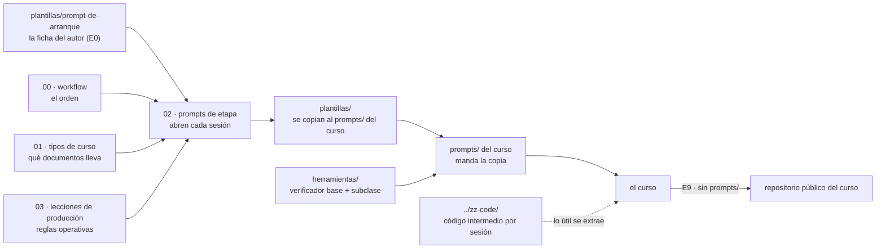

# 🧰 Instrucciones de producción de cursos

> ⚡ **¿Con prisa?** Empieza por [`QUICK-START.md`](QUICK-START.md): un curso nuevo en seis pasos, de
> la ficha de arranque a la primera tanda. Este README es el mapa completo.

> **Qué es esta carpeta:** la maquinaria genérica para **diseñar, preparar y escribir un curso** en
> Markdown con asistencia de un LLM: el flujo de trabajo, los prompts que abren cada etapa y las
> plantillas de los documentos de `prompts/` que todo curso termina necesitando.
> **De dónde sale:** destilada de los `prompts/` de los corpus de `repaso-entrevistas/` y de los cursos
> de `courses-ia-generated` (sobre todo el laboratorio de contenedores y Kubernetes, la Ruta SQL, los
> cursos de lenguajes para devs Java y los cursos legacy). Lo que esos cursos aprendieron a golpes
> está aquí como regla por defecto.
> **Qué no es:** material de ningún curso. Nada de esta carpeta se publica ni se cita desde un curso:
> se **copia** al `prompts/` del curso nuevo, se rellena y desde ese momento manda la copia.
> **Al lado:** [`../zz-code/`](../zz-code/README.md), donde va **todo** el código con el que las
> sesiones prueban las ideas de un curso, cada directorio con un `README.md` que dice cómo correr y
> medir sus pruebas. Las dos carpetas empiezan por `zz-` para quedar al final del
> listado.
> **Estado:** primera versión, en uso; se moverá a `courses-ia-generated`, que pasará a ser la casa
> de estos lineamientos.
> **Alcance:** todo lo que dice esta carpeta rige sin fecha, desde ya, para cualquier curso. Los cursos
> producidos antes no lo cumplen entero y se alinean en sesiones propias; mientras tanto, su estado no
> es un precedente que corrija estas reglas.

**Salto rápido:** [Mapa](#️-mapa) · [Cómo se usa](#-cómo-se-usa) · [Prompt de arranque](#-el-prompt-de-arranque) · [VS Code](#️-configurar-vs-code-para-ver-el-curso) · [CLAUDE.md](#-el-claudemd-del-repositorio) · [Convenciones de las plantillas](#-convenciones-de-las-plantillas) · [Lo que queda por discutir](#-lo-que-queda-por-discutir)

---

## 🗺️ Mapa

```text
zz-instrucciones/
├── README.md                          este documento
├── QUICK-START.md                     un curso nuevo en seis pasos, para arrancar sin leer todo
├── 00-workflow-de-un-curso.md         las etapas E0–E9, sus compuertas y qué sale de cada una
├── 01-tipos-de-curso.md               curso completo, legacy, repaso, banco de entrevista, banco de examen
├── 02-prompts-de-etapa.md             el prompt que abre cada etapa, listo para pegar
├── 03-lecciones-de-produccion.md      reglas operativas aprendidas en los cursos ya producidos
├── 04-usar-en-cada-repositorio.md    qué cambia entre job-interview-sept-2026 y courses-ia-generated
├── plantillas/                        se copian al prompts/ del curso nuevo
│   ├── alcance-del-proyecto.md        QUÉ enseña el curso, a quién y con qué límites
│   ├── propuesta-fases-y-alcance.md   el arco, las fichas de fase o capítulo y el registro de decisiones
│   ├── propuesta-apendices-y-alcance.md
│   ├── plan-de-produccion.md          tandas, estado, verificaciones, bitácora y checklist
│   ├── guia-de-estilo-y-convenciones.md   CÓMO se escribe; termina en el checklist de cierre
│   ├── diccionario-de-terminos.md     qué se queda en inglés, qué se traduce y cómo se nombra el código
│   ├── contrato-de-nombres.md         los nombres técnicos congelados antes de escribir
│   ├── convencion-de-git-y-tags.md    cómo versiona el lector; va publicada en la raíz del curso
│   ├── plantillas-de-capitulo.md      esqueletos de fase, capítulo, lab, apéndice, simulación y solucionario
│   ├── prompts-de-fase.md             marco común + protocolo de tres pasos + un bloque por fase
│   ├── prompts-de-apendice.md
│   ├── banco-de-preguntas.md          formatos de banco de entrevista y de examen
│   ├── historia-de-la-empresa.md      la empresa ficticia que ancla cada fase (opcional)
│   ├── ejemplo-historia.md            esa plantilla llena: Escapes Houdini, el taller del ejemplo de este README; no se copia
│   ├── readme-de-prompts.md           el manual de operación del prompts/ de un curso
│   └── prompt-de-arranque.md          la ficha que llena el autor para abrir la discusión (E0); no se copia
└── herramientas/
    ├── verificador_base.py            las validaciones base de todo curso, configurables y extensibles
    ├── verificar-corpus.py            plantilla: la subclase que cada curso copia a su prompts/ y extiende
    ├── exportar-diagramas.py          saca cada diagrama Mermaid de los .md a PNG o SVG (mmdc, npx o Docker)
    └── rescatar-transcripcion.py      reconstruye de la transcripción de una sesión el código que escribió y corrió
```

Cómo se relacionan las piezas:



| Documento | Lo necesitas cuando… |
|---|---|
| [`plantillas/prompt-de-arranque.md`](plantillas/prompt-de-arranque.md) | tienes la idea de un curso y quieres abrir la discusión ([explicada abajo](#-el-prompt-de-arranque)) |
| [`00-workflow-de-un-curso.md`](00-workflow-de-un-curso.md) | vas a empezar un curso y quieres saber qué viene antes de qué |
| [`01-tipos-de-curso.md`](01-tipos-de-curso.md) | tienes que decidir qué forma tiene el curso y qué documentos lleva |
| [`02-prompts-de-etapa.md`](02-prompts-de-etapa.md) | abres una sesión de etapa (alcance, propuesta, plan, lineamientos, cierre) |
| [`04-usar-en-cada-repositorio.md`](04-usar-en-cada-repositorio.md) | vas a crear el curso en uno de los dos repositorios y necesitas saber qué declarar y con qué perfil verificar |
| [`03-lecciones-de-produccion.md`](03-lecciones-de-produccion.md) | vas a ejecutar algo, tocar archivos o retomar un curso: git, Docker, lo que no se puede correr, trampas |
| [`plantillas/`](plantillas/) | la etapa te pide escribir uno de los documentos de `prompts/` |
| [`herramientas/verificador_base.py`](herramientas/verificador_base.py) y [`verificar-corpus.py`](herramientas/verificar-corpus.py) | preparas el verificador de un curso, o cierras una tanda |

---

## 🚀 Cómo se usa

0. **Llena el [prompt de arranque](#-el-prompt-de-arranque)** y pégalo en una sesión nueva: es la
   discusión inicial (E0), y termina con la carpeta del curso creada y su `prompts/ficha-de-arranque.md`.
1. **Lee [`00-workflow-de-un-curso.md`](00-workflow-de-un-curso.md) entero una vez.** Es corto y fija
   el orden: idea y alcance → propuesta de fases y apéndices → plan de producción → lineamientos →
   prompts de sesión → verificación previa → escritura por tandas → cierre.
2. **Elige el tipo de curso** en [`01-tipos-de-curso.md`](01-tipos-de-curso.md). El tipo decide qué
   plantillas copias y cuáles no.
3. **Crea la carpeta del curso con su `prompts/`** y abre la primera sesión pegando el prompt de la
   etapa E1 de [`02-prompts-de-etapa.md`](02-prompts-de-etapa.md). Si el curso se basa en otro que ya
   existe, el prompt es el de E1b.
4. **Copia cada plantilla en el momento en que su etapa la pide**, no todas de golpe: una plantilla
   copiada antes de tiempo se rellena con suposiciones.
5. **Prepara el verificador del curso** en la etapa E4: copia `herramientas/verificador_base.py` y
   `herramientas/verificar-corpus.py` al `prompts/` del curso, y ajusta la subclase de
   `verificar-corpus.py` con los valores de su guía (callouts, bandas, secciones obligatorias,
   autocontención) y sus validaciones propias.
6. **Al cerrar cada tanda**, córrelo desde la raíz del curso:

   ```bash
   python3 prompts/verificar-corpus.py              # todo el curso
   python3 prompts/verificar-corpus.py 04-bloque    # solo un bloque
   ```

   - La base revisa enlaces y anclas, enlaces que salen del curso o citan `prompts/`, restos de
     plantilla (`{{…}}` y `✏️`), codificación rota, emoji en `###`, secciones obligatorias, el
     encabezado, las bandas de líneas y preguntas, el orden de dificultad, los callouts y la
     sincronía pregunta a pregunta con el solucionario, enunciado literal incluido.
   - Antes de tener el curso montado, la base también corre sola:
     `python3 zz-instrucciones/herramientas/verificador_base.py <carpeta-del-curso>`.

---

## 🚀 El prompt de arranque

[`plantillas/prompt-de-arranque.md`](plantillas/prompt-de-arranque.md) es la ficha con la que se
**abre la discusión** de un curso nuevo (etapa E0). Va aparte de las demás plantillas porque no la
llena una sesión: la llena el autor, marcando casillas, y la pega en una sesión nueva. La sesión no
escribe ningún documento: devuelve el curso contado en un párrafo, las combinaciones que chocan, cada
respuesta traducida a su decisión `D-xx` y sus preguntas. Cuando el autor cierra la discusión, la
sesión crea la carpeta del curso y guarda la ficha confirmada como `prompts/ficha-de-arranque.md`,
que es la entrada de E1 (o de E1b, si el curso hereda la maquinaria de otro).

**Cómo se llena:** `[x]` en una opción por pregunta; las líneas de **Explica** y los `{{…}}` en texto
libre. Para lo que todavía no está claro hay dos salidas, y no son lo mismo:

- **Dejarla en blanco** cuando da igual: la sesión asume su valor por defecto, lo marca como tal en la
  tabla de decisiones, y la pregunta se da por cerrada salvo que el autor la reabra.
- **Marcar "Me lo sugieres tú en la sesión"** cuando importa pero no hay decisión. Todas las preguntas
  la traen (también el título y la inspiración). La sesión no asume nada: por cada una propone de dos a
  cuatro opciones pensadas para *este* curso, con lo que gana y lo que pierde cada una, su
  recomendación y las preguntas que haría para afinarla. Las ordena de la que más condiciona a las
  demás (tipo, audiencia, profundidad) a la que menos. En cada vuelta de la discusión vuelve a listar
  las que siguen abiertas, con ideas nuevas si las anteriores no convencieron y con lo que las otras
  respuestas cambiaron. **Ninguna se cierra hasta que el autor elige**, y la ficha no se guarda con
  una pregunta así abierta.

Una ficha puede llegar casi entera en "Me lo sugieres tú": entonces la sesión de arranque es una
lluvia de ideas guiada, y su primera vuelta conviene limitarla a las tres preguntas que condicionan
todo lo demás. Las preguntas y a qué decisión del alcance llevan:

| Pregunta | Opciones | Va a |
|---|---|---|
| 1 · Título tentativo | texto, más la frase y el porqué | §1 del alcance; el porqué es el *disparador* de E0 |
| 2 · Tipo de curso | completo · legacy · repaso · banco de entrevista · banco de examen · mezcla | `D-02`, y qué plantillas se copian ([`01-tipos-de-curso.md`](01-tipos-de-curso.md)) |
| 3 · Audiencia | dummie · con conocimientos · senior | el lector del alcance; si no es gente de IT, la guía declara la excepción al `CLAUDE.md` |
| 4 · Profundidad | lo básico · medio · full geek · súper saiyajin | una decisión propia del curso (`D-14`); mueve los pesos de `D-04` |
| 5 · Ejercicios | sí · no; y su dificultad: equilibrados de punta a punta · hasta medio · solo fáciles · solo de medio a difícil · aleatorio | `D-05`: cantidad y reparto 🟢🟡🟠🔴🔥 |
| 6 · Taller | no · uno global · por sección · boss por sección + boss final | `D-09` y, si hay bosses, el formato de miniproyectos |
| 7 · Respuestas | documento separado · en cada ejercicio | `D-05` (solucionario o `<details>`) |
| 8 · Código de ejemplo | sí, con stack y versiones · no | `D-09` y `D-07` |
| 9 · Inspiración | rutas, y qué tomar de cada una | material de partida de E1, o la base de E1b |
| 10 · Diagramas | no o a criterio · ASCII · Mermaid | `D-12` |
| 11 · Tipo de prueba | inspección · contenedor · máquina local | `D-08` y `D-06` |
| 12 · `zz-code/` documentado | sí · no | las reglas 7–10 de `zz-code/README.md`; "no" se declara como excepción |
| 13 · Historia | no · sí con idea · sí, que proponga la IA | `D-11` y la plantilla de historia |
| 14 · Organización | una sola secuencia · en bloques · en pistas paralelas | `D-02` (tipo y organización), alcance §9 y propuesta §3.0 ([`01-tipos-de-curso.md` §10](01-tipos-de-curso.md#10--cursos-extensos-bloques-y-pistas)) |
| 15 · Lo demás | lo que no se quiere, tamaño, notas | fuera de alcance y `D-04` |

### Un ejemplo lleno: Python desde cero para el taller

Un curso de Python para alguien que nunca programó, anclado en un taller mecánico de verdad. La
historia que sale de la pregunta 13, ya escrita sobre la plantilla de historia, es
[`plantillas/ejemplo-historia.md`](plantillas/ejemplo-historia.md): **Escapes Houdini**, con su
cronología, su gente, sus papeles, el incidente de la garantía que abre el curso, sus cifras y sus
reglas de negocio. Sirve de modelo para el tono y el nivel de detalle de cualquier historia. Así queda
la ficha (solo las respuestas; las opciones no marcadas se omiten). El autor tenía dudas con la
profundidad y los diagramas, y las dejó para la sesión:

```markdown
## 1. 🏷️ Título tentativo
Python desde cero: el sistema del taller
**De qué va, en una frase:** aprender a programar en Python construyendo, paso a paso, el sistema
que reemplaza el cuaderno y el Excel de un taller mecánico.
**Por qué ahora:** contenido para YouTube; un curso para quien nunca programó y se asusta con los
tutoriales en inglés.

## 2. 🧩 Tipo de curso
- [x] **Curso completo**

## 3. 👤 Audiencia
- [x] **Dummie**
**Qué sabe ya y qué no hay que explicarle:** usa Excel y WhatsApp; nunca abrió una terminal. Hay
que explicarle todo, empezando por qué es un archivo y una carpeta.

## 4. 🔬 Profundidad
- [x] **Me lo sugieres tú en la sesión**

## 5. 🧪 Ejercicios
- [x] **Sí** — unos 12 por fase
- [x] **Equilibrados hasta medio** — 🟢 🟡 🟠, sin difíciles ni boss

## 6. 🛠️ Taller
- [x] **Miniproyecto boss por sección + boss final**
**Explica:** cada sección cierra con una pieza del sistema del taller: clientes y vehículos, órdenes
de trabajo, inventario de repuestos, cotizaciones y cobro. El boss final las une en un programa de
consola que guarda en SQLite y saca el reporte del mes.

## 7. ✅ Respuestas
- [x] **Respuestas en cada ejercicio** — plegadas debajo del enunciado

## 8. 💻 Código de ejemplo
- [x] **Sí** — Python 3, la última estable; solo la biblioteca estándar más pytest

## 9. 🎨 Inspiración
| Ruta | Tomar el tema | Tomar el estilo | Tomar la estructura |
|---|---|---|---|
| cursos-algoritmos-lenguajes/python-for-java-devs | sí | no | sí |
| cursos-contenedores-cloud-infra/lab-docker-kubernetes | no | sí | no |

## 10. 📐 Diagramas
- [x] **Me lo sugieres tú en la sesión**

## 11. 🧫 Tipo de prueba
- [x] **Creación y ejecución en contenedor**

## 12. 📦 Código generado en `zz-code/`
- [x] **Sí, con documentación completa**

## 13. 🎭 Historia
- [x] **Sí, con mi idea:** Escapes Houdini, un taller de escapes en Barranquilla. Lo abrió un
mecánico de la costa que se especializó en escapes en el taller de un concesionario Mercedes-Benz,
con dos amigos pensionados que buscaban dónde invertir; el nombre lo puso uno de ellos medio en broma
y quedó. Todo empezó en hojas con gancho y cuadernos verdes; la sobrina de un socio, de secretaria
mientras estudiaba, organizó como pudo y después aprendió Excel y macros (la factura en plantilla,
impresa en dos copias). Un amigo que busca emprender usa el taller como piloto de un futuro software
para talleres: la primera versión, local, en la laptop de la oficina.

## 14. 🧱 Organización
- [x] **Una sola secuencia**

## 15. 📝 Lo demás
- **Lo que NO quiero:** frameworks web, programación orientada a objetos avanzada, nada en la nube.
- **Tamaño o tiempo disponible:** unas 15 fases.
```

Lo que la sesión debería devolver en el paso 2, entre otras cosas:

- **El choque con el `CLAUDE.md`**: su audiencia por defecto es gente de IT, y esta no lo es. La guía
  del curso declara la excepción (lector, tono y "no explicar lo básico") con su porqué.
- **El contenedor contra el lector**: las pruebas de la sesión corren en contenedor, pero el lector
  dummie va a instalar Python en su propia máquina. La fase de instalación necesita un camino por
  sistema operativo, y lo que el autor no verifique en su máquina se marca *no verificado* (`D-06`).
- **La inspiración partida**: de `python-for-java-devs` se toman el temario y la estructura de fases,
  pero no el tono, que supone un lector con oficio; el tono y el uso de la historia vienen de
  `lab-docker-kubernetes`.
- **Las dos que dejó para la sesión**, con opciones y recomendación. *Profundidad:* "lo básico"
  (usar Python con confianza y terminar el sistema del taller), "medio" (además, entender por qué
  funciona: memoria, errores, tipos) o "básico con 🔥 opcionales" para quien quiera más; recomienda
  la última, porque un lector dummie abandona si el camino base se pone denso, y pregunta si el curso
  apunta a que el lector consiga trabajo o solo a que resuelva su taller. *Diagramas:* ninguno
  obligatorio, ASCII (se ve igual en cualquier editor y en el celular) o Mermaid (se ve mejor en
  GitHub y en VS Code con la extensión, y sirve para el video); recomienda Mermaid, porque es contenido
  para YouTube, y pregunta si los videos se graban desde VS Code o desde GitHub.
- **Lo que el reparto de dificultad pide**: "hasta medio" en los ejercicios no deja sin reto al
  lector, porque el reto vive en los bosses del taller. La sesión lo señala y propone repartir los 12
  en 5 🟢, 4 🟡 y 3 🟠, distinto en fases vecinas.
- **Las decisiones** que ya puede escribir: `D-02` curso completo en una sola secuencia · `D-04` peso ligero en casi todas
  las fases · `D-05` 12 ejercicios hasta 🟠 con solución plegada · `D-09` un proyecto que crece con tags por
  boss · `D-11` con historia · `D-12` y `D-14` abiertas hasta que el autor elija.
- **La historia, en dos o tres versiones de un párrafo** para elegir el énfasis (Lorena como
  protagonista que aprende, Pipe como mentor con su piloto, o Wilfrido como el que desconfía del
  computador), y después el documento completo, como el de
  [`plantillas/ejemplo-historia.md`](plantillas/ejemplo-historia.md).
- **Preguntas**: si el boss final es de consola o con una interfaz mínima; si la historia usa nombres
  de personas o negocios reales (no: todo inventado y declarado como tal, incluido el taller).

---

## 🖥️ Configurar VS Code para ver el curso

Los cursos son Markdown con diagramas en Mermaid (o en `text`), y VS Code los muestra bien con dos
extensiones. Ninguna pide cuenta ni manda los diagramas a ningún servicio.

| Extensión | ID | Para qué |
|---|---|---|
| **Markdown Preview Mermaid Support** | `bierner.markdown-mermaid` | dibuja los bloques ` ```mermaid ` dentro de la vista previa normal de Markdown, con zoom y desplazamiento |
| **Mermaid Preview** | `MermaidChart.vscode-mermaid-preview` | abre **cada diagrama por separado** en un panel, para editarlo con vista en vivo, hacer zoom y exportarlo a PNG o SVG |

Se instalan desde la vista de extensiones (`Ctrl+Shift+X`, en macOS `Cmd+Shift+X`) buscando el ID, o
por terminal:

```bash
code --install-extension bierner.markdown-mermaid
code --install-extension MermaidChart.vscode-mermaid-preview
```

> ⚠️ **No confundir con "Mermaid Chart"** (`MermaidChart.vscode-mermaid-chart`), de los mismos autores:
> desde su versión 2.7.7 pide iniciar sesión hasta para previsualizar. La que se usa aquí es *Mermaid
> Preview*, que es local.

**Leer una lección con sus diagramas.** Con el `.md` abierto, `Ctrl+Shift+V` (`Cmd+Shift+V`) abre la
vista previa en una pestaña, y `Ctrl+K V` (`Cmd+K V`) la abre al lado del código, desplazándose junto
con él. Los diagramas se dibujan en su lugar.

**Hacer zoom dentro de la vista previa.** Al pasar el mouse sobre un diagrama aparecen sus controles
(acercar, alejar, desplazar y volver al tamaño original). También se hace zoom con `Alt` + rueda del
mouse o pellizcando el trackpad, y se desplaza con `Alt` + arrastrar. Tres ajustes de
`settings.json` ayudan con los diagramas grandes:

```json
{
  "markdown-mermaid.mouseNavigation.enabled": "alt",
  "markdown-mermaid.controls.show": "onHoverOrFocus",
  "markdown-mermaid.resizable": true,
  "markdown-mermaid.darkModeTheme": "dark",
  "markdown-mermaid.lightModeTheme": "default"
}
```

**Ver un diagrama solo y editarlo.** Con *Mermaid Preview* instalada, encima de cada bloque
` ```mermaid ` de un `.md` aparece un enlace (*edit diagram*) que abre ese diagrama en su propio panel.
También desde la paleta de comandos (`Ctrl+Shift+P` / `Cmd+Shift+P`): **Mermaid Preview: Preview
Diagram**. El panel tiene zoom, desplazamiento y vuelta al tamaño original, y se actualiza mientras
se escribe. Los archivos `.mmd` se abren directo con resaltado y vista en vivo. **Mermaid Preview:
Export** guarda el diagrama abierto como PNG o SVG.

### Generar los PNG de todos los diagramas por terminal

Para sacar las imágenes de un curso entero (para un video, una presentación o revisar cómo quedan) se
usa la herramienta oficial, **mermaid-cli** (`mmdc`), que dibuja con un Chrome sin interfaz. Hay tres
caminos; el de Docker no instala nada en la máquina.

**1. Con Node (lo más directo).** Instala Node en su versión **LTS** y después mermaid-cli:

- **Windows:** el instalador `.msi` de la versión LTS de <https://nodejs.org/> (siguiente, siguiente,
  con "Add to PATH" marcado), o en una terminal `winget install OpenJS.NodeJS.LTS`. Cierra y abre la
  terminal para que tome el `PATH`.
- **macOS:** el instalador `.pkg` LTS de <https://nodejs.org/>, o `brew install node`.
- **Linux:** la página de descargas de <https://nodejs.org/> trae el comando para instalar la LTS con
  `nvm`; el paquete `nodejs` de la distribución suele estar varias versiones atrás.

```bash
node --version && npm --version          # comprobar
npm install -g @mermaid-js/mermaid-cli   # instala el comando mmdc
mmdc -h                                  # comprobar

mmdc -i flujo.mmd -o flujo.png -s 2 -b white       # un diagrama, PNG al doble de resolución
mmdc -i flujo.mmd -o flujo.svg -t dark             # SVG con tema oscuro
mmdc -i leccion.md -o leccion-con-imagenes.md -e png
#   ↑ toma un Markdown, dibuja cada bloque mermaid como leccion-con-imagenes-1.png, -2.png…
#     y escribe una copia del .md con las imágenes en lugar de los bloques (el original no cambia)
```

Sin instalar nada globalmente: `npx -p @mermaid-js/mermaid-cli mmdc -i flujo.mmd -o flujo.png`.

**2. Con Docker (sin Node en la máquina).** La imagen oficial trae Node, mmdc y Chrome:

```bash
docker run --rm -u "$(id -u):$(id -g)" -v "$PWD":/data minlag/mermaid-cli -i flujo.mmd -o flujo.png -s 2
```

En Windows con PowerShell, `-v "${PWD}:/data"` y sin el `-u`.

**3. Con Python, para un curso entero.** [`herramientas/exportar-diagramas.py`](herramientas/exportar-diagramas.py)
recorre un archivo o una carpeta, saca cada bloque ` ```mermaid ` a su propio `.mmd` y lo convierte
con cualquiera de los dos caminos anteriores. Necesita Python 3 y nada más que la biblioteca estándar:

- **Windows:** el instalador de la última versión estable de <https://www.python.org/downloads/>,
  **marcando "Add python.exe to PATH"** en la primera pantalla; o `winget search Python.Python` y
  `winget install` del ID de la versión más alta.
- **macOS:** el instalador de <https://www.python.org/downloads/>, o `brew install python`.
- **Linux:** viene con casi todas las distribuciones (`python3 --version`); si no,
  `sudo apt install python3` o el equivalente de la distribución.

```bash
python3 zz-instrucciones/herramientas/exportar-diagramas.py cursos-legacy/react-16-legacy-for-backend-devs \
        --salida diagramas-react16                    # con mmdc instalado
python3 zz-instrucciones/herramientas/exportar-diagramas.py zz-instrucciones/01-tipos-de-curso.md --motor docker
python3 zz-instrucciones/herramientas/exportar-diagramas.py zz-instrucciones/README.md --motor npx --formato svg --tema dark
```

Deja en la carpeta de salida un `<archivo>-NN.mmd` y su imagen por diagrama, y al final cuántos
fallaron. Un diagrama que falla casi siempre tiene un error de sintaxis: el `.mmd` queda ahí para
abrirlo con *Mermaid Preview* y ver dónde. En Windows, el comando es `py` o `python` en lugar de
`python3`.

> ⚠️ **En Linux, mmdc puede fallar al arrancar Chrome** por el sandbox, sobre todo como root o dentro
> de un contenedor propio. El README de mermaid-cli explica cómo pasarle una configuración de
> Puppeteer; el camino de Docker evita el problema.

---

## 🧠 El `CLAUDE.md` del repositorio

Claude Code lee el `CLAUDE.md` de la raíz al empezar cada sesión: es la memoria base del proyecto. Para
un repositorio de cursos nuevo hay uno de ejemplo listo para usar, alineado con todo lo de esta carpeta:

- [`../zz-code/CLAUDE-sample-en.md`](../zz-code/CLAUDE-sample-en.md) — **el que se copia**, en inglés.
- [`../zz-code/CLAUDE-ejemplo-es.md`](../zz-code/CLAUDE-ejemplo-es.md) — el mismo contenido en español,
  **solo para leerlo**.

```bash
cp zz-code/CLAUDE-sample-en.md CLAUDE.md     # en la raíz del repositorio
```

Después se ajustan dos cosas: el nombre de las carpetas personales del autor (si las hay) y cualquier
valor por defecto que el repositorio quiera distinto. Si el repositorio ya tiene un `CLAUDE.md`, no se
reemplaza a ciegas: se comparan y se pasa lo que falte.

**Por qué en inglés:** es el idioma en que el modelo sigue instrucciones con más precisión, y el
archivo se lee al principio de cada sesión. Los cursos siguen escritos en español porque el ejemplo lo
manda. **Si el inglés es una barrera**, edita la versión en español y pide a tu LLM de confianza que la
traduzca al inglés antes de copiarla; quita el recuadro de "solo para leer" de la copia.

**Lo que fija y lo que no.** Fija solo lo transversal: qué es el repositorio, dónde está cada cosa, el
orden de autoridad, la anatomía de un curso, el flujo, las reglas editoriales por defecto, las reglas
de sesión (git, Docker, `zz-code/`, nada de instalar) y qué guarda la memoria. **No fija audiencia**:
dice que los cursos son para cualquier audiencia y que cada uno la declara en su ficha de arranque. Así
no contradice un curso para dummies ni uno para seniors. Lo mismo con la cantidad y la dificultad de
los ejercicios, el formato de los diagramas y la historia: los decide la ficha.

---

## 🧷 Convenciones de las plantillas

- **`{{placeholder}}`** — un hueco que se rellena. Si lleva alternativas, van separadas por barras:
  `{{ligera | media | densa}}`; dentro de una tabla, con barra inclinada para no romperla:
  `{{ligera / media / densa}}`. Un `{{…}}` que sobrevive al cierre es un error y el verificador lo
  reporta.
- **`> ✏️ **Plantilla:** …`** — una instrucción para quien rellena, no para el lector. Se borra la
  línea entera al terminar. El verificador busca la marca completa, `✏️ **Plantilla`, así que un ✏️
  suelto en el contenido de un curso (`### ✏️ Edición`) no cuenta como resto.
- **`⚖️ D-xx`** — una decisión que el curso tiene que cerrar, con su valor por defecto. Las plantillas
  traen las decisiones típicas ya escritas como candidatas; el autor las cierra, y la sesión las
  traslada.
- **Los diagramas de esta carpeta están en Mermaid** porque así se pidió para ella. En los cursos no
  es obligatorio: solo cuando se pide de forma explícita al crearlos o al revisarlos (`D-12`).
- **Las secciones opcionales** dicen *(opcional)* en el título de la plantilla y se borran enteras si
  el curso no las usa. Nunca se dejan vacías.
- **La convención de git no va en `prompts/`**: se copia a la raíz del curso como
  `00-convencion-de-git-y-tags.md`, se publica con él y cada fase la enlaza desde su bloque 🏷️ de
  cierre. Es, junto con la historia, la única plantilla que produce un documento que lee el lector.
  Parte de una regla fija: **el curso se escribe en este repositorio y el lector lo copia a un
  repositorio propio para hacerlo**; sus commits y sus tags viven en esa copia, nunca aquí.
- **La numeración de secciones de las plantillas es la que citan las demás plantillas** (por ejemplo,
  "guía §12" es siempre el checklist de cierre). Si un curso renumera, actualiza las referencias
  cruzadas de sus propios `prompts/` en la misma edición.

---

## 📌 Lo que queda por discutir

Esta es la primera versión. Lo que está escrito como valor por defecto puede cambiar, y estas son las
decisiones que más pesan:

- **El diccionario de términos crece**: hoy trae una semilla de unas 390 entradas en quince áreas.
  Falta agrandarlo y cerrar los ⚖️ marcados (por ejemplo, *librería* contra *biblioteca*, que en el
  repositorio están casi empatadas).
- **El tipo "banco de examen"** es el menos probado: ningún curso existente lo usa todavía, y su
  plantilla está escrita desde cero.
- **Dónde vive el plan de producción**: aquí nace justo después de la propuesta (etapa E3), para que
  la preparación entera quede registrada en tandas. Los cursos existentes lo escribieron al final de la
  preparación; la diferencia está argumentada en el workflow.
- **El verificador** tiene una base común (`verificador_base.py`) y una subclase por curso
  (`verificar-corpus.py`), al estilo del de `bases/03-poo-y-patrones`. Se probó contra
  once cursos reales de los dos repositorios y contra un curso de prueba con un error de cada tipo, que
  detectó todos. En los cursos del repositorio sale en cero salvo por lo que es configuración de cada
  uno: los repasos con autocontención editorial enlazan otros corpus y su guía
  (`AUTOCONTENIDO = False`, `PROHIBIR_ENLACES_A_PROMPTS = False`), y los de nube tienen un solucionario
  con otro formato de entrada (`ENTRADA_RE`).
- **La mudanza a `courses-ia-generated`**: esta carpeta se moverá allí y ese repositorio será la casa
  de los lineamientos. `zz-code/` es por repositorio: cada uno tiene el suyo. Al moverla, se revisan
  las rutas `zz-instrucciones/herramientas/…` de los prompts y del plan, que hoy asumen esta raíz.
- **La herramienta de conversión de enlaces entre cursos** para la etapa E9: hoy los enlaces son
  locales, y se escribe cuando se publique el primer curso.
- **Las lecciones de producción** salen de la memoria de trabajo de los dos repositorios. Cuando se
  cierre un curso nuevo, lo que su bitácora enseñe y sirva a cualquier curso se sube a
  [`03-lecciones-de-produccion.md`](03-lecciones-de-produccion.md).
