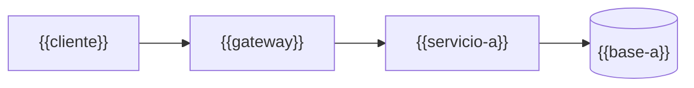

# 🎯 Alcance del proyecto
## {{Nombre del curso}}

> ✏️ **Plantilla:** se escribe en la etapa E1, en conversación. Borra todas las líneas ✏️ al cerrar.
> Las secciones *(opcional)* se borran enteras si el curso no las usa; las demás no se saltan.

> **Qué es este documento:** la fuente de verdad de **qué** enseña el curso, a quién y con qué
> límites. Lo que no esté aquí no está en el curso.
> **Fecha de esta versión:** {{DD de mes de AAAA}}. {{Qué consolida: la idea inicial, una propuesta
> previa, decisiones de la sesión del …}}
> **Precedencia:** manda este documento. Después viene
> [`guia-de-estilo-y-convenciones.md`](guia-de-estilo-y-convenciones.md), que decide **cómo** se
> escribe; después [`contrato-de-nombres.md`](contrato-de-nombres.md) y
> [`diccionario-de-terminos.md`](diccionario-de-terminos.md), y las propuestas. Las plantillas y los
> prompts se actualizan siempre al final. {{Por encima de todos está el `CLAUDE.md` del repositorio,
> en lo que este curso no haya declarado como excepción (§12) | El curso es autocontenido y no
> depende de ningún `CLAUDE.md` externo (D-03 total)}}.
> **Estado de las decisiones:** {{N}} cerradas, {{M}} abiertas (§12).

---

## 1. 🧭 En una frase

**{{Un curso que enseña X haciendo Y, para que el lector pueda Z.}}**

{{Un segundo párrafo con lo que el curso NO forma: no forma administradores, no prepara una
certificación, no enseña a programar… y la capacidad concreta que sí forma, dicha como la frase que
el lector podrá decir después.}}

---

## 2. 🔥 El problema que resuelve

{{Qué tiene ya el lector y qué le falta. Por qué le falta: la razón concreta, no "es difícil".
Dónde aprende hoy eso, y qué le cuesta aprenderlo así.}}

El villano es uno solo, **{{la confusión que el curso ataca}}**, y tiene {{dos o tres}} caras:

- **"{{La frase que el lector dice hoy}}."** {{Por qué es falsa o incompleta, y qué parte del curso
  existe para demostrarlo.}}
- **"{{…}}."** {{…}}

> ⚠️ **El antagonista no es ninguna herramienta.** {{Cada opción gana en algún sitio; el curso cierra
> con el veredicto de cuándo no hacía falta nada de esto.}}

---

## 3. 🎓 Objetivo pedagógico

Al terminar, el lector puede hacer {{cinco o seis}} cosas que antes no podía:

1. **{{Verbo + objeto verificable}}**: {{el detalle que lo hace comprobable}}.
2. **{{…}}**

> ✏️ **Plantilla:** "entender X" no es verificable; "diagnosticar X en los primeros treinta segundos,
> diciendo qué mirar y qué hipótesis descartar" sí lo es.

Lo que **no** es objetivo: {{lista corta y tajante}}.

---

## 4. 👥 Perfil del lector

{{Quién es: nivel, años, lenguajes, qué ha usado. Una frase que resuma qué se le explica y qué no:
"Se le explica infraestructura, no programación".}}

**Lo que se da por sabido y no se explica jamás:** {{lista}}.

**Lo que se explica con cero ambigüedad**, aunque el lector sea senior: {{los conceptos donde la
intuición falla}}.

> 🧭 **Ninguna caja negra prematura, no menos profundidad.** Si una frase obliga al lector a suponer
> algo, está mal escrita.

**Requisitos de entrada:** {{máquina, sistema operativo, memoria, cuentas, conocimientos}}. {{Lo que
NO hace falta tener instalado.}}

---

## 5. 🧭 La pregunta que ordena el curso

> *{{La pregunta, en una línea, que el curso entero responde.}}*

Se presenta en {{la primera fase}}, reaparece en {{el veredicto de cada fase | la simulación de cada
bloque}} y ordena el arco:

- {{Partes que responden la primera mitad de la pregunta.}}
- {{Partes que responden la segunda.}}
- {{El cierre, que responde la pregunta entera.}}

---

## 6. 📏 Cómo se mide *(opcional)*

> ✏️ **Plantilla:** para cursos que comparan alternativas con números. Un repaso sin laboratorio la
> sustituye por "Cómo se evalúa" (preguntas, simulación, solucionario) o la borra.

**Todo "mejor que" lleva un número**, medido con un arnés consistente y consolidado en
`BENCHMARKS.md`. Lo que el curso mide es {{qué costo: tamaño, tiempo, memoria, latencia…}}, no
{{lo que no mide}}.

Las reglas de honestidad no se negocian: se publica lo que salió y no lo que se esperaba · el empate
se llama empate · nada de números redondos sin dispersión · el competidor se configura bien · se
declara lo que no se midió · y nunca se extrapola de un portátil a producción.

Dos anclas por fase, cuando la fase las admite: 🪞 **una apuesta** escrita antes de ejecutar y nunca
editada después, y 🧨 **una rotura provocada**, con el síntoma literal y lo que costó salir.

---

## 7. 🧪 El sistema del curso *(opcional)*

> ✏️ **Plantilla:** el sistema de ejemplo, el laboratorio o la empresa ficticia. Si existe, se declara
> entero aquí aunque coincida con el de otro curso: coincidir ayuda, depender castiga. **La historia es
> opcional (`D-11`)** y depende de la idea: un repaso corto suele ir con un sistema de ejemplo neutro;
> un curso pensado para generar contenido en YouTube o TikTok gana mucho con una empresa ficticia, y
> tiende a ser más largo y completo.

### 7.1 El dominio

{{Qué hace el sistema, con cuántas entidades, y qué complejidad de negocio queda fuera a propósito.
Si hay una historia, el nombre de la empresa y dónde vive el documento de historia.}}

### 7.2 El stack, y qué compra cada pieza

| Pieza | Elección | Qué compra | Qué cuesta |
|---|---|---|---|
| {{…}} | {{…}} | {{…}} | {{…}} |

### 7.3 Cómo se construye el código

{{A mano, generado con prompts publicados, o andamiaje que el curso entrega. Si se genera: contrato,
suite de conformidad y prompts escalonados.}}

### 7.4 El tamaño mínimo

{{Cuánta memoria, cuánto disco, cuántos procesos. Si es restricción de diseño, dilo.}}

---

## 8. 🧰 Herramientas y plataformas

{{Las herramientas, con la política de versiones (no los números: viven en {{a01 | la guía}}).
Las plataformas soportadas, siempre en el mismo orden, y cuál verifica el autor.}}

---

## 9. 🪜 La forma del curso

**Tipo:** {{curso completo | curso legacy | curso repaso | banco de entrevista | banco de examen}}.
**Organización:** {{una sola secuencia, con partes | N bloques con directorio propio, troncal
{{01-slug}} | pistas paralelas: el eje y la práctica}} (`zz-instrucciones/01-tipos-de-curso.md` §10).
{{Número de fases o capítulos, cómo se agrupan, y la promesa de esfuerzo: peso o horas.}} El detalle,
fase por fase, está en [`propuesta-fases-y-alcance.md`](propuesta-fases-y-alcance.md).

| {{Parte / Bloque}} | Qué hace | {{Fases / Capítulos}} |
|---|---|---|
| **{{0 · Nombre}}** | {{…}} | {{00 – 02}} |

{{Las reglas de método que atraviesan el arco, si las hay.}}

---

## 10. ✅ Lo que está dentro del alcance

- {{…}}

## 11. 🚫 Lo que está fuera del alcance

Se declara y el texto se detiene: **no se dice dónde estaría ese material.**

- {{…}}

---

## 12. ⚖️ Decisiones

Si una sesión futura quiere cambiar una, primero la cambia aquí y después en todo lo demás, nunca al
revés. ✅ cerrada · ⏳ abierta · 🔄 reabierta.

> ✏️ **Plantilla:** las trece primeras son las que todo curso termina decidiendo; vienen con su valor
> por defecto. Agrega las propias del curso a partir de `D-14`.

| ID | Decisión | Valor | Estado |
|---|---|---|---|
| D-01 | Idioma | Español latinoamericano neutro con tuteo; código, comandos, identificadores y salida de terminal en inglés; comentarios de código en español | ⏳ |
| D-02 | Tipo y organización | {{curso completo / legacy / repaso / banco de entrevista / banco de examen}}; {{una sola secuencia / N bloques con troncal / pistas paralelas}} | ⏳ |
| D-03 | Autocontención | {{total: la carpeta se copia a otro proyecto y funciona; no cita otros cursos ni el `CLAUDE.md` raíz / editorial: `prompts/` puede citar la guía madre; lo publicado no cita otros cursos salvo como sugerencia de estudio}} | ⏳ |
| D-04 | Promesa de esfuerzo | {{peso ligera/media/densa sin horas / horas por fase con tope de N h}} | ⏳ |
| D-05 | Aparato de evaluación | {{ejercicios 12/20/24 por peso / 20–30 preguntas por capítulo + solucionario en tres capas / …}} | ⏳ |
| D-06 | Plataformas | {{cuáles}}; el autor verifica en {{cuál}}; lo demás se marca no verificado | ⏳ |
| D-07 | Política de versiones | Última LTS, y donde no haya LTS, última estable, a la fecha de la verificación previa; fijadas en {{a01 / la guía}} | ⏳ |
| D-08 | Ejecución | {{nada se publica sin haberse ejecutado / sin laboratorio}} | ⏳ |
| D-09 | Código | {{un solo proyecto en `src/` con tags / una carpeta por fase / sin código}} | ⏳ |
| D-10 | README y temario | Se escriben al final, en una tanda propia | ⏳ |
| D-11 | Historia | {{sin historia: sistema de ejemplo neutro / con historia: una empresa ficticia en `00-historia-de-….md`, que ancla cada fase y sirve de base para contenido en video}} | ⏳ |
| D-12 | Diagramas | {{a criterio de quien escribe: diagrama ASCII en `text` o Mermaid, ninguno obligatorio / Mermaid obligatorio, porque se pidió explícitamente al crear el curso}} | ⏳ |
| D-13 | Publicación | Repositorio público propio del curso, con la carpeta del curso sin `prompts/`; enlaces a otros cursos convertidos al publicar (etapa E9) | ⏳ |
| D-14 | {{…}} | {{…}} | ⏳ |

**Excepciones declaradas al `CLAUDE.md` del repositorio**, con su porqué (el detalle en la guía §13):

- {{Regla por defecto que se reemplaza → lo que hace el curso → por qué.}}

---

## 13. 🏁 El proyecto final *(opcional)*

{{El encargo que ninguna fase explica y que demuestra todo lo aprendido. Es el mejor criterio de
éxito que el curso puede darse.}}

---

## 14. 🎯 Criterios de éxito

El curso está bien si:

- {{Criterio observable: "cada fase cierra con algo que se rompió a propósito y se arregló con
  método".}}
- {{"Un lector que solo hace las Partes 0 a II sale con…".}}

---

## 15. 📌 Extensión futura, fuera de este curso *(opcional)*

{{Lo que el diseño deja preparado sin prometerlo. No se escribe aquí, no se promete fecha y ninguna
fase lo menciona.}}
