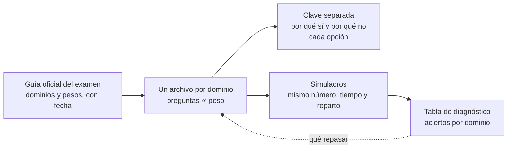

# 🎤 Banco de preguntas
## {{Nombre del banco}}

> ✏️ **Plantilla:** para los tipos "banco de entrevista" y "banco de examen" de `01-tipos-de-curso`,
> y para la simulación de un repaso. Tiene tres partes: la guía corta del banco (§1–§4), el formato
> de entrevista (§5) y el formato de examen (§6). Se conserva la que aplica.

---

## 1. 🧭 Qué evalúa este banco

**{{El criterio, no la definición}}.** Una respuesta buena {{nombra el precio | dice el tramo | elige
y justifica}}; una que recita la definición correcta y se detiene está a medias.

- **Lector:** {{nivel y rol al que apunta: Backend Senior, Tech Lead, Arquitecto | candidato a la
  certificación X}}.
- **Tema y fronteras:** {{qué entra, qué no}}.
- **Variante:** {{A · respuesta en línea | B · respuesta separada en tres capas | examen}}.

---

## 2. 🟢 La escala y el reparto

| | Nivel | Qué pide |
|---|---|---|
| 🟢 | Base | Reproducir o definir un concepto |
| 🟡 | Estándar | Distinguir dos cosas que se confunden |
| 🟠 | Profundidad | Decidir entre alternativas y justificar el precio |
| 🔴 | Abierta o adversarial | Diseñar, diagnosticar, o desmontar una premisa falsa |

Reparto orientativo por parte: 25 % 🟢 · 25 % 🟡 · 30 % 🟠 · 20 % 🔴, distinto entre partes vecinas.
Dentro de cada parte, de menor a mayor.

---

## 3. 🚫 Lo que no se negocia

- **Ninguna pregunta de un proceso real** con datos de la empresa o del entrevistador: eso es
  material personal y no va en un banco publicable.
- **Ninguna cifra de producción ni nombre de cliente real** en las respuestas: clientes por sector,
  cifras de reproducciones propias etiquetadas como tales.
- **Toda respuesta con una versión corta equivocada que suena bien lo dice**: "la respuesta típica es
  X; lo preciso es Y".
- **Las 🔴 piden un artefacto o una secuencia**, no una opinión.
- **En los bancos de examen, ninguna pregunta reproduce una del examen real** (§6).

---

## 4. 📁 Estructura de archivos

```text
{{carpeta}}/
├── README.md                    qué es, cómo se usa, índice de partes
├── 01-{{tema}}.md               ~100 preguntas en partes de 20–25 (variante A)
├── 01-{{tema}}-preguntas.md     (variante B) solo enunciados
└── 01-{{tema}}-respuestas.md    (variante B) enunciado literal + tres capas
```

---

## 5. 🎤 Formato de entrevista

### 5.1 Variante A · respuesta en línea

````markdown
# {{emoji}} {{N}} preguntas de entrevista — {{Tema}}

> **Nivel:** {{senior / arquitecto}}. Las respuestas son guías, no guiones: lo que evalúan es el **criterio**, no la definición.
> **Dificultad:** 🟢 base · 🟡 estándar · 🟠 profundidad · 🔴 abierta o adversarial

---

## {{emoji}} Parte 1 — {{Subtema}} (1–25)

**1. 🟢 {{Pregunta}}**
{{Respuesta en un párrafo: la idea central primero, después el matiz que sube la nota, y si aplica la
trampa clásica. Las palabras clave en negrita, como máximo tres.}}

**2. 🟡 {{Pregunta}}**
{{…}}
````

### 5.2 Variante B · respuesta separada

````markdown
# {{Tema}} — Preguntas

1. {{Enunciado.}} 🟢
2. {{…}} 🔴
````

````markdown
# {{Tema}} — Respuestas

**1. {{Enunciado copiado literal}} 🟢**

- ⏱️ **30 segundos:** {{lo que dices primero, como se diría, en una respiración}}.
- 🗣️ **2 minutos:** {{lo que añades cuando dicen "cuéntame más"; aquí va el precio}}.
- 🔬 **El detalle:** {{para estudiar: la excepción, la librería, el número, lo que preguntarán después}}.
````

### 5.3 Preguntas de comportamiento *(opcional)*

{{Para bancos de liderazgo técnico: la pregunta, qué evalúa en realidad, y la estructura de respuesta
(situación → decisión → resultado con número → qué cambiarías), sin datos reales de clientes.}}

---

## 6. 📝 Formato de examen



### 6.1 La guía del examen (`00-guia-del-examen.md`)

| Dato | Valor | Fuente |
|---|---|---|
| Examen y código | {{…}} | {{URL oficial, verificada por código de estado}} |
| Versión de la guía del examen | {{…}} | {{fecha}} |
| Formato | {{N preguntas, opción múltiple y respuesta múltiple}} | |
| Duración y nota de corte | {{…}} | |

| Dominio | Peso oficial | Preguntas en el banco |
|---|---|---|
| {{1 · Nombre}} | {{24 %}} | {{proporcional al peso}} |

### 6.2 Una pregunta

````markdown
**{{D1}}-{{07}}. 🟠** {{Escenario en dos o tres frases, con los datos que importan y ninguno de adorno.}}
{{La pregunta.}} *(Elige {{UNA | DOS}}.)*

- A. {{…}}
- B. {{…}}
- C. {{…}}
- D. {{…}}
````

- **Los distractores son errores plausibles**, de los que comete alguien que estudió a medias: la
  opción que funciona pero cuesta más, la que funciona en otra versión, la que resuelve otro problema.
  Nunca opciones absurdas.
- **Una sola respuesta defendible** (o exactamente las que pide), comprobada contra la documentación.
- **Sin pistas gramaticales**: todas las opciones con la misma forma y longitud parecida.

### 6.3 La clave (`NN-respuestas.md`)

````markdown
**{{D1}}-{{07}} → {{B}}**

- **Por qué B:** {{el razonamiento, con el concepto que evalúa}}.
- **Por qué no A:** {{…}} · **Por qué no C:** {{…}} · **Por qué no D:** {{…}}
- 📚 {{Documentación oficial del concepto, URL completa.}}
````

### 6.4 Simulacros

- **Mismo número de preguntas, mismo tiempo y mismo reparto por dominio** que el examen real.
- **Preguntas propias del simulacro**, no recicladas del banco por dominio.
- Al final, una **tabla de diagnóstico**: aciertos por dominio contra el peso oficial, para saber qué
  repasar.

### 6.5 Lo que no se hace nunca

- **Reproducir preguntas reales del examen** ("dumps"): lo prohíben los acuerdos de confidencialidad
  de las certificaciones y enseñan a reconocer, no a razonar.
- **Afirmar el formato o la nota de corte sin la guía oficial vigente**: los exámenes cambian de
  versión y de código.
