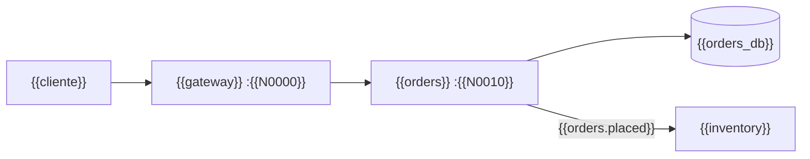

# 🧊 Contrato de nombres
## {{Nombre del curso}}

> ✏️ **Plantilla:** se escribe en la etapa E4 (tanda P6), **antes de la primera fase**. Solo para
> cursos con laboratorio, código o un sistema de ejemplo que varias fases comparten. Es la fusión de
> lo que los cursos existentes llamaron "contrato del cluster", "congelamiento de nombres" y "nombres
> fijos del laboratorio".

Este documento cierra, **antes de escribir la primera fase**, los nombres que muchas fases arrastran y
que no se pueden cambiar después sin tocarlas todas: los del sistema, los del laboratorio, los del
código y los de git.

> 🧭 **Manda sobre los entregables, no sobre el marco.** Va por debajo del
> [alcance](alcance-del-proyecto.md) y de la [guía](guia-de-estilo-y-convenciones.md), al lado del
> [diccionario](diccionario-de-terminos.md) (que fija las palabras; este fija los identificadores), y
> por encima de cualquier fase ya escrita. **Si una fase necesita un nombre que aquí no está, se agrega
> aquí primero.**
> **Vigencia:** {{AAAA-MM-DD}}.

---

## 1. 🧭 Las reglas del contrato

1. **No se inventan valores nuevos** en una fase. Todo nombre, puerto, región, tag o variable sale de
   aquí.
2. **No se renombra** lo ya publicado. Si un nombre resultó malo, se documenta la excepción; no se
   arrastra el cambio por veinte documentos.
3. **Lo que todavía no se puede fijar se marca ⏳** con la fase que lo fija, y esa fase lo escribe aquí
   antes de cerrar (§8).
4. **Nunca `latest`, `*` ni rangos de versión** donde el curso fija un valor exacto.

---

## 2. 🌍 Valores globales

| Qué | Valor | Nota |
|---|---|---|
| Prefijo de recursos | `{{inv-lab / ev- / sl-}}` | todo lo que el curso crea lo lleva |
| Etiqueta de recursos | `curso={{slug}}` | solo se borra lo que la lleva |
| Puertos del laboratorio publicado | `{{los de por defecto (8080, 5432…) / altos, N0000–N0099, ligados a 127.0.0.1 y configurables por variable}}` | decisión del curso: los de por defecto son los que el lector reconoce; los altos evitan choques con sus otros contenedores. Si son altos, el script del laboratorio comprueba que estén libres |
| Puertos de las pruebas de la sesión | aleatorios, los elige Docker (`-p 127.0.0.1::PUERTO`) | siempre, aunque el curso publique los de por defecto (con un `compose.override.yaml` en `zz-code/`); se leen con `docker port`; nunca se fijan |
| Región / zona | `{{us-east-1 / us-central1 / eastus2}}` | solo cursos de nube |
| Perfil o configuración aislada | `{{perfil de CLI, AZURE_CONFIG_DIR, contexto de kubectl}}` | para no tocar la configuración del autor |
| Cuenta / proyecto de ejemplo | `{{111122223333}}` | siempre ficticio |
| Lenguaje de scripting | {{Python 3, solo biblioteca estándar}} | un script para todas las plataformas |

---

## 3. 🗂️ La estructura de archivos

```text
{{carpeta-del-curso}}/
├── README.md                       se escribe al final
├── {{00-historia-de-….md}}         si hay historia: el lector la lee
├── {{00-slug.md … NN-slug.md}}     fases o capítulos
├── {{aNN-slug.md}}                 apéndices
├── prompts/                        maquinaria; el lector no la abre
└── {{src/ | laboratorio/ | taller/}}  código global, si lo hay; el README del curso la nombra · {{un solo proyecto con tags | una carpeta por fase, con el nombre exacto del documento}}
    └── {{…}}
```

---

## 4. 🧱 El sistema: servicios, módulos o componentes

| Nombre | Qué es | Lenguaje / tecnología | Puerto | Depende de |
|---|---|---|---|---|
| `{{orders}}` | {{…}} | {{…}} | `{{N0010}}` | {{…}} |



**El piloto** (el que estrena cada patrón): `{{…}}`.

---

## 5. 🗄️ Datos

| Base o almacén | Nombre | Tablas o colecciones | Dueño |
|---|---|---|---|
| {{PostgreSQL}} | `{{orders_db}}` | `{{orders}}`, `{{order_lines}}` | `{{orders}}` |

{{El esquema heredado, si el curso parte de un legado: tabla por tabla, con sus rarezas y su
causa histórica, escritas **tal cual** —no se corrigen, no se traducen, no se "arreglan de paso"—.}}

---

## 6. 📨 Eventos, colas y contratos *(opcional)*

| Evento | *Topic* o cola | Clave | Productor | Consumidores |
|---|---|---|---|---|
| `{{OrderPlaced}}` | `{{orders.placed}}` | `{{orderId}}` | `{{orders}}` | {{…}} |

| Contrato | Archivo | Versión |
|---|---|---|
| {{API REST de orders}} | `{{contracts/orders.yaml}}` | {{v1}} |

---

## 7. 🏷️ Git

- **Tags de fase:** `{{fase-NN-slug}}`, al cerrar cada fase; los crea el autor.
- **Tags de incidente o de taller:** `{{inc/NN/slug-roto}}` y `{{-fix}}` | `{{taller-NN}}`.
- **Tracks opcionales:** su propio espacio de nombres (`{{be-fase-NN}}`), para que
  `git tag -l 'fase-*'` siga siendo el índice limpio del camino base.
- **Commits:** prefijo `{{fNN:}}`; los de ejercicio `{{fNN ejMM:}}`.

---

## 8. 🔒 Fijado por fase

> ✏️ **Plantilla:** cada fase que fija nombres nuevos agrega aquí su subsección **al cerrarse**, con
> fecha y tanda. No se reescriben las anteriores.

### 8.1 Fijado por {{FNN}} ({{T-n}}, {{AAAA-MM-DD}})

| Qué | Valor |
|---|---|
| {{…}} | {{…}} |

---

## 9. ❓ Qué hacer si falta un nombre

1. Se busca aquí, en el diccionario §5 y en las fases ya escritas.
2. Si no existe, se propone siguiendo las convenciones del diccionario §5.6 y se agrega aquí, con la
   fase que lo estrena.
3. Si choca con uno existente, gana el existente.
