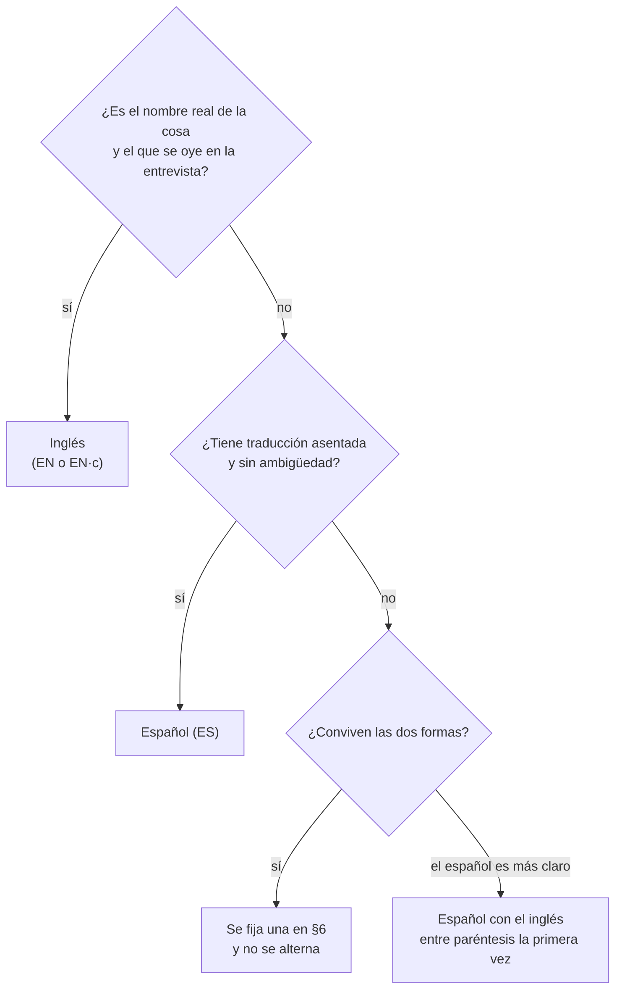

# 📖 Diccionario de términos
## {{Nombre del curso}}

> ✏️ **Plantilla:** se escribe en la etapa E4 (tanda P5), después de la guía. La semilla de §3 es
> común a todos los cursos y crece aquí, en la carpeta de plantillas; al copiarla a un curso se
> **recortan** las áreas que no tocan y se **agregan** los términos del tema. Los ⚖️ de §6 los cierra
> el autor una vez por curso.

> **Qué es este documento:** qué palabra se escribe para cada concepto del oficio —si se queda en
> inglés, si tiene traducción asentada o si se fija una— y cómo se nombra en el código cada concepto
> del dominio del curso. La [guía](guia-de-estilo-y-convenciones.md) §3 lo cita y no lo copia.
> **Regla de una línea:** el código en inglés; la narrativa en español; los términos del oficio, como
> los dice quien los usa todos los días —que casi nunca es como los traduce un diccionario—.
> **Vigencia:** {{AAAA-MM-DD}}.

**Salto rápido:** [1](#1--cómo-se-decide) · [2](#2-️-cómo-se-escribe-cada-tratamiento) · [3](#3--la-semilla-por-área) · [4](#4--calcos-y-falsos-amigos) · [5](#5--el-código-del-dominio) · [6](#6-️-decisiones-del-curso) · [7](#7--cómo-se-agrega-un-término)

---

## 1. 🧭 Cómo se decide

Tres preguntas, en este orden:

1. **¿Es el nombre real de la cosa** —el que aparece en la API, en la consola, en el mensaje de error,
   en la documentación oficial— **y el que se oye en una entrevista?** Se queda en inglés: *offset*,
   *pod*, *cold start*. Traducirlo obliga al lector a retraducir cada vez que mira una salida.
2. **¿Tiene una traducción asentada** que el oficio usa sin ambigüedad? Se escribe en español:
   contenedor, partición, réplica, caché, despliegue.
3. **¿Las dos formas conviven?** Se **fija una por curso** (§6), se declara aquí y no se alterna nunca
   dentro de un documento. Si el español es más claro pero el inglés es el que se busca, español con
   el inglés entre paréntesis **la primera vez** en cada documento.

Lo que **nunca** se hace: inventar una traducción ("tema" por *topic*), alternar dos formas en un
mismo documento, o españolizar un verbo inglés cuando hay uno español corriente (§4).

---

## 2. ✍️ Cómo se escribe cada tratamiento

| Clave | Significa | Cómo se escribe | Ejemplo |
|---|---|---|---|
| **EN** | inglés asimilado | sin cursiva, plural español | los *endpoints* → los endpoints; el framework |
| **EN·c** | inglés técnico no asimilado | en cursiva cada vez que no es código | el *cold start*, un *watermark* |
| **ES** | traducción asentada | español, sin glosa | la partición, la réplica |
| **ES (EN)** | español con glosa | español; el inglés entre paréntesis la primera vez por documento | reparto (*rebalance*) |
| **cód.** | nombre propio de la API | en `código`, con su mayúscula, nunca traducido | `Deployment`, `@Transactional` |

- **Género:** el que usa el oficio y, si duda, el de la palabra española equivalente: *el* cluster
  (el grupo), *la* API (la interfaz), *el* endpoint (el punto), *la* caché, *el* commit, *la* pull
  request, *el* bug.
- **Plural:** el inglés asimilado se pluraliza en español (los tokens, los pods, los frameworks).
- **Siglas:** se desarrollan la primera vez que aparecen en un documento, en el idioma en que se
  usan: *Service Level Objective* (SLO); las universales (HTTP, JSON, SQL, API, URL) no.
- **Nombres de error, métrica, estado o campo** se escriben como son, en `código`, aunque el concepto
  se diga en español: el reparto, y el error `REBALANCE_IN_PROGRESS`.

---

## 3. 📚 La semilla, por área

> ✏️ **Plantilla:** columnas fijas. "Nota" dice por qué, o con qué no confundirlo. Los términos
> marcados ⚖️ tienen decisión en §6.

### 3.1 Ingeniería de software general

| Inglés | Se escribe | Trato | Nota |
|---|---|---|---|
| software, hardware | software, hardware | EN | |
| framework | framework | EN | "marco de trabajo" no se usa en el oficio |
| library | librería ⚖️ | ES | ver §6; fijar una por curso |
| dependency | dependencia | ES | |
| package | paquete | ES | `package` en Java, en código |
| build | build ⚖️ | EN | "compilación" cuando es solo compilar; build es el proceso completo |
| release | versión, *release* | ES (EN) | *release* para el artefacto publicado |
| deployment (acción) | despliegue | ES | `Deployment` de Kubernetes es otra cosa, en código |
| to deploy | desplegar | ES | nunca "deployar" |
| rollback | *rollback* | EN·c | "reversión" casi no se usa |
| bug | bug | EN | también "error", "defecto" |
| debugging | depuración | ES | "debuggear" no; "depurar" |
| refactoring | refactorización | ES | verbo: refactorizar |
| legacy | legado, sistema heredado | ES | *legacy* solo como adjetivo citado |
| technical debt | deuda técnica | ES | |
| codebase | base de código | ES | |
| boilerplate | código repetitivo, *boilerplate* | ES (EN) | |
| feature | funcionalidad | ES | *feature flag* se queda en inglés |
| feature flag | *feature flag* | EN·c | |
| trade-off | compromiso, *trade-off* | ES (EN) | también "precio" en las guías que hablan de monedas |
| best practice | buena práctica | ES | con su porqué, nunca a secas |
| proof of concept | prueba de concepto (PoC) | ES | |
| stack | stack | EN | "pila" solo para la estructura de datos |
| runtime | *runtime*, entorno de ejecución | ES (EN) | |
| toolchain | cadena de herramientas, *toolchain* | ES (EN) | |
| IDE | IDE | EN | |
| CLI | CLI, línea de comandos | EN | |
| script | script | EN | |
| shell | shell | EN | "la terminal" para la ventana |
| path | ruta | ES | `PATH` la variable, en código |
| environment variable | variable de entorno | ES | |
| config file | archivo de configuración | ES | |
| hardcoded | fijo en el código, *hardcodeado* ⚖️ | ES | |
| open source | código abierto | ES | |
| vendor lock-in | dependencia del proveedor, *lock-in* | ES (EN) | |

### 3.2 Arquitectura y diseño

| Inglés | Se escribe | Trato | Nota |
|---|---|---|---|
| software architecture | arquitectura de software | ES | |
| monolith | monolito | ES | |
| modular monolith | monolito modular | ES | |
| microservices | microservicios | ES | |
| service | servicio | ES | |
| layer / tier | capa / nivel | ES | capa lógica; nivel físico |
| hexagonal architecture | arquitectura hexagonal | ES | |
| ports and adapters | puertos y adaptadores | ES | |
| clean architecture | arquitectura limpia, *Clean Architecture* | ES (EN) | |
| domain | dominio | ES | |
| bounded context | contexto delimitado (*bounded context*) | ES (EN) | |
| aggregate | agregado | ES | |
| entity | entidad | ES | |
| value object | objeto de valor (*value object*) | ES (EN) | |
| repository | repositorio | ES | ambiguo con git: el contexto decide |
| use case | caso de uso | ES | |
| coupling / cohesion | acoplamiento / cohesión | ES | |
| separation of concerns | separación de responsabilidades | ES | |
| single responsibility | responsabilidad única | ES | |
| dependency injection | inyección de dependencias | ES | |
| inversion of control | inversión de control | ES | |
| design pattern | patrón de diseño | ES | nombres de patrón en inglés si así se buscan: *Strategy*, *Builder* ⚖️ |
| anti-pattern | antipatrón | ES | |
| facade | fachada | ES | |
| strangler fig | *strangler fig*, estrangulador | EN·c | |
| anti-corruption layer | capa anticorrupción | ES | |
| API gateway | *API gateway* | EN·c | |
| backend for frontend | *backend for frontend* (BFF) | EN·c | |
| service mesh | *service mesh* | EN·c | |
| sidecar | *sidecar* | EN·c | |
| event-driven | orientado a eventos | ES | |
| serverless | serverless | EN | |
| scalability | escalabilidad | ES | |
| availability | disponibilidad | ES | |
| reliability | fiabilidad | ES | "confiabilidad" ⚖️ |
| resilience | resiliencia | ES | |
| maintainability | mantenibilidad | ES | |
| quality attribute | atributo de calidad | ES | |
| architecture decision record | registro de decisión de arquitectura (ADR) | ES | |
| blueprint | plano, diseño de referencia | ES | |
| greenfield / brownfield | proyecto nuevo / sobre sistema existente | ES | |

### 3.3 Sistemas distribuidos, mensajería y eventos

| Inglés | Se escribe | Trato | Nota |
|---|---|---|---|
| distributed system | sistema distribuido | ES | |
| node | nodo | ES | |
| replica | réplica | ES | |
| leader / follower | líder / seguidor | ES | |
| consensus | consenso | ES | |
| quorum | quórum | ES | |
| partition (network) | partición de red | ES | |
| partition (log) | partición | ES | nunca *partition* en el cuerpo |
| sharding | *sharding*, particionado horizontal | EN·c | |
| consistency | consistencia | ES | |
| strong consistency | consistencia fuerte | ES | |
| eventual consistency | consistencia eventual | ES | término fijado; "eventualmente" suelto no (§4) |
| eventually consistent | con consistencia eventual | ES | |
| idempotent | idempotente | ES | |
| idempotency key | clave de idempotencia | ES | `Idempotency-Key` la cabecera |
| at-least-once | al-menos-una-vez | ES | con guiones, como sustantivo compuesto |
| at-most-once | como-mucho-una-vez | ES | |
| exactly-once | *exactly-once*, siempre con su tramo | EN·c | sin tramo es la sobregeneralización |
| message broker | broker de mensajes | EN | |
| message queue | cola de mensajes | ES | |
| topic | *topic* | EN·c | nunca "tema" |
| offset | *offset* | EN·c | nunca "desplazamiento" |
| consumer group | grupo de consumidores | ES | |
| rebalance | reparto (*rebalance*) | ES (EN) | |
| producer / consumer | productor / consumidor | ES | |
| publish / subscribe | publicar / suscribirse | ES | *pub/sub* el patrón |
| dead letter queue | cola de mensajes muertos (DLQ) | ES | se dice DLQ |
| retry | reintento | ES | |
| backoff | *backoff* | EN·c | "espera exponencial" para explicarlo |
| backpressure | contrapresión | ES (EN) | |
| timeout | *timeout*, tiempo de espera | EN·c | |
| circuit breaker | *circuit breaker* | EN·c | |
| bulkhead | *bulkhead*, compartimentos | EN·c | |
| rate limiting | limitación de tasa, *rate limiting* | ES (EN) | |
| throttling | *throttling* | EN·c | nombre del error y de la métrica |
| saga | saga | ES | |
| orchestration / choreography | orquestación / coreografía | ES | |
| compensation | compensación | ES | |
| outbox / inbox | *outbox* / *inbox* | EN·c | |
| change data capture | captura de cambios (CDC) | ES | |
| domain event / integration event | evento de dominio / evento de integración | ES | |
| event sourcing | *event sourcing* | EN·c | |
| CQRS | CQRS | EN | |
| projection | proyección | ES | |
| replay | *replay*, reproceso | ES (EN) | |
| event time / processing time | *event time* / *processing time* | EN·c | la distinción es el concepto |
| watermark | *watermark* | EN·c | |
| window (streaming) | ventana | ES | |
| lag | *lag* | EN·c | |
| two-phase commit | *commit* en dos fases (2PC) | ES | |
| split brain | *split brain* | EN·c | |
| heartbeat | latido, *heartbeat* | ES (EN) | |

### 3.4 Datos y bases de datos

| Inglés | Se escribe | Trato | Nota |
|---|---|---|---|
| database | base de datos | ES | "la base" en prosa corrida |
| table / row / column | tabla / fila / columna | ES | |
| schema | esquema | ES | |
| index | índice | ES | |
| primary key / foreign key | llave primaria / llave foránea ⚖️ | ES | "clave" también; fijar una |
| query | consulta | ES | *query* solo en nombres de API |
| query plan | plan de ejecución | ES | |
| transaction | transacción | ES | |
| isolation level | nivel de aislamiento | ES | |
| dirty read / phantom read | lectura sucia / lectura fantasma | ES | |
| lock / deadlock | bloqueo / interbloqueo (*deadlock*) | ES (EN) | |
| optimistic / pessimistic locking | bloqueo optimista / pesimista | ES | |
| connection pool | pool de conexiones | EN | |
| migration | migración | ES | |
| seed data | datos semilla, semilla | ES | |
| ORM | ORM | EN | |
| N+1 problem | problema N+1 | ES | |
| stored procedure | procedimiento almacenado | ES | |
| trigger | *trigger*, disparador ⚖️ | EN·c | |
| view / materialized view | vista / vista materializada | ES | |
| normalization | normalización | ES | |
| replication | replicación | ES | |
| read replica | réplica de lectura | ES | |
| backup / restore | respaldo / restauración | ES | *backup* aceptado en citas |
| key-value store | almacén clave-valor | ES | |
| document database | base documental | ES | |
| wide-column | de columnas anchas | ES | |
| graph database | base de grafos | ES | |
| time series | series temporales | ES | |
| vector database | base vectorial | ES | |
| embedding | *embedding* | EN·c | |
| data lake / warehouse | *data lake* / almacén de datos (*data warehouse*) | EN·c | |
| ETL / ELT | ETL / ELT | EN | |
| cache | caché | ES | `cache` en identificadores |
| cache hit / miss | acierto / fallo de caché | ES | |
| TTL | TTL, tiempo de vida | EN | |
| write-ahead log | *write-ahead log* (WAL) | EN·c | |
| vacuum | `VACUUM` | cód. | |

### 3.5 APIs, HTTP y protocolos

| Inglés | Se escribe | Trato | Nota |
|---|---|---|---|
| API | API (la) | EN | |
| endpoint | endpoint | EN | |
| request / response | petición / respuesta | ES | "solicitud" solo en citas de RFC ⚖️ |
| header | cabecera | ES | el nombre, en código: `Content-Type` |
| body / payload | cuerpo / *payload* | ES | |
| status code | código de estado | ES | |
| method / verb | método | ES | `GET`, `POST` en código |
| resource | recurso | ES | |
| idempotent method | método idempotente | ES | |
| safe method | método seguro | ES | |
| content negotiation | negociación de contenido | ES | |
| caching (HTTP) | caché HTTP | ES | |
| versioning | versionado | ES | |
| deprecation | obsolescencia, *deprecation* | ES (EN) | `Deprecation` la cabecera |
| backward compatible | compatible hacia atrás | ES | |
| breaking change | cambio que rompe, *breaking change* | ES (EN) | |
| contract | contrato | ES | |
| contract testing | pruebas de contrato | ES | |
| webhook | webhook | EN | |
| polling / long polling | sondeo / sondeo largo | ES | |
| streaming | *streaming* | EN·c | |
| websocket | WebSocket | EN | |
| gRPC, REST, GraphQL | gRPC, REST, GraphQL | EN | |
| RPC | RPC, llamada remota | EN | |
| serialization | serialización | ES | |
| pagination / cursor | paginación / cursor | ES | |
| rate limit | límite de tasa | ES | |
| reverse proxy | proxy inverso | ES | |
| load balancer | balanceador de carga | ES | |
| DNS, TLS, TCP | DNS, TLS, TCP | EN | |
| handshake | *handshake*, negociación | EN·c | |
| keep-alive | *keep-alive* | EN·c | |

### 3.6 Concurrencia y rendimiento

| Inglés | Se escribe | Trato | Nota |
|---|---|---|---|
| thread | hilo | ES | `Thread` en código |
| virtual thread | hilo virtual | ES | |
| process | proceso | ES | |
| concurrency / parallelism | concurrencia / paralelismo | ES | no son lo mismo |
| race condition | condición de carrera | ES | |
| mutex / semaphore | mutex / semáforo | ES | |
| atomic | atómico | ES | |
| thread-safe | seguro para hilos, *thread-safe* | ES (EN) | |
| blocking / non-blocking | bloqueante / no bloqueante | ES | |
| async / await | asíncrono; `async`/`await` en código | ES | |
| event loop | *event loop*, bucle de eventos | EN·c | |
| reactive | reactivo | ES | |
| performance | rendimiento | ES | "performance" no (§4) |
| latency | latencia | ES | |
| throughput | *throughput*, caudal ⚖️ | EN·c | |
| percentile (p99) | percentil (p99) | ES | |
| tail latency | latencia de cola | ES | |
| benchmark | medición, *benchmark* | ES (EN) | `BENCHMARKS.md` el archivo |
| warm-up | calentamiento | ES | |
| cold start | arranque en frío (*cold start*) | ES (EN) | no "arranque lento" |
| garbage collection | recolección de basura (GC) | ES | |
| heap / stack | *heap* / pila | EN·c | |
| memory leak | fuga de memoria | ES | |
| profiling | perfilado, *profiling* | ES (EN) | |
| bottleneck | cuello de botella | ES | |
| scale up / out | escalar vertical / horizontalmente | ES | |
| scale to zero | escalar a cero | ES | |
| autoscaling | autoescalado | ES | |
| capacity planning | planificación de capacidad | ES | |
| overhead | sobrecosto, *overhead* | ES (EN) | |

### 3.7 Contenedores, Kubernetes y plataforma

| Inglés | Se escribe | Trato | Nota |
|---|---|---|---|
| container | contenedor | ES | |
| image | imagen | ES | |
| layer | capa | ES | |
| registry | registro, *registry* ⚖️ | ES (EN) | |
| tag (image) | tag | EN | |
| digest | *digest* | EN·c | |
| multi-stage build | build multietapa | ES | |
| volume / bind mount | volumen / *bind mount* | ES | |
| orchestrator | orquestador | ES | |
| cluster | cluster ⚖️ | EN | "clúster" con tilde también se usa; fijar uno |
| node | nodo | ES | |
| pod | pod | EN | `Pod` el objeto |
| namespace | namespace | EN | o "espacio de nombres", uno solo por documento |
| control plane | plano de control | ES | |
| reconciliation loop | bucle de reconciliación | ES | |
| desired state | estado deseado | ES | |
| manifest | manifiesto | ES | |
| probe | sonda | ES | `readinessProbe` en código |
| readiness / liveness | *readiness* / *liveness* | EN·c | |
| rollout | *rollout* | EN·c | |
| rolling update | actualización progresiva | ES | |
| blue-green / canary | *blue-green* / *canary* | EN·c | |
| request / limit (recursos) | *request* / *limit* | EN·c | |
| OOMKilled, CrashLoopBackOff | `OOMKilled`, `CrashLoopBackOff` | cód. | |
| Deployment, Service, ConfigMap… | `Deployment`, `Service`, `ConfigMap` | cód. | objetos de la API, con su mayúscula |
| ingress / gateway | entrada al sistema; `Ingress`, `Gateway` | cód. | |
| operator | *operator* | EN·c | |
| helm chart | chart de Helm | EN | |
| GitOps | GitOps | EN | |
| infrastructure as code | infraestructura como código (IaC) | ES | |
| platform engineering | ingeniería de plataforma | ES | |

### 3.8 Nube

| Inglés | Se escribe | Trato | Nota |
|---|---|---|---|
| cloud provider | proveedor de nube | ES | |
| region / availability zone | región / zona de disponibilidad | ES | |
| managed service | servicio gestionado | ES | |
| Security Group, VPC, IAM… | *Security Group*, VPC, IAM | EN·c | nombres de servicio, nunca traducidos |
| role / policy | rol / política | ES | |
| least privilege | mínimo privilegio | ES | |
| account / project / subscription | cuenta / proyecto / suscripción | ES | según proveedor |
| billing | facturación | ES | |
| on-demand / reserved / spot | bajo demanda / reservada / *spot* | ES | |
| egress | tráfico de salida, *egress* | ES (EN) | |
| object storage / bucket | almacenamiento de objetos / *bucket* | ES | |
| serverless function | función serverless | ES | |
| execution environment | entorno de ejecución | ES | no "contenedor" ni "instancia" para Lambda |
| invocation | invocación | ES | |
| teardown | *teardown*, limpieza | EN·c | |
| landing zone | *landing zone* | EN·c | |
| multi-tenant | multiinquilino, *multi-tenant* ⚖️ | ES (EN) | |
| shared responsibility | responsabilidad compartida | ES | |

### 3.9 Seguridad

| Inglés | Se escribe | Trato | Nota |
|---|---|---|---|
| authentication / authorization | autenticación / autorización | ES | |
| identity provider | proveedor de identidad (IdP) | ES | |
| token | token | EN | |
| access / refresh token | token de acceso / de refresco | ES | |
| JWT, OAuth 2.x, OIDC | JWT, OAuth 2.x, OIDC | EN | |
| scope / claim | *scope* / *claim* | EN·c | |
| session | sesión | ES | |
| single sign-on | inicio de sesión único (SSO) | ES | |
| secret | secreto | ES | `Secret` el objeto |
| certificate / CA | certificado / autoridad certificadora (CA) | ES | |
| mutual TLS | mTLS | EN | |
| encryption at rest / in transit | cifrado en reposo / en tránsito | ES | "encriptar" no (§4) |
| hash / salt | *hash* / sal | EN·c | |
| vulnerability | vulnerabilidad | ES | |
| attack surface | superficie de ataque | ES | |
| threat model | modelo de amenazas | ES | |
| injection | inyección | ES | |
| CSRF, XSS, SSRF | CSRF, XSS, SSRF | EN | |
| CORS | CORS | EN | |
| zero trust | confianza cero, *zero trust* | ES (EN) | |
| supply chain | cadena de suministro | ES | |
| hardening | endurecimiento, *hardening* | ES (EN) | |
| audit log | registro de auditoría | ES | |
| PII | datos personales (PII) | ES | |

### 3.10 Pruebas y calidad

| Inglés | Se escribe | Trato | Nota |
|---|---|---|---|
| test | prueba | ES | `test` en nombres de archivo y métodos |
| unit / integration / end-to-end test | prueba unitaria / de integración / de punta a punta | ES | |
| test suite | suite de pruebas | ES | |
| test double / mock / stub / fake | doble de prueba / *mock* / *stub* / *fake* | EN·c | |
| fixture | *fixture* | EN·c | |
| assertion | aserción | ES | |
| coverage | cobertura | ES | |
| flaky test | prueba inestable (*flaky*) | ES (EN) | |
| regression | regresión | ES | |
| TDD / BDD | TDD / BDD | EN | |
| property-based testing | pruebas basadas en propiedades | ES | |
| load / stress test | prueba de carga / de estrés | ES | |
| chaos engineering | ingeniería del caos | ES | |
| smoke test | prueba de humo | ES | |
| code review | revisión de código | ES | |
| linter | linter | EN | |
| static analysis | análisis estático | ES | |

### 3.11 DevOps, CI/CD y git

| Inglés | Se escribe | Trato | Nota |
|---|---|---|---|
| continuous integration / delivery / deployment | integración / entrega / despliegue continuo | ES | CI/CD |
| pipeline | pipeline | EN | |
| stage / job / step | etapa / *job* / paso | ES | |
| artifact | artefacto | ES | |
| environment (dev, staging, prod) | ambiente ⚖️ | ES | "entorno" también; fijar uno |
| production | producción | ES | |
| staging | *staging*, preproducción | EN·c | |
| commit | commit | EN | "hacer commit"; nunca "commitear" |
| branch | rama | ES | |
| merge | *merge*, fusión | EN·c | "hacer merge" |
| rebase | *rebase* | EN·c | |
| pull request / merge request | *pull request* (PR) | EN·c | |
| tag | tag | EN | "etiqueta" solo para labels de Docker o K8s |
| trunk-based development | desarrollo basado en el tronco | ES | |
| release train | tren de versiones | ES | |
| on-call | guardia | ES | |
| runbook | manual de operación, *runbook* | ES (EN) | |
| postmortem | *postmortem*, autopsia | EN·c | |
| incident | incidente | ES | |
| SRE | SRE | EN | |

### 3.12 Observabilidad y operación

| Inglés | Se escribe | Trato | Nota |
|---|---|---|---|
| observability | observabilidad | ES | |
| monitoring | monitoreo | ES | |
| logs / logging | logs / registro | EN | "registro" para la acción |
| structured logging | logs estructurados | EN | |
| metrics | métricas | ES | |
| traces / tracing | trazas / trazado distribuido | ES | |
| span | *span* | EN·c | |
| correlation id | id de correlación | ES | |
| dashboard | tablero, *dashboard* ⚖️ | ES (EN) | |
| alert | alerta | ES | |
| SLI / SLO / SLA | SLI / SLO / SLA | EN | se desarrollan la primera vez |
| error budget | presupuesto de errores | ES | |
| health check | comprobación de salud, *health check* | ES (EN) | |
| uptime / downtime | tiempo en línea / caída | ES | |
| MTTR | MTTR | EN | |
| root cause | causa raíz | ES | |
| blast radius | radio de impacto | ES | |
| toil | trabajo repetitivo, *toil* | ES (EN) | |

### 3.13 Java y Spring

| Inglés | Se escribe | Trato | Nota |
|---|---|---|---|
| bean | bean | EN | |
| application context | contexto de aplicación | ES | `ApplicationContext` en código |
| auto-configuration | autoconfiguración | ES | |
| starter | *starter* | EN·c | |
| annotation | anotación | ES | `@Service` en código |
| proxy | proxy | EN | |
| filter / interceptor | filtro / interceptor | ES | |
| record, sealed, switch pattern | `record`, `sealed`, *pattern matching* | cód. | |
| generics | genéricos | ES | |
| checked exception | excepción comprobada | ES | |
| classpath / module path | *classpath* / *module path* | EN·c | |
| JVM, JDK, JRE, JIT, AOT | JVM, JDK, JRE, JIT, AOT | EN | |
| native image | imagen nativa | ES | |
| build tool | herramienta de build | ES | |
| fat jar | *fat jar*, jar ejecutable | EN·c | |
| batch job | proceso por lotes, *job* | ES (EN) | |

### 3.14 IA y modelos de lenguaje

| Inglés | Se escribe | Trato | Nota |
|---|---|---|---|
| large language model | modelo de lenguaje (LLM) | ES | |
| prompt | prompt | EN | |
| system prompt | prompt de sistema | ES | |
| context window | ventana de contexto | ES | |
| token (LLM) | token | EN | ambiguo con seguridad: el contexto decide |
| retrieval-augmented generation | generación aumentada con recuperación (RAG) | ES | se dice RAG |
| fine-tuning | ajuste fino, *fine-tuning* | ES (EN) | |
| inference | inferencia | ES | |
| hallucination | alucinación | ES | |
| agent / tool use | agente / uso de herramientas | ES | |
| evaluation (evals) | evaluación | ES | |
| vibe coding | *vibecoding* | EN·c | grafía de los cursos del repositorio |

### 3.15 Frontend *(recortar si el curso no lo toca)*

| Inglés | Se escribe | Trato | Nota |
|---|---|---|---|
| component | componente | ES | |
| state / props | estado / *props* | ES | |
| store | *store* | EN·c | |
| hook | *hook* | EN·c | |
| rendering / SSR | renderizado / renderizado en servidor (SSR) | ES | |
| hydration | hidratación | ES | |
| bundle / bundler | *bundle* / empaquetador | EN·c | |
| single-page application | aplicación de una sola página (SPA) | ES | |

---

## 4. 🚫 Calcos y falsos amigos

Lo que no se escribe, y qué va en su lugar.

| No se escribe | Se escribe | Por qué |
|---|---|---|
| eventualmente (= *eventually*) | finalmente, con el tiempo, tarde o temprano | en español "eventualmente" significa "quizás"; "consistencia eventual" es la única excepción, por ser término fijado |
| actualmente (= *actually*) | en realidad | *actually* no es "actualmente" |
| asumir (= *assume*) | suponer, dar por hecho | "asumir" es hacerse cargo; se admite "se asume leído" por uso del repositorio ⚖️ |
| soportar (= *support*) | admitir, ser compatible con, ofrecer | soportar es aguantar |
| remover (= *remove*) | quitar, eliminar, borrar | |
| aplicar (= *apply for*) | postular, presentarse | en contexto de vacantes |
| performance | rendimiento | |
| deployar, deployment (acción) | desplegar, despliegue | |
| setear | asignar, configurar, fijar | |
| chequear | comprobar, verificar | |
| customizar | personalizar | |
| loguear / logearse | registrar / iniciar sesión | |
| testear | probar | |
| commitear, pushear, mergear | hacer commit, hacer push, hacer merge | el sustantivo inglés se queda; el verbo españolizado no |
| encriptar | cifrar | |
| randomizar | aleatorizar | |
| librería (si el curso fija biblioteca) | biblioteca | §6 |
| en base a | con base en, a partir de | |
| a nivel de | en | "a nivel de base de datos" → "en la base de datos" |
| implementar (abuso) | escribir, construir, aplicar | "implementar" vale para un patrón o una interfaz, no para todo |
| tema (= *topic*) | *topic* | §3.3 |
| rebalanceo | reparto (*rebalance*) | §3.3 |
| arranque lento (= *cold start*) | arranque en frío | |

---

## 5. 💻 El código del dominio

> ✏️ **Plantilla:** se llena con el sistema de ejemplo o la empresa de la historia, entidad por
> entidad, **antes** de la primera fase. Lo que aquí se fija lo usa el
> [contrato de nombres](contrato-de-nombres.md).

### 5.1 Qué se traduce al inglés y qué no

| Cosa | ¿Inglés? | Ejemplo |
|---|---|---|
| Clase, función, método, variable | ✅ | `OrderService.placeOrder()` |
| Tabla, columna, colección | ✅ | `orders.created_at` |
| Endpoint y ruta de API | ✅ | `POST /orders` |
| Valor de enum o estado interno | ✅ | `status: PENDING` |
| Nombre de archivo de código, recurso, variable de entorno | ✅ | `order-service.yaml`, `DATABASE_URL` |
| Comentario en el código | ❌ | `// reservamos stock antes de cobrar` |
| Texto que ve el usuario | ❌ | `"No se pudo crear el pedido"` |
| Mensaje de error legible | ⚠️ parcial | la clave en inglés, el valor en español |
| Mapeo de estado a etiqueta | ⚠️ parcial | `case PENDING -> "Pendiente"` |
| Nombre del dominio en la prosa | ❌ | se sigue diciendo "pedido", "cobro" |
| Nombre de archivo `.md`, títulos | ❌ | `05-la-saga-orquestada.md` |

### 5.2 Entidades

| Español | Código | Nota |
|---|---|---|
| {{pedido}} | `{{Order}}` / `{{orders}}` | {{singular la clase, plural la tabla y la ruta}} |

### 5.3 Estados

| Español | Código | Significa exactamente |
|---|---|---|
| {{pendiente}} | `{{PENDING}}` | {{la definición operativa: qué ya pasó y qué no}} |

### 5.4 Verbos de negocio

| Español | Código |
|---|---|
| {{reservar}} | `{{reserve}}` |

### 5.5 Campos frecuentes

| Español | Código |
|---|---|
| fecha de creación | `createdAt` / `created_at` |
| fecha de actualización | `updatedAt` / `updated_at` |
| {{…}} | `{{…}}` |

### 5.6 Convenciones por tipo de artefacto

| Artefacto | Convención | Ejemplo |
|---|---|---|
| Clase / tipo | PascalCase, sustantivo | `PaymentGateway` |
| Método / función | camelCase, verbo | `chargeCard` |
| Tabla / columna | snake_case, plural la tabla | `payment_attempts` |
| Ruta de API | kebab-case, plural | `/payment-attempts` |
| Evento | PascalCase en pasado | `OrderPlaced` |
| *Topic* o cola | {{`dominio.evento`}} | `orders.placed` |
| Variable de entorno | SCREAMING_SNAKE_CASE | `PAYMENTS_TIMEOUT_MS` |
| Recurso de infraestructura | kebab-case con prefijo del curso | `{{prefijo}}-orders-db` |

---

## 6. ⚖️ Decisiones del curso

Las dos formas conviven en el repositorio; cada curso fija una, aquí, y no la alterna.

| Término | Opciones | Uso en el repositorio (oct. 2026) | Valor de este curso |
|---|---|---|---|
| *library* | librería · biblioteca | 761 · 604 apariciones | {{…}} |
| *cluster* | cluster · clúster | 184 · 98 | {{…}} |
| *cache* | caché · cache | 1.775 · 1.268 (la segunda incluye código) | {{caché en prosa, `cache` en código}} |
| *environment* | ambiente · entorno | — | {{…}} |
| *key* (BD) | llave · clave | — | {{…}} |
| *build* | build · compilación | — | {{…}} |
| *registry* | registro · *registry* | — | {{…}} |
| *dashboard* | tablero · *dashboard* | — | {{…}} |
| *throughput* | *throughput* · caudal · rendimiento | — | {{…}} |
| *reliability* | fiabilidad · confiabilidad | — | {{…}} |
| *request* | petición · solicitud | 1.754 · 165 | {{…}} |
| nombres de patrón GoF | inglés (*Strategy*) · español (Estrategia) | — | {{…}} |
| *assume* | asumir · suponer | — | {{…}} |
| *trigger* (BD) | *trigger* · disparador | — | {{…}} |
| *multi-tenant* | multiinquilino · *multi-tenant* | — | {{…}} |
| *hardcoded* | fijo en el código · *hardcodeado* | — | {{…}} |

---

## 7. ➕ Cómo se agrega un término

1. **Se busca primero** aquí y en los documentos ya publicados del curso: si ya se usa una forma, se
   adopta esa.
2. **Se aplican las tres preguntas de §1** y se elige el tratamiento de §2.
3. **Se agrega la fila** en su área, con la nota de por qué si no es evidente. Si admite dos formas, a
   §6 con propuesta, y lo cierra el autor.
4. **Si el término es transversal** (sirve a cualquier curso), se sube también a la semilla de la
   carpeta de plantillas, para que el próximo curso lo herede.
5. **Si se cambia un término ya usado**, se reemplaza en todo el curso en la misma edición (con
   `perl -CSD -Mutf8 -pi`, revisando los falsos positivos a mano).
