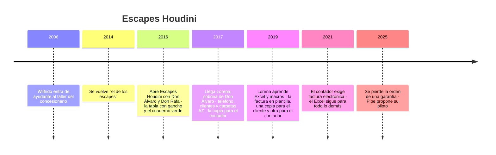

# 🏢 Escapes Houdini: la historia

> 📝 **Ejemplo, no plantilla.** Así queda [`historia-de-la-empresa.md`](historia-de-la-empresa.md)
> llena, en versión breve, para el curso de ejemplo del README de `zz-instrucciones/` (*Python desde
> cero: el sistema del taller*). Sirve para ver el tono, el nivel de detalle y cómo cada dato queda
> listo para que una fase lo use. No se copia a ningún curso.

> **Qué es este documento:** la fuente de verdad de todo lo narrativo del curso: el taller, su gente,
> sus papeles, sus cifras y sus reglas. **Ninguna fase inventa un dato**: si lo necesita y no está
> aquí, se agrega aquí primero.
> **Vigencia:** 2026-10-06.

**Escapes Houdini es un taller ficticio**, igual que todas las personas de esta historia. Se parece a
muchos talleres de verdad porque está escrito para eso.

---

## 1. 📅 Cómo llegó hasta aquí

Wilfrido Mendoza Polo nació en Ciénaga y aprendió mecánica en el taller del concesionario Mercedes-Benz
de Barranquilla, donde entró de ayudante en 2006. Allí descubrió que lo que nadie quería hacer —bajar
un múltiple oxidado, soldar un silenciador sin que vibre, cambiar un catalizador sin dañar el sensor de
oxígeno— era lo que él hacía mejor. Para 2014 los otros técnicos le pasaban "lo del escape", y los
clientes del concesionario empezaron a buscarlo por fuera.

En 2016 se juntó con dos amigos recién pensionados que buscaban dónde poner la liquidación para tener
un ingreso: **Don Álvaro Cantillo**, que se jubiló de jefe de bodega en el puerto, y **Don Rafael
Fontalvo**, profesor de física de colegio. El nombre lo puso Don Rafa, medio en broma, en la primera
reunión: *"Si aquí el ruido desaparece como por arte de magia, esto se llama Houdini"*. Se rieron, nadie
propuso otro, y quedó pintado en la fachada.

El primer año todo fue papel. Las órdenes se escribían a mano y colgaban de una tabla de madera con
gancho junto a la caja; los cobros y los gastos iban al cuaderno verde de Don Álvaro, y las facturas,
de un talonario con copia al carbón. Wilfrido atendía el teléfono con las manos llenas de grasa, o no
lo atendía. A fin de 2016 Don Álvaro hizo la cuenta de las llamadas perdidas y propuso una solución de
familia: su sobrina **Lorena**, que acababa de salir del colegio y empezaba a estudiar Administración
de Empresas por las noches, podía trabajar de día en el taller. Contestaría el teléfono, recibiría a
los clientes y, sobre todo, pondría orden.

Nadie le enseñó cómo, así que inventó un sistema. Cada factura salía en dos copias: la original para el
cliente y la copia para el contador, que pasaba el último viernes del mes a recogerlas en una carpeta
de gancho. Las órdenes cerradas iban a carpetas AZ por mes, en un archivador de cuatro gavetas, y lo
que no cabía en ninguna parte iba a una caja de cartón debajo del escritorio. Funcionaba porque
Lorena se acordaba de dónde estaba cada cosa.

En 2019, con un curso de Excel en video y muchas noches, pasó la factura a una plantilla con una macro
que ponía el consecutivo y mandaba a imprimir las dos copias, y empezó a llevar los clientes y el
resumen del mes en el mismo libro. El taller ganó tiempo, pero la parte del contador no cambió: cada
mes él seguía recibiendo las copias impresas, y desde que llegó la factura electrónica, además, un
Excel por correo que volvía a digitar en su programa contable. Nada cruzaba solo. Dos veces al año
aparecía una diferencia, y Lorena pasaba un sábado entero buscando el papel que la explicaba.

Pipe apareció por el lado de los amigos. **Andrés Felipe Ariza**, Pipe para todo el mundo, era del
parche de Lorena desde el colegio y estudiaba Ingeniería de Sistemas. Con un compañero de semestre
venía dándole vueltas a una idea para un proyecto que algún día fuera empresa: un sistema para
talleres, porque todos los que conocían llevaban el negocio en papel. Ya lo habían intentado en un
taller de motos del barrio. Le hicieron una demo en el portátil y le ofrecieron instalarlo gratis, a
cambio de que lo usara y les dijera qué fallaba. El dueño los oyó con amabilidad, les dijo que lo iba
a pensar y no les volvió a parar muchas bolas: con el cuaderno le alcanzaba. Pipe sacó una conclusión
que después repetiría mucho: *"un taller no cambia porque le muestres algo bonito; cambia el día que
el papel le cuesta plata"*. En las reuniones del parche, Lorena contaba sus sábados buscando
facturas, y Pipe tomaba nota.

En 2025 el papel que faltaba fue la orden de una garantía, y esa vez no apareció (§4). Ese día, el
papel le costó plata a Escapes Houdini.

| Año | Qué pasó | Quién lo decidió | Lo que dejó |
|---|---|---|---|
| 2016 | Las órdenes se escriben a mano en hojas sueltas, en una tabla de madera con gancho que cuelga junto a la caja | Wilfrido: "lo importante es el carro, no el papel" | cada orden existe en un solo papel, y el papel se moja, se mancha de grasa y se pierde |
| 2016 | Los cobros, los pagos y los gastos van a un cuaderno verde de contabilidad, una línea por movimiento | Don Álvaro, por costumbre de bodega | un libro por año, con la letra de tres personas y sin cruce con las órdenes |
| 2017 | Llega Lorena: atiende el teléfono y a los clientes, archiva las órdenes cerradas en carpetas AZ por mes y separa la copia de cada factura para el contador | Don Álvaro la propone; el sistema lo inventa ella, sin que nadie le enseñe | para buscar una orden hay que saber el mes; los clientes no saben el mes |
| 2019 | Lorena aprende Excel por videos y arma `HOUDINI_FACTURAS_v7_FINAL.xlsm`: plantilla de factura con una macro que pone el consecutivo y manda a imprimir dos copias, la del cliente y la del contador | Lorena, para dejar de escribir las facturas a mano | el consecutivo vive en una celda; cuando se copió el archivo al computador de la caja, hubo dos consecutivos. Con el contador, todo sigue siendo papel |
| 2021 | La factura legal pasa a un proveedor de factura electrónica; el Excel se queda para cotizaciones, órdenes y el reporte del mes, y se le manda al contador por correo para que lo digite | el contador externo | dos fuentes de verdad para una misma venta, y una tercera en el programa del contador; el cruce es a mano |
| 2025 | Pipe Ariza, del parche de Lorena, propone usar el taller como piloto del sistema para talleres que no logró meter en el taller de motos del barrio | Pipe, con el visto bueno de los tres socios | **el curso**: la primera versión, local, en la laptop de la oficina |

## 2. 👥 La gente

| Personaje | Rol | Cómo habla | Qué quiere | Aparece en |
|---|---|---|---|---|
| **Wilfrido Mendoza Polo**, 47 | fundador y jefe de taller; socio | corto, práctico, con refranes de taller | que el carro salga bien y que nadie lo llame por un papel | todo el curso; dueño de las reglas técnicas |
| **Don Álvaro Cantillo**, 68 | socio inversionista | ordenado, desconfiado de lo que no se puede tocar | saber cuánto entra y cuánto sale, sin sorpresas a fin de mes | cobros, reportes, boss final |
| **Don Rafael "Rafa" Fontalvo**, 66 | socio inversionista | bromista, explica todo con un ejemplo de física | que el taller crezca sin perder la gracia | apertura de secciones; las metáforas |
| **Lorena Cantillo**, 26 | secretaria y administradora desde 2017; sobrina de Don Álvaro; estudió Administración de Empresas de noche | directa, con humor; sabe dónde está cada papel | dejar de buscar en carpetas y aprender algo que le sirva para su carrera | **la protagonista**: es quien aprende Python |
| **Andrés Felipe "Pipe" Ariza**, 26 | estudiante de Ingeniería de Sistemas, del parche de Lorena desde el colegio; con un compañero quiere volver empresa un sistema para talleres | entusiasta, habla de "MVP" y "SaaS" y Lorena lo baja a tierra | validar su sistema con un taller de verdad, después del que no le paró bolas | mentor de Lorena; revisa cada boss |
| **Los técnicos**: Yesid y el Mono | mecánicos | poco, con las manos | que la orden diga clarito qué hay que hacer | órdenes de trabajo, inventario |

## 3. 🏚️ Lo que hay (el patrimonio)

- **La tabla con gancho**: las órdenes abiertas, en hojas de un talonario genérico, a mano. Tiene
  placa, nombre del cliente, teléfono y "qué tiene" en una línea. El precio a veces, a lápiz.
- **El archivador de cuatro gavetas**: carpetas AZ por mes desde 2017; antes de 2017, una caja de
  cartón.
- **Los cuadernos verdes**: uno por año desde 2016, en la gaveta de Don Álvaro. Fecha, concepto, entra,
  sale. Los de 2016 y 2017 tienen la letra de los tres socios.
- **`HOUDINI_FACTURAS_v7_FINAL.xlsm`**: cuatro hojas (`FACTURA`, `COTIZACION`, `CLIENTES`, `MES`), una
  macro de consecutivo e impresión, fórmulas pegadas sobre valores en la hoja `MES`. Vive en la laptop
  de la oficina y hay una copia vieja en el computador de la caja.
- **El WhatsApp del taller**: un celular con las fotos de los carros y los audios de los clientes.
- **La laptop de la oficina**: una Lenovo de 2019 con Windows, donde corre todo lo nuevo. **Sin
  servidor ni nube**: es la primera iteración del piloto, a propósito.

Lo que el curso construye: un programa de consola en Python que guarda en SQLite clientes, vehículos,
órdenes, repuestos y cobros, y saca el reporte del mes. El Excel y los cuadernos solo se mencionan; se
importan los datos de `CLIENTES` en una fase.

## 4. 🔥 El incidente que lo empezó todo

Un lunes de marzo de 2025 llega un cliente con una Fortuner: el silenciador que le soldaron "hace como
dos meses" volvió a sonar, y viene por la garantía. Wilfrido se acuerda del carro pero no de la fecha.
Lorena busca en la carpeta AZ de enero, de febrero y de diciembre. La orden no aparece. En el cuaderno
verde hay un cobro de "silenciador Toyota" en enero, sin placa. El cliente se va molesto, con la
garantía hecha pero sin factura que la respalde, y Don Álvaro pregunta en la reunión del viernes cuántas
garantías se han regalado así.

Nadie sabe. Esa tarde Lorena le escribe a Pipe, que llevaba meses buscando un taller para probar su
idea: *"Venga y mire esto antes de que le dé pena"*.

## 5. 💰 Las cifras

Todas son **ficticias**, acotadas a lo que el laboratorio del curso maneja con comodidad.

| Cifra | Valor | Fuente o supuesto |
|---|---|---|
| Órdenes de trabajo al mes | 110–140 | ficticia |
| Clientes en la hoja `CLIENTES` | 1.850, con unas 200 filas repetidas | ficticia; la importación las encuentra |
| Precio de un silenciador soldado | $280.000 (COP), mano de obra incluida | ficticia |
| Garantías al mes | 3–5 | ficticia; la del incidente es una |
| Repuestos distintos en bodega | unos 90 | ficticia |
| Gente en el taller | 3 socios, 2 técnicos, Lorena | ficticia |

## 6. 📏 Las reglas de negocio

- **La orden de trabajo** tiene un consecutivo propio, nunca se borra y pasa por *abierta → en
  reparación → lista → entregada*; si se cancela, queda *cancelada* con el motivo.
- **Una cotización vale 8 días calendario.** Después hay que volver a cotizar.
- **Anticipo del 50 %** en trabajos de más de $500.000.
- **Garantía de 3 meses** en soldaduras y de 6 meses en catalizadores y silenciadores nuevos, contados
  desde la entrega, y solo con orden registrada.
- **Un repuesto se descuenta de bodega cuando se instala**, no cuando se cotiza.
- **El reporte del mes** dice cuánto se cobró, cuánto se debe, cuántas garantías hubo y qué repuestos
  están por debajo de 3 unidades.

## 7. 🗣️ Cómo hablan

Voz costeña con moderación, una frase por escena; la narración y las instrucciones al lector, en tuteo
neutro.

- **Wilfrido:** *"El carro habla; hay que saber oírlo"*, *"eso es una vaina sencilla"*.
- **Don Álvaro:** *"Lo que no está anotado, no pasó"*.
- **Don Rafa:** *"¡Ajá!, ¿y entonces?"*, siempre antes de una pregunta incómoda.
- **Lorena:** *"Eche, ¿y quién se aprende eso?"* … y después se lo aprende.
- **Pipe:** el que dice *MVP*, *SaaS* y *escalar*, y a quien Lorena responde *"primero que funcione en
  la laptop"*.
