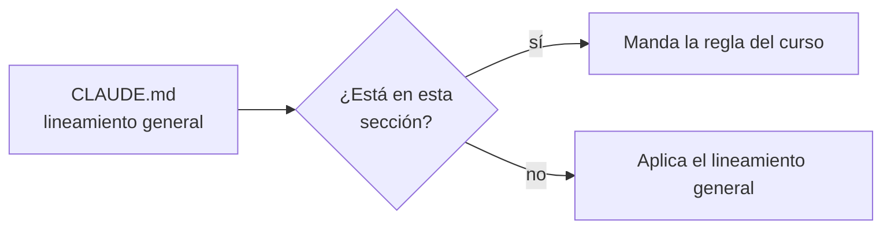

# ✍️ Guía de estilo, tono y convenciones
## {{Nombre del curso}}

> ✏️ **Plantilla:** se escribe en la etapa E4 (tanda P4). Lo que trae escrito son los **valores por
> defecto** destilados de los cursos ya producidos; se conservan, se ajustan o se reemplazan, pero
> cada reemplazo de una regla heredada se declara en el encabezado. La numeración de §9, §10, §12 y
> §13 la citan las demás plantillas: no se renumera.

Esta guía es la fuente de verdad editorial del curso. Cualquier sesión que produzca o edite un `.md`
de este proyecto la sigue. Su objetivo es que {{las N fases | los N capítulos}} se lean como escritos
por la misma mano, y que todos apunten al mismo sitio: **{{la capacidad del alcance §1, en una
frase}}**.

Si dudas entre dos formas de escribir algo, gana la que le sirva más a alguien que mañana
{{tiene una entrevista donde le preguntarán X | tiene que explicarle a su equipo por qué Y}}.

> **Precedencia.** {{Por encima de esta guía solo está [`alcance-del-proyecto.md`](alcance-del-proyecto.md),
> que decide qué enseña el curso; esta decide cómo se escribe.}} Por debajo van el
> [diccionario](diccionario-de-terminos.md), el [contrato de nombres](contrato-de-nombres.md), las
> propuestas, las plantillas y los prompts, que se actualizan después y nunca al revés.
>
> **Derivada de** {{la guía de … (fecha) | ninguna: escrita desde las plantillas generales}}. Lo que se
> hereda sin cambios se hereda en silencio; **diverge en {{N}} puntos declarados**: {{§x (qué), §y
> (qué)}}.
>
> **Vigencia:** {{AAAA-MM-DD}}.

**Salto rápido:** [1](#1--principio-rector) · [2](#2--tono) · [3](#3-️-idioma-y-forma-de-la-narrativa) · [4](#4--pedagogía-cómo-se-explica) · [5](#5--código-comandos-y-archivos) · [6](#6--la-plantilla-de-los-documentos) · [7](#7--los-tipos-de-documento-y-su-coherencia) · [8](#8--evaluación-preguntas-y-ejercicios) · [9](#9--longitud-y-densidad) · [10](#10--referencias-y-enlaces) · [11](#11--vocabulario-visual) · [12](#12--checklist-antes-de-dar-por-cerrado-un-md) · [13](#13-️-excepciones-declaradas) · [14](#14--laboratorio-opcional) · [15](#15--pendientes-que-afectan-a-esta-guía)

---

## 1. 🧭 Principio rector

**{{Todo lo que se escribe apunta a que alguien … y lo pueda defender con …}}.**

El filtro para cada párrafo es este: **¿esto ayuda a {{construir | diagnosticar | medir | decidir |
responder en la entrevista}}?** Si no, sobra, aunque esté muy bien escrito. Sobre todo si está muy
bien escrito.

> 🧠 **{{La frase que resume el orden de casi todas las fases: "primero funciona, después se entiende,
> y al final se rompe a propósito".}}**

### 1.1 Qué NO es este curso

{{Las fronteras con los temas vecinos, una viñeta por frontera, diciendo qué entra de ese tema aquí
(lo que cambia una decisión) y qué no. Si `D-03` = total, sin nombrar dónde vive lo excluido.}}

- **No es {{…}}.** {{Qué entra de ello aquí y qué no.}}

### 1.2 Requisitos y autocontención

> ✏️ **Plantilla:** fija la regla de `D-03`. Elige un bloque y borra el otro.

**Autocontención total.** El curso no nombra ningún otro curso ni depende de ningún documento fuera de
su carpeta, incluido el `CLAUDE.md` del repositorio: la carpeta se copia a otro proyecto y funciona.
Cuando un tema queda fuera, se declara la exclusión y el texto se detiene ahí.

**Autocontención editorial.** {{El troncal}} es el único requisito: se asume, no se resume. Los demás
cursos son **sugerencias de estudio** y aparecen solo en el pie como *Relacionado*, en la última
entrada de "Para profundizar" y en el README, diciendo **qué añaden**, nunca "antes de leer esto, lee…".
Lo que un capítulo tome de un curso opcional se resume en lo mínimo para sostenerse solo. El sistema
de ejemplo se redeclara entero aunque coincida con el de otro curso. El laboratorio no depende de
ningún otro laboratorio.

---

## 2. 🎤 Tono

**Semiformal, cálido y directo**, de colega senior a colega senior, con humor seco cuando cae bien y
nunca más de un chiste por sección.

- **Tuteo latinoamericano, siempre.** Nada de voseo, nada de "usted" y nada de impersonal permanente.
  {{Excepción declarada: los personajes de la historia hablan como hablan, entre comillas.}}
- **Semiformal.** Frases completas, puntuación correcta, cero abreviaturas de mensajería.
- **Cálido sin condescendencia.** El lector es senior; lo que se le explica con cero ambigüedad es lo
  que todavía no sabe, no lo que ya sabe.
- **Honesto sobre lo feo y sobre los costos.** Cada opción gana en algún sitio y pierde en otro, y las
  pérdidas van con número. Incluye a la opción que el curso elige.
- **Neutral entre herramientas.** Ninguna se ridiculiza; a la favorita se le nombran sus costos.
- **Sin superioridad.** Nunca "obviamente", "cualquiera sabe", "error de novato", "mala práctica" a
  secas.

### 2.1 El tono de las autopsias *(opcional)*

⚰️ Una autopsia se escribe sobre una **decisión**, jamás sobre una persona ni sobre una herramienta,
y **defiende la decisión antes de desmontarla**: (1) la decisión con su mejor argumento, (2) por qué
era razonable en su contexto, (3) qué pasó después, con número, (4) cuánto costó salir, con número,
(5) qué pregunta habría cambiado el resultado.

---

## 3. 🗣️ Idioma y forma de la narrativa

- **Español latinoamericano neutro**, técnico y claro, para todo lo que no sea código o salida.
- **Los términos del oficio siguen el [diccionario de términos](diccionario-de-terminos.md)**: qué se
  queda en inglés, qué tiene traducción asentada y cuál se fija. **No se inventa vocabulario y no se
  alternan dos formas en un mismo documento.** Un término nuevo se agrega al diccionario antes de
  usarlo.
- **Markdown siempre.** Nada de HTML embebido salvo `<details>` para soluciones plegadas.
- **Prosa antes que listas.** Un párrafo que explica *por qué* vale más que cinco viñetas que enumeran
  *qué*.
- **Nada de prosa telegrama.** Una frase aislada es un golpe de ritmo; tres seguidas son un telegrama.
  Una por sección, dos si la sección es larga.
- **Tablas solo para lo tabular y corto**: comparación, traducción, versiones, decisión. Tres o cuatro
  columnas; ninguna celda que necesite explicación.
- **Diagramas cuando hay estructura que mostrar**: el camino de una petición, una secuencia entre
  servicios, una máquina de estados, una línea de tiempo, una cadena de confianza. Cada diagrama lleva
  antes una frase que diga qué mirar en él.
- **Mermaid no es obligatorio** (`D-12`). Por defecto, el formato queda a criterio de quien escribe:
  un diagrama ASCII en bloque `text` o uno en Mermaid. **Mermaid es obligatorio solo si se pidió de
  forma explícita** al crear el curso (y entonces `D-12` lo dice) o en una solicitud de revisión (y
  entonces vale para lo que esa revisión toca). Las reglas y mnemotecnias, las salidas de terminal y
  los árboles de archivos van siempre en `text`.

  Ejemplo, si el curso usa Mermaid:

  ```mermaid
  sequenceDiagram
      participant C as {{cliente}}
      participant G as {{gateway}}
      participant S as {{servicio}}
      C->>G: {{POST /orders}}
      G->>S: {{reenvía con timeout de 2 s}}
      S-->>G: {{201 Created}}
      G-->>C: {{201 Created}}
  ```
- **Salida de terminal literal**, en bloque `text`, sin embellecer y sin recortar la parte incómoda.

---

## 4. 🎓 Pedagogía: cómo se explica

> **"Como para un bebé" significa cero ambigüedad, no menos profundidad.**

### 4.1 La regla del andamio

Todo concepto nuevo se presenta en tres tiempos: **el problema primero** (el dolor, reproducido o
contado con una línea de tiempo), **el mecanismo después** (el nombre y la definición mínima) y **el
código, el comando o el diagrama que lo demuestra**, con lo que hay que mirar en él. Por eso la
primera sección de contenido de toda {{fase | capítulo}} es `🎯 El problema` {{| `🧨 El problema, en el
laboratorio`}}.

### 4.2 Ningún bloque sin desglose, ningún beneficio sin precio

- **Ningún bloque de código ni comando aparece sin una frase antes que diga qué demuestra y viñetas
  después que digan qué mirar.** Un bloque suelto es un error de estilo. Ningún flag queda sin
  explicar.
- **Bloques mínimos**: la firma, la anotación y las tres líneas que importan. Si un bloque introduce
  tres cosas desconocidas, se parte en tres.
- **Toda afirmación de beneficio lleva su precio en la misma sección**, en las monedas del curso:
  `{{latencia · consistencia · operación · dinero · esfuerzo}}`.

### 4.3 Explica el porqué

Cada decisión de un manifiesto, una configuración o un diseño lleva su razón. "Se pone así" no es una
razón.

### 4.4 Analogías con fecha de caducidad

Una analogía sirve para entrar y se abandona en cuanto el lector tiene el modelo real. Se dice dónde
deja de valer.

### 4.5 Densidad calibrada

No explicar lo que el lector ya sabe (alcance §4) y no dejar ambiguo nada de lo que no.

### 4.6 Cierra los bucles

Toda promesa de "esto se ve en X" tiene su enlace (o su entrada en la deuda de enlaces del plan). Todo
"como vimos" apunta a donde se vio.

### 4.7 El patrón fijo de cada concepto *(opcional)*

```text
Qué es        → la definición mínima, en una o dos frases
Cómo va       → el mecanismo: la secuencia, las piezas
{{Qué garantiza → la ficha propia del curso}}
Con qué       → la herramienta o la librería concreta. NUNCA se omite.
Cuánto        → el precio en las monedas de §4.2. NUNCA se omite.
Cuándo sí     → los casos donde se paga solo
Cuándo no     → los casos donde es ceremonia. NUNCA se omite.
Veredicto     → la frase que resume el criterio, en blockquote
```

---

## 5. 💻 Código, comandos y archivos

- **Identificadores, nombres de archivo, recursos, variables y salida en inglés; comentarios dentro
  del código en español con tildes.** El diccionario de código del dominio está en el
  [diccionario](diccionario-de-terminos.md) §5.
- **Todo bloque declara su lenguaje** (`bash`, `java`, `yaml`, `text`…).
- **Los nombres técnicos son los del [contrato de nombres](contrato-de-nombres.md).** Un nombre que no
  está allí se agrega allí primero.
- **Versiones:** {{política de `D-07`}}. Viven en {{a01 | §5.1 de esta guía}} con su fecha de
  verificación, y ningún otro documento escribe un número de versión: lo cita. Nunca `latest`, `*` ni
  rangos donde el curso fija un valor exacto.
- **Plataformas:** {{las soportadas, siempre en el mismo orden}}. Solo {{la del autor}} está verificada;
  lo demás lleva la marca *"no verificado por el autor; se confirma al hacer el curso"*.
- **Lo que no se pudo ejecutar** lleva el marcador {{`[PENDIENTE DE CORRIDA]`}} y nunca una salida
  inventada.
- **Todo lo que cobra por hora se nombra con precio y unidad**, y toda exclusión del laboratorio dice
  por qué. {{Solo cursos de nube.}}

### 5.1 Versiones fijadas *(opcional)*

| Pieza | Versión | Verificada | Fuente |
|---|---|---|---|
| {{…}} | {{…}} | {{AAAA-MM-DD}} | {{registro oficial}} |

---

## 6. 🧱 La plantilla de los documentos

Los esqueletos completos están en [`plantillas-de-capitulo.md`](plantillas-de-capitulo.md). Las de
{{fase | capítulo}} son **rígidas** y se siguen literales, sin secciones extra ni reordenadas; la de
apéndice es **laxa**.

Lo obligatorio en toda {{fase | capítulo}}:

- **Título** `# {{NN}} — {{Tema}}: {{la promesa concreta}}`.
- **Bloque de encabezado** en blockquote: {{curso · posición · peso · depende de · habilita · qué
  asume leído (con enlace) · fecha de verificación · objetivo}}.
- **Salto rápido** si pasa de ~400 líneas.
- **Numeración `##` arábiga y continua**, con emoji funcional en `##` y **ninguno en `###`**.
- **Pie de navegación**: Anterior · Siguiente {{· Relacionado}}.

---

## 7. 📐 Los tipos de documento y su coherencia

{{Los tipos que existen en este curso —fase, apéndice, capítulo, simulación, solucionario, taller,
README, documentos vivos— y qué lleva cada uno. Ver `01-tipos-de-curso` en las plantillas generales
para los valores por defecto.}}

**Coherencia entre documentos:**

- **No se contradice un documento publicado**: se matiza, con enlace.
- **Un concepto tiene un solo dueño.** Los demás documentos lo enlazan, no lo reescriben.

  | Concepto | Dueño |
  |---|---|
  | {{…}} | {{`NN`}} |

- **Los apéndices no repiten lo que explica una fase, y viceversa: se enlazan.**
- **Una fase no cita `prompts/` ni el plan de producción**: cita otra fase, un apéndice o un
  documento vivo. Los documentos de `prompts/` son de autoría, no del lector.
- **Los datos de la historia no se inventan de nuevo.** Si falta uno, se agrega primero a la historia.
- **Los README {{y `0-ESTRUCTURA-CURSO.md`}} no se tocan al escribir una fase**: se escriben al final.
  Lo que una fase querría agregarles va a 📌 Pendientes.
- 🗑️ **Los documentos `_desechable-*` no se citan nunca.**

---

## 8. 🧪 Evaluación: preguntas y ejercicios

> ✏️ **Plantilla:** deja el bloque del tipo de curso y borra el otro. Las cantidades salen de la
> propuesta §8.

### 8.1 Ejercicios *(curso completo, labs, talleres, apéndices)*

- **Cantidad fija por peso** (§9), la de la propuesta. **La cantidad no arregla un aparato flojo**: si
  el ejercicio 22 sale como variante del 9, el número correcto era 21, y se dice en 📌.
- **La escala:**

  | | Nivel | Qué pide |
  |---|---|---|
  | 🟢 | Fácil | Reproducir lo que la fase acaba de mostrar, con otro caso |
  | 🟡 | Intermedio | Aplicar el patrón donde no es mecánico |
  | 🟠 | Difícil | Combinar, diagnosticar, decidir entre alternativas |
  | 🔴 | Muy difícil | Abierto o adversarial: se entrega algo roto y hay que razonarlo |
  | 🔥 | Extra | Fuera del alcance base; no cuenta |

- **Reparto ≈ 30 % 🟢, 30 % 🟡, 25 % 🟠, 15 % 🔴.** Al menos un tercio de diagnóstico o de medición.
  **Predecir antes de ejecutar** en 🟠 y 🔴.
- **Cada ejercicio cierra con `**Criterio:**`** verificable: un comando y su resultado esperado, nunca
  "despliega X" a secas.
- **Agrupados por dificultad**, con encabezado de rango y el conteo en el título.
- **Solución:** los 🟢 y 🟡 llevan la solución plegada en `<details>`; los 🟠 y 🔴, una rúbrica. {{O:
  todas en el solucionario único.}}

### 8.2 Preguntas *(curso repaso, banco)*

- **{{20–30 | 10–15}} preguntas por capítulo**, calibradas por cuántas cosas distintas enseña, nunca
  por su longitud. **Sin respuesta en el capítulo**: van al solucionario. **Nunca ejercicios en un
  capítulo teórico.**
- **Dificultad al final del enunciado**: 🟢 definición · 🟡 distinción · 🟠 decisión · 🔴 diseño o
  diagnóstico. Reparto orientativo 25/25/30/20, **distinto en capítulos vecinos**. De menor a mayor.
- **Las 🔴 piden un artefacto o una secuencia**, no una opinión.
- **{{Preguntas obligatorias propias del curso, si las hay.}}**
- **La regla de sincronía:** quien agrega, elimina o reordena una pregunta refleja el cambio en el
  solucionario **en la misma edición**, con el enunciado copiado literal.
- **Las tres capas de la respuesta**, siempre las tres y en este orden: ⏱️ **30 segundos** (lo que
  dices primero, como se diría, sin nombres de librería) · 🗣️ **2 minutos** (añade, no repite; es
  donde entra el precio) · 🔬 **el detalle** (para estudiar: la excepción, la librería, el número).

---

## 9. 📏 Longitud y densidad

| {{Peso / Tipo}} | {{Palabras de cuerpo / Líneas}} | {{Ejercicios / Preguntas}} |
|---|---|---|
| {{ligera}} | {{2.500–3.500}} | {{12}} |
| {{media}} | {{3.500–4.500}} | {{20}} |
| {{densa}} | {{4.500–6.000}} | {{24}} |

El cuerpo se mide cortando por el encabezado de {{🧪 Ejercicios | 🧠 Preguntas}}. Si un documento
pasa del techo, se poda o se parte; no se estira para llegar al piso.

---

## 10. 📚 Referencias y enlaces

### 10.1 Enlaces externos

- **Orden de autoridad:** documentación oficial de la versión que se usa → especificaciones y RFC →
  libros → artículos de autor reconocido → charlas y vídeos.
- **URL completa y específica por concepto**, nunca a la portada. **No se inventan URLs**: un enlace
  no verificado no se escribe. Se comprueban **por código de estado**; aterrizar en la portada cuenta
  como roto.
- **{{Máximo N entradas}}** en `📚 Para profundizar`, ordenadas por autoridad, con al menos un libro
  con capítulo concreto. Se advierte cuando un enlace apunta a otra versión.
- **{{Fuentes citadas por título sin URL: …}}**

**Libros base** (edición y año comprobados el {{fecha}}, en la verificación previa):

- {{Autor, *Título*, N.ª edición, Editorial, año.}}

### 10.2 Enlaces internos y anclas

- **Anclas de GitHub**: minúsculas, se borra todo lo que no sea letra, número, espacio, guion o guion
  bajo —el punto de la numeración, el emoji, los backticks— y los espacios restantes pasan a guiones.
  Cada carácter borrado deja su espacio: `## 2. 🧱 Tema` → `#2--tema`. **Excepción que rompe
  enlaces:** los emojis que llevan selector de variación (⚠️, ⚖️, ⚙️, 🏷️, 🗂️…) dejan el U+FE0F en el
  ancla: `## 10. ⚠️ Errores frecuentes` → `#10-️-errores-frecuentes`, con un carácter invisible entre los
  guiones. Lo más seguro es copiar el ancla que propone el verificador (`ANCLA-FE0F`).
- **Al renombrar un archivo o un encabezado**, se revisan los enlaces entrantes en la misma edición.
- **Ningún enlace a un documento que todavía no existe**: la mención va en prosa y a la deuda del plan.

### 10.3 Vigencia

Todo documento lleva `Vigencia:` o fecha de verificación en su encabezado, y la cambia cuando se
revisa.

---

## 11. 🧷 Vocabulario visual

- **Emoji funcional en `##`, ninguno en `###`.**
- **Callouts admitidos**, en blockquote con la etiqueta en negrita, **como mucho uno por sección `##`
  y nunca dos seguidos**:
  ⚠️ advertencia · 🧠 modelo mental · 💡 truco · 🩺 diagnóstico · 💰 costo · 📝 contexto ·
  📚 referencia inline · {{los propios del curso: 🪞 apuesta · 🧨 rotura · ⚰️ autopsia · ⚖️ veredicto ·
  📏 medición · 🧭 principio}}.
- **Marcadores de estado** {{propios del curso: ⭐ fase central · 🔥 opcional · 🚧 hasta aquí llega el
  laboratorio · …}}.
- **La escala 🟢🟡🟠🔴** solo en enunciados de preguntas y ejercicios. **✅ y ❌** solo en tablas y
  bloques de comparación.
- **Ningún otro emoji**: nada de 🚨, 💸, ⭐ ni 🎉 fuera de lo declarado aquí.
- **Regla o mnemotecnia** en bloque `text`, etiquetada antes ("Regla:"); **la frase correcta** en
  blockquote, y el veredicto con la etiqueta `**Veredicto:**`.
- **La autopsia de un incidente**: síntoma → cadena (diagrama `text`) → causa, con la decisión que la
  hizo posible → corrección → generalización.
- **`## ⚠️ Errores frecuentes`** con tabla "Se dice / Lo preciso", 5–8 entradas. {{Repasos.}}

---

## 12. ✅ Checklist antes de dar por cerrado un `.md`

```text
Estructura
[ ] Sigue su plantilla, o está declarado como excepción
[ ] Encabezado completo: posición, peso, depende de, qué asume leído con enlace, vigencia, objetivo
[ ] Salto rápido si pasa de ~400 líneas; anclas verificadas
[ ] Abre con el problema, no con una definición
[ ] Numeración ## continua; emoji en ##, ninguno en ###
[ ] Pie de navegación

Contenido
[ ] Ningún bloque de código ni comando sin frase antes y desglose después; ningún flag sin explicar
[ ] Todo beneficio con su precio; cada opción con dónde pierde
[ ] Lo que dice la ficha de la propuesta está; lo que falta, declarado
[ ] Ningún concepto reescrito si tiene otro dueño: se enlaza
[ ] Todo comando, salida y número salió de una ejecución real, o lleva el marcador de pendiente
[ ] Ningún nombre técnico fuera del contrato; ningún término fuera del diccionario
[ ] Ninguna versión escrita fuera de su sitio; nunca latest ni rangos
[ ] Cuerpo en la banda de §9

Forma
[ ] Tuteo en todo el documento; cero voseo, cero "usted" fuera de las citas declaradas
[ ] Sin prosa telegrama; tablas solo para comparar o mapear
[ ] Callouts solo los de §11, uno por sección como mucho
[ ] Diagramas con una frase antes, en el formato de D-12 (Mermaid solo si se pidió explícitamente)
[ ] Código en inglés, comentarios en español; bloques con lenguaje declarado

Evaluación
[ ] Cantidad de la propuesta §8, graduada, de menor a mayor
[ ] Ejercicios con Criterio verificable | preguntas sin respuesta visible
[ ] Si se tocó una pregunta, el solucionario se actualizó en la misma edición, enunciado literal
[ ] Reparto de dificultad distinto al del documento vecino

Referencias y coherencia
[ ] Todas las URL verificadas por código de estado en esta edición
[ ] Ningún enlace interno roto ni a un documento que no existe
[ ] No contradice nada publicado; ningún bucle abierto
[ ] Ningún otro curso nombrado fuera de lo que permite §1.2; ningún _desechable-* citado
[ ] Ningún README modificado fuera de su tanda
[ ] Todo pendiente abierto tiene destino explícito
```

---

## 13. ⚖️ Excepciones declaradas

El `CLAUDE.md` del repositorio trae **lineamientos generales**: son valores por defecto, no techos, y
este curso los sobrescribe con reglas más específicas cuando las necesita. La condición es nombrar la
regla general, el valor nuevo y por qué; si no estuvieran escritas aquí, cada sesión futura las
"arreglaría" de vuelta.



| Regla general | Este curso | Por qué |
|---|---|---|
| {{20–30 preguntas por capítulo}} | {{50 preguntas en los capítulos del bloque 03}} | {{el bloque cubre el doble de conceptos comprobables por separado}} |
| {{…}} | {{…}} | {{…}} |

Todo lo demás del `CLAUDE.md` aplica tal cual. {{Si `D-03` = total: este curso no depende de ningún
`CLAUDE.md`; las reglas que necesita están copiadas aquí.}}

---

## 14. 🧪 Laboratorio *(opcional)*

> ✏️ **Plantilla:** para cursos con laboratorio o bloque de talleres. Si el curso es mixto, aquí van
> las reglas de la mitad práctica; la teórica se sostiene sin ella.

- **Es {{camino base | opcional}}**, y {{el corpus teórico se sostiene sin él: nada de "esto lo verás en
  el taller" como sustituto de una explicación}}.
- **Se ejecuta en {{Docker Compose local | …}}**, con recursos etiquetados `curso={{slug}}`, prefijo
  `{{prefijo}}-` y {{**los puertos por defecto** de cada servicio, que son los que el lector reconoce |
  **puertos altos** del rango N0000–N0099 ligados a `127.0.0.1`, configurables por variable y
  comprobados libres antes de levantar, para no chocar con otros contenedores del lector}}. Las
  pruebas de producción usan siempre puertos altos y aleatorios, sea cual sea la elección del curso.
- **El teardown borra los contenedores con sus volúmenes** (`docker compose down -v` sobre el proyecto
  del laboratorio) y nada más del lector.
- **Orquestación con {{`scripts/lab.py`, Python 3 con biblioteca estándar}}**: un solo script para las
  tres plataformas en vez de `.sh` más `.ps1`.
- **Cada provocación**: 🪞 apuesta escrita antes → provocación con la salida pegada → punto de rotura
  literal → salida en orden de costo (configuración → código → modelo → topología).
- **El teardown se escribe junto al recurso**, no al final de la serie.
- **Los errores se reproducen a propósito antes de corregirlos**, y los errores reales que aparecen al
  correr van a la sección 🩺.
- **El código global vive en `{{src/ | laboratorio/ | taller/}}`**, en la raíz del curso, y el
  `README.md` del curso lo nombra. {{Se omite si el curso no tiene código global.}}
- **Estado congelado** al cerrar cada {{taller}} en `{{laboratorio/estados/NN/}}`.
- **Un solo `.gitignore`, en `{{laboratorio/ | la raíz del curso}}`**, que se sostiene sin el de la
  raíz del repositorio y cubre todo el código del curso, también `estados/NN/`. Ningún servicio,
  lenguaje ni estado congelado lleva el suyo; las carpetas vacías que exige un framework se versionan
  con `.gitkeep`. {{Va en la raíz del curso solo si hay código en más de un bloque.}}

---

## 15. 📌 Pendientes que afectan a esta guía

- {{⏳ Versiones: se fijan en la verificación previa.}}
- {{⏳ Libros base: edición y año, en la verificación previa.}}
