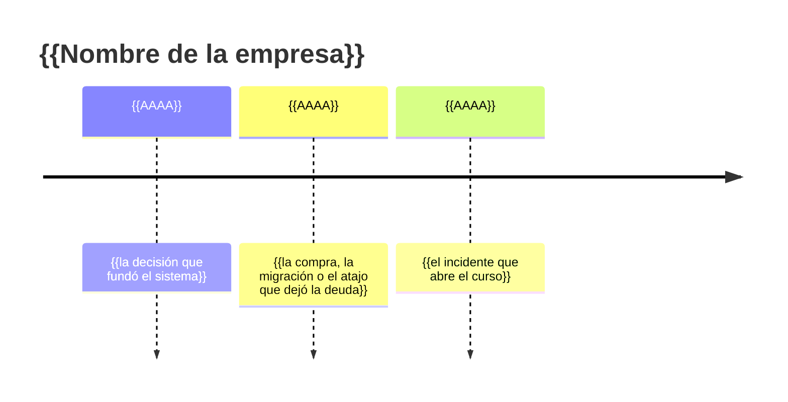

# 🏢 {{Nombre de la empresa}}: la historia

> ✏️ **Plantilla:** formato propio opcional (etapa E4) para cursos que anclan cada fase en una empresa
> ficticia. A diferencia del resto de `prompts/`, **este documento lo lee el lector**: vive en la raíz
> del curso como `00-historia-de-{{slug}}.md`. Se escribe en varias rondas con el autor; las primeras
> son propuestas candidatas (dos o tres empresas distintas) y el autor elige. Un ejemplo lleno, en
> versión breve: [`ejemplo-historia.md`](ejemplo-historia.md) (Escapes Houdini).

> **Qué es este documento:** la fuente de verdad de todo lo narrativo del curso —la empresa, su gente,
> sus sistemas, sus cifras y sus reglas de negocio—. **Ninguna fase inventa un dato**: si lo necesita y
> no está aquí, se agrega aquí primero.
> **Vigencia:** {{AAAA-MM-DD}}.

> ✏️ **Plantilla — qué hace que una historia funcione** (de los cursos ya producidos):
> - **Verosimilitud plausible, no documental.** Tiene que *parecer* un caso real de empresa
>   latinoamericana, con los matices de cómo pasan las cosas de verdad: la consultora que arma el
>   organigrama, el Excel reenviado por correo personal, el sistemita de los practicantes que se
>   queda, la compra rápida por contactos en una contingencia, la estimación optimista por trimestre,
>   "hoy comemos pizza".
> - **Decisiones con fecha, autor y razón; nunca villanos.** Cada rareza técnica del sistema tiene una
>   causa histórica que en su momento fue razonable.
> - **Cifras acotadas a lo que el laboratorio sostiene**, y las que vienen del mundo real (licencias,
>   precios, fechas de productos) verificadas con fuente en la verificación previa.
> - **Un dolor concreto por fase**: la historia existe para que cada fase abra con alguien que tiene un
>   problema, no con "vamos a probar el rendimiento de X".
> - **Voces regionales con moderación**: una frase por escena, no un acento impostado; la narración y
>   las instrucciones al lector siguen en tuteo neutro.

---

## 1. 📅 Cómo llegó hasta aquí

{{La cronología, año por año, con las decisiones que dejaron el sistema como está. Cada entrada: qué
se decidió, quién, por qué tenía sentido entonces, qué costó después. La línea de tiempo es
opcional; en Mermaid solo si `D-12` lo pide.}}

| Año | Qué pasó | Quién lo decidió | Lo que dejó |
|---|---|---|---|
| {{…}} | {{…}} | {{…}} | {{…}} |

## 2. 👥 La gente

| Personaje | Rol | Cómo habla | Qué quiere | Aparece en |
|---|---|---|---|---|
| {{…}} | {{…}} | {{…}} | {{…}} | {{fases}} |

## 3. 🏚️ Lo que hay (el patrimonio)

{{Los sistemas existentes, con su stack, su edad, quién los mantiene y sus mañas. Lo que el curso
levanta en el laboratorio y lo que solo se menciona.}}

## 4. 🔥 El incidente que lo empezó todo

{{La escena de apertura: la noche, el síntoma, la pregunta que alguien hizo al día siguiente.}}

## 5. 💰 Las cifras

| Cifra | Valor | Fuente o supuesto |
|---|---|---|
| {{…}} | {{…}} | {{verificada el … / ficticia, acotada al laboratorio}} |

## 6. 📏 Las reglas de negocio

{{Las que el sistema implementa, con su definición operativa. Cada regla que una fase necesita, aquí
primero.}}

## 7. 🗣️ Cómo hablan

{{Las expresiones regionales permitidas y quién las usa.}}
