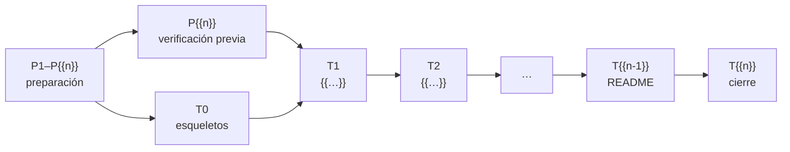

# 🗓️ Plan de producción: tandas, estado y checklist
## {{Nombre del curso}}

> ✏️ **Plantilla:** nace en la etapa E3, en cuanto existe la lista de fases. Las secciones 3, 6, 7 y 8
> se actualizan al cerrar **cada** sesión. Mientras el curso está en producción el archivo puede
> llamarse `_desechable-plan-de-produccion.md` para que nadie lo cite.

Este documento dice **en qué orden se prepara y se escribe el curso, cuándo una tanda está terminada
y dónde va la producción**. Hay dos fases: la **preparación** (tandas `P1`–`P{{n}}`), que solo toca
`prompts/` {{y el laboratorio de verificación}} y no escribe ni una fase, y la **escritura** (tandas
`T0`–`T{{n}}`), que arranca cuando está cerrada la parte de la preparación que cada tanda necesita
(regla 6). Es operativo: **cualquier sesión que retome el curso empieza leyendo §3 (estado), §6
(deuda), §7 (bitácora) y §8 (checklist).**

- El qué lo manda [`alcance-del-proyecto.md`](alcance-del-proyecto.md).
- La forma la manda [`guia-de-estilo-y-convenciones.md`](guia-de-estilo-y-convenciones.md).
- Los nombres, [`contrato-de-nombres.md`](contrato-de-nombres.md) y
  [`diccionario-de-terminos.md`](diccionario-de-terminos.md).
- La ficha de cada fase, [`propuesta-fases-y-alcance.md`](propuesta-fases-y-alcance.md).
- La entrada de cada tanda es su prompt: [`prompts-de-fase.md`](prompts-de-fase.md){{ y
  [`prompts-de-apendice.md`](prompts-de-apendice.md)}}.
- **El orden lo manda este documento.**

> **Caducidad:** es un documento de producción. Al cerrar el curso se conserva en `prompts/` como
> referencia —`prompts/` no viaja al repositorio público—, salvo que el autor pida borrarlo. **No se
> cita desde ninguna fase, apéndice ni README.**
>
> **Vigencia:** {{AAAA-MM-DD}}.

**Salto rápido:** [1](#1--las-reglas-de-orden) · [2](#2--qué-es-una-tanda) · [3](#3--estado) · [4](#4--las-verificaciones) · [5](#5--las-tandas-una-por-una) · [6](#6--deuda-de-enlaces-abierta) · [7](#7--bitácora) · [8](#8--checklist-final) · [9](#9--directorios-de-zz-code)

---

## 1. 🧭 Las reglas de orden

Son {{N fases, M apéndices, K documentos de soporte}}. Escritos en orden de carpeta, el curso tendría
la mitad de los enlaces rotos durante semanas y {{los solucionarios atrasados | los documentos vivos
desactualizados}}. Las tandas van por **dependencia**, y cada una deja el curso coherente y publicable
hasta donde llega.

1. **Ninguna tanda se cierra con un documento que crece atrasado**: {{el solucionario de su bloque,
   con el enunciado literal | los documentos vivos | los apéndices de consulta}}, en la misma tanda.
2. **Ningún enlace interno apunta a un documento que no existe.** La referencia va en prosa y se
   anota en §6; la tanda que escribe el destino la convierte en enlace.
3. **Los README {{y `0-ESTRUCTURA-CURSO.md`}} se escriben en una tanda final y aparte (T{{n}}), y
   ninguna otra tanda los toca.** Lo que una tanda querría decir en uno de ellos se anota en §6.
4. **Nada se nombra sin comprobarlo en la misma sesión**: versión, librería, flag, URL por código de
   estado, libro con edición y año.
5. **{{Una fase no se cierra sin haberse corrido entera}} en {{plataforma del autor}}**, con la salida
   literal y fechada. Lo que no se puede correr lleva el marcador de la guía y su casilla "corrida" ⬜.
6. **Ninguna tanda de escritura empieza con su preparación abierta.** Cada una exige lo suyo:
   - **T0** exige {{P-n}}: decisiones cerradas y trasladadas.
   - **T1** exige además {{P-n}} (la verificación previa).
   - {{…}}
7. **Por defecto, todo en el hilo principal, secuencial y sin agentes**, salvo que el autor pida lo
   contrario. La sesión de preparación no escribe el curso; **por defecto se para al cerrar cada
   tanda**.
8. **Git lo hace el autor.** Se borra con `rm`, archivo por archivo, nunca con `git rm` ni borrando
   directorios. Los tags los crea el autor con los mensajes que la tanda deja en la bitácora.
9. **La máquina del autor no se toca sin permiso**: nada se instala ni genera cargos. Los contenedores
   de las pruebas llevan la etiqueta `curso={{slug}}`, usan **puertos altos y aleatorios** (nunca los
   de por defecto, que otro contenedor puede tener ocupados; el curso sí puede publicarlos) y se borran **con sus volúmenes** al
   terminar; nada que ya existía se borra.
10. **El código intermedio de las pruebas va a `zz-code/`**: un directorio por sesión
    (`python3 zz-code/nuevo.py {{slug}}`), registrado en §9 con su estado. Lo efímero (logs, salidas,
    copias) va a su `salidas/`; ninguna prueba en el scratchpad. Ningún documento del curso cita `zz-code/`.

Las dependencias, en un vistazo:



**Prioridad si el tiempo aprieta:** {{T1 → T2 → …}}: {{qué deja un curso utilizable por sí solo}}. Lo
que falte de las tandas saltadas va en prosa y a §6.

---

## 2. 📦 Qué es una tanda

### 2.0 Una tanda de preparación

Un documento de `prompts/`, o un paso que lo deja coherente con los demás: una decisión, una
verificación, un traslado. **No crea nada fuera de `prompts/`** {{salvo …}}. Terminada cuando sus
enlaces pasan §4 y los documentos que la citan están al día.

### 2.1 Una tanda de escritura

Un grupo de {{fases | capítulos}} que se enlazan entre sí, con su parte del solucionario {{y su
laboratorio corrido}}. La rutina, igual en todas:

1. Pegar el prompt de cada documento y seguir su protocolo de tres pasos.
2. Tener delante el checklist de la guía §12, que se recorre **al cerrar cada archivo**.
3. Releer la ficha de la propuesta: lo que dice es el piso.
4. Comprobar versiones, librerías, URL y libros **antes** de escribirlos.
5. {{Partir del laboratorio en el estado que dejó la tanda anterior; ejecutar y anotar —el error
   antes de arreglarlo, literal—; después escribir.}}
6. Escribir en el orden en que los documentos se enlazan; después de cada uno, sus respuestas.
7. Alimentar lo que crece: {{solucionario, documentos vivos, apéndices de consulta}}.
8. Resolver la deuda de §6 que la tanda cierra.
9. Correr las verificaciones de §4.
10. Actualizar §3, §6, §7 y §8, y dejar en la bitácora los tags que el autor tiene que crear.

### 2.2 Peso de cada tanda

```text
ligera   {{T0 · …}}        esqueletos, cierres, README
normal   {{…}}             una capa nueva sobre lo ya probado
densa    {{…}}             laboratorio nuevo, el patrón central, infraestructura que no existía
```

Las **densas** llevan verificación de versiones y de recursos antes de escribir una línea, anotada con
fecha.

---

## 3. 📊 Estado

Leyenda: ⬜ pendiente · 🟡 en curso · ✅ terminada y verificada.

| Tanda | Entrega | Docs nuevos | Peso | Estado |
|---|---|---|---|---|
| **P1** | Alcance del proyecto | 1 | — | ✅ |
| **P2** | Propuesta de fases {{y de apéndices}} | {{1–2}} | — | ✅ |
| **P3** | Este plan | 1 | — | ✅ |
| **P4** | Guía de estilo y convenciones{{, derivada de …}} | 1 | — | ⬜ |
| **P5** | Diccionario de términos | 1 | — | ⬜ |
| **P6** | Contrato de nombres | 1 | — | ⬜ |
| **P7** | Plantillas de capítulo {{y formatos propios}} | {{1–n}} | — | ⬜ |
| **P8** | Prompts de fase {{y de apéndice}} | {{1–2}} | — | ⬜ |
| **P9** | Decisiones abiertas cerradas por el autor | — | — | ⬜ |
| **P10** | Verificación previa: versiones, libros, URL{{, laboratorio}} | {{1}} | {{densa}} | ⬜ |
| **P11** | Traslado de lo decidido y lo verificado | — | — | ⬜ |
| **T0** | Arranque: esqueletos de {{solucionarios, documentos vivos, apéndices que crecen}} | {{n}} | ligera | ⬜ |
| **T1** | {{…}} | {{n}} | {{…}} | ⬜ |
| **T{{n-1}}** | Los README {{y la estructura}} | {{n}} | ligera | ⬜ |
| **T{{n}}** | Cierre: verificación global, revisión total, limpieza de `prompts/` | — | ligera | ⬜ |

> 🚦 **Dónde está la producción ({{DD/MM/AAAA}}).** {{Una frase: qué está cerrado, qué sigue, qué
> decisiones esperan revisión del autor.}}

**Total: {{N}} documentos** ({{desglose}}), más {{el código de `src/`}} y los {{n}} documentos de
`prompts/` que existen durante la producción.

---

## 4. 🔍 Las verificaciones

Se corren al cerrar cada tanda, y todas en la tanda de cierre, desde la raíz del curso.

**El verificador del curso** (`prompts/verificar-corpus.py`, subclase de `prompts/verificador_base.py`):

```bash
python3 prompts/verificar-corpus.py
```

- La base: enlaces y anclas, enlaces fuera del curso o a `prompts/`, restos de plantilla, codificación
  rota, emoji en `###`, secciones obligatorias, bandas, orden de dificultad, callouts y sincronía con el
  solucionario pregunta a pregunta. Lo propio del curso: {{las validaciones de la subclase}}.

**Ningún documento publicado cita `prompts/` ni un desechable:**

```bash
grep -rln "_desechable-\|prompts/" --include='*.md' . | grep -v '^./prompts/'   # vacío
```

**Ningún otro curso del repositorio nombrado** (si `D-03` = total):

```bash
grep -rn "{{nombres de los cursos vecinos}}" --include='*.md' .   # vacío
```

**Ningún README cambió fuera de su tanda** (solo lectura: git lo maneja el autor):

```bash
git status --short -- ':(glob)**/README.md'    # fuera de T{{n-1}}, vacío
```

**Cantidades contra la propuesta §8:**

```bash
for f in [0-9][0-9]-*.md; do
  n=$(grep -cE '^### (🟢|🟡|🟠|🔴) Ejercicio [0-9]+' "$f")
  printf '%-50s %s\n' "$f" "$n"
done
```

- Cuenta los ejercicios por fase; en un repaso, se cambia el patrón por el de las preguntas
  (`^[0-9]+\. ` dentro de `## 🧠 Preguntas`).

**Longitud del cuerpo**, cortando por el encabezado de 🧪:

```bash
for f in [0-9][0-9]-*.md; do
  printf '%-50s %6s\n' "$f" "$(sed '/^## 🧪/,$d' "$f" | wc -w)"
done
```

**Codificación sana** (después de cualquier sustitución masiva):

```bash
grep -rl "Ã\|â€" --include='*.md' .    # vacío
```

**URL externas**, por código de estado y sin seguir a ciegas las redirecciones: aterrizar en la
portada de la documentación cuenta como roto.

---

## 5. 📦 Las tandas, una por una

Lo que cada documento escribe y arriesga está en su ficha y en su prompt. Aquí va solo lo que no
cubren: **por qué la tanda va en ese lugar y cuándo está terminada.**

### P1 a P{{n}} — Los documentos de `prompts/`

{{Fecha y orden en que se escribieron. Si uno cambia, se corrigen después los que cuelgan de él,
nunca al revés.}}

### P{{n}} — Verificación previa

**Entrega:** `prompts/verificacion/hallazgos.md` (`H1`, `H2`…). **Qué se verifica:** {{lista}}.
**Terminada cuando** todo tiene un hallazgo con fecha, y lo que no funciona tiene alternativa decidida.

### T0 — Arranque

**Entrega:** {{los esqueletos}}, con su encabezado y la nota "crece con el curso", **sin enlaces** a
documentos que todavía no existen.

### T{{n}} — {{Nombre}}

{{Qué escribe, por qué va aquí, qué exige. **Terminada cuando** …}}

---

## 6. 🧾 Deuda de enlaces abierta

Cada mención en prosa que espera a que exista su destino. Formato: origen → destino → tanda que la
cierra.

| Origen | Destino pendiente | La cierra |
|---|---|---|
| {{…}} | {{…}} | {{T-n}} |

---

## 7. 📓 Bitácora

Una entrada por sesión, **la más reciente arriba**: qué se cerró, qué quedó a medias y por qué, qué se
comprobó y cómo, **las trampas que la próxima sesión debe conocer**, los tags para el autor y qué sigue.

> ✏️ **Plantilla:** el formato de una entrada.

**{{AAAA-MM-DD}} · {{T-n}} {{cerrada | en curso}}.** {{Pedido literal del autor, si lo hubo.}} Escritas
**{{…}}** ({{palabras}}, {{ejercicios o preguntas}}). **Decisiones por defecto, a revisar:** {{D-xx}}.
**Comprobado:** {{versiones, URL, corridas}}. **Trampas para la próxima sesión:** {{…}}. **Recursos que
quedan levantados:** {{contenedores, cluster, configuración cambiada | ninguno}}. **`zz-code/`:**
{{`zz-code/{{slug}}-AAAAMMDD-hash/` creado o cambiado de estado | nada}}. **Efímero para borrar:**
{{`zz-code/…/salidas/` | nada}}. **Tags para el
autor:** `{{fase-NN-slug}}`. **Siguiente:** {{T-n+1}}.

---

## 8. ✅ Checklist final

Se marca `[x]` al cerrar cada punto. Una tanda se marca terminada en §3 solo cuando todos sus puntos lo
están. **En cursos con laboratorio, cada documento ejecutable lleva dos casillas: escrita y corrida.**

### Preparación (`prompts/`)

- [x] P1 · `prompts/alcance-del-proyecto.md`
- [x] P2 · `prompts/propuesta-fases-y-alcance.md` {{y `propuesta-apendices-y-alcance.md`}}
- [x] P3 · este plan
- [ ] P4 · `prompts/guia-de-estilo-y-convenciones.md`
- [ ] P5 · `prompts/diccionario-de-terminos.md`
- [ ] P6 · `prompts/contrato-de-nombres.md`
- [ ] P7 · `prompts/plantillas-de-capitulo.md` {{y formatos propios}}
- [ ] P8 · `prompts/prompts-de-fase.md` {{y `prompts-de-apendice.md`}}
- [ ] P9 · D-{{xx}}–D-{{yy}} cerradas por el autor
- [ ] P10 · Versiones según la política de la guía, con fecha y fuente (H-{{n}})
- [ ] P10 · Edición y año de los libros base (H-{{n}})
- [ ] P10 · URL de documentación oficial por concepto, por código de estado (H-{{n}})
- [ ] P10 · {{Laboratorio levantado y prototipo del método pasando de punta a punta}} (H-{{n}})
- [ ] P11 · Lo decidido y lo verificado trasladado; ningún ⏳ resuelto sin cerrar; §4 limpia sobre `prompts/`

### T0 — Arranque

- [ ] {{Esqueletos de …}}

### T1 — {{Nombre}}

- [ ] {{FNN}} · {{título}} — escrita
- [ ] {{FNN}} · {{título}} — corrida
- [ ] Solucionario {{o documentos vivos}} al día · §4 limpia

### T{{n-1}} — Los README

- [ ] `README.md` del curso, con el estado real {{y la carpeta del código global (`src/`, `laboratorio/`, `taller/`)}}
- [ ] {{README de cada bloque | `0-ESTRUCTURA-CURSO.md`}}
- [ ] Deuda de §6 dirigida a esta tanda, saldada

### T{{n}} — Cierre

- [ ] §4 limpia en todo el curso; URL externas verificadas
- [ ] Revisión total (continuidad, referencias, omisiones, autocontención) sin pendientes
- [ ] Contenedores del curso borrados con sus volúmenes, comparados contra el inventario inicial; configuración de la máquina restaurada
- [ ] `zz-code/`: ningún directorio del curso *vigente* en §9; vista previa de `zz-code/limpiar.py` mostrada al autor y lo regenerable liberado
- [ ] Ninguna prueba quedó fuera de `zz-code/`; las `salidas/` liberadas con `limpiar.py` o listadas para el autor
- [ ] `_desechable-*` borrados con permiso del autor, menciones limpias; `prompts/` conservado como referencia

### E9 — Publicación

- [ ] `verificador_base.py --perfil=publicacion` sin errores sobre la carpeta del curso
- [ ] README que se sostiene solo; licencia; `.gitignore` del repositorio público
- [ ] Ningún secreto ni dato personal en el código ni en los ejemplos
- [ ] El autor copió la carpeta sin `prompts/` a su repositorio público

---

## 9. 🧪 Directorios de `zz-code/`

Cada directorio de código intermedio que crearon las sesiones de este curso, con su estado. El detalle
de cada uno está en su `MANIFIESTO.md`; las reglas, en `zz-code/README.md`.

Estados: *vigente* (se sigue usando) · *extraído* (lo útil ya pasó al curso, a `prompts/` o a
`zz-instrucciones/herramientas/`) · *archivado* (se conserva como referencia).

| Directorio | Tanda | Qué se probó | Estado | Regenerable liberado |
|---|---|---|---|---|
| `zz-code/{{slug}}-{{AAAAMMDD}}-{{hash}}/` | {{T-n}} | {{…}} | {{vigente / extraído / archivado}} | {{sí / no}} |
