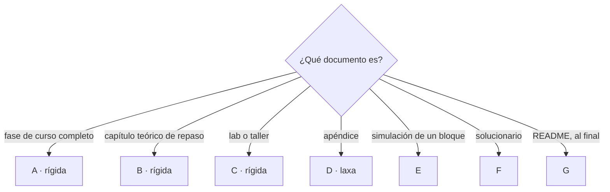

# 🧩 Plantillas de capítulo
## {{Nombre del curso}}

> ✏️ **Plantilla:** se escribe en la etapa E4 (tanda P8). Trae siete esqueletos; **se conservan solo
> los del tipo de curso** y se borran los demás. Las de fase, capítulo y taller son **rígidas**: se
> siguen literales, sin secciones extra ni reordenadas. La de apéndice es **laxa** a propósito.

Los esqueletos que se copian al abrir una sesión nueva. Se copia el bloque, se rellenan los
`{{placeholders}}` y se borran las notas entre llaves antes de entregar.

> **Nota de coherencia:** el peso, los ejercicios o preguntas y lo que reserva cada documento son los
> de [`propuesta-fases-y-alcance.md`](propuesta-fases-y-alcance.md) §8. Si cambian, se cambian **allí
> primero** y aquí después. Las longitudes son las de la [guía](guia-de-estilo-y-convenciones.md) §9;
> los nombres técnicos, los del [contrato de nombres](contrato-de-nombres.md).

**Salto rápido:** [A · Fase](#a--fase-de-curso-completo) · [B · Capítulo](#b--capítulo-de-repaso) · [C · Lab o taller](#c--lab-o-taller) · [D · Apéndice](#d--apéndice) · [E · Simulación](#e--simulación-de-entrevista) · [F · Solucionario](#f--solucionario) · [G · README](#g--readme-del-curso-o-del-bloque)

Cuál se usa:



---

## A · Fase de curso completo

````markdown
# {{emoji}} Fase {{NN}} — {{Tema}}: {{la promesa concreta del documento}}

> **Curso:** {{nombre}} · {{Bloque BB — nombre del bloque ·}} Fase {{NN}} de {{total}} · Parte {{romano}} — {{nombre de la parte}} · **{{ligera | media | densa}}** {{⭐}}
> **Depende de:** Fase {{NN-1}} · **Habilita:** Fase {{NN+1}}
> **{{Línea propia del curso: perfil, motor, servicios que toca, paso de generación}}**
> **Reserva:** {{incidentes, mediciones | nada}} · **Apéndices de apoyo:** {{a01, …}}
> **Fecha de verificación ejecutada:** {{DD/MM/AAAA}} · {{plataforma}} {{· otras: no verificadas por el autor}}
> **Objetivo:** {{una frase, verificable}}

---

## 🧭 1. Dónde estamos

{{Qué dejó la fase anterior, en qué estado está el sistema y qué falta. Si la historia tiene una
escena para esta fase, va aquí, en la voz de quien tiene el problema. Tres o cuatro párrafos.}}

## 🎯 2. Objetivos de esta fase

{{3 a 5 objetivos verificables.}}

## 🚫 3. Qué NO entra todavía

- {{tema diferido}} → Fase {{M}}.

## 🧨 4. El problema, en el laboratorio

{{El dolor reproducido, con la salida literal. Nunca contado: mostrado.}}

## 🧩 5. {{El mecanismo}}

{{El concepto con la regla del andamio: problema → mecanismo → demostración. Cada bloque con frase
antes y desglose después. Si un diagrama ayuda, va con una frase antes; en Mermaid solo si `D-12` lo
pide, si no, en el formato que se elija.}}

```mermaid
sequenceDiagram
    {{opcional: el mecanismo como secuencia, estados o flujo}}
```

## 🪞 6. La apuesta *(si la fase la admite)*

> 🪞 **Apuesta, escrita antes de medir:** {{la frase falsable}}.

## 📏 7. {{La medición | La rotura}}

{{Hipótesis · condiciones · resultado con dispersión · veredicto. O el cambio exacto que rompe, el
síntoma literal y lo que costó salir. Se dice si la apuesta se ganó o se perdió.}}

## ⚰️ 8. Autopsia: {{la decisión}} *(opcional)*

{{Decisión con su mejor argumento → por qué era razonable → qué pasó, con número → cuánto costó salir
→ qué pregunta habría cambiado el resultado.}}

## ⚖️ 9. Veredicto honesto: cuándo NO usar esto

{{La pérdida cuantificada, y la pregunta que ordena el curso respondida para lo que esta fase enseñó.}}

## ⚠️ 10. Errores comunes y diagnóstico

{{Síntoma → causa → comando que lo confirma.}}

## 📋 11. Checklist de validación

- [ ] {{verificación concreta, con comando}}

## 🧪 12. Ejercicios ({{total}})

### 🟢 Fácil — {{tema}} (1–{{a}})

### 🟢 Ejercicio 1 — {{título}}

{{Enunciado.}}

**Criterio:** {{comando}} devuelve {{resultado esperado}}.

<details><summary>Solución</summary>

{{…}}

</details>

### 🟡 Intermedio — {{tema}} ({{a+1}}–{{b}})
### 🟠 Difícil — {{tema}} ({{b+1}}–{{c}})
### 🔴 Muy difícil — {{tema}} ({{c+1}}–{{total}})
### 🔥 Opcionales

## 📚 13. Referencias

{{Por autoridad, con orden de lectura sugerido y la advertencia de que las URL cambian.}}

## 🏁 14. Resultado de la fase

{{Qué quedó funcionando, y la señal de que quedó bien.}}

> 🏷️ **No cierres la fase sin el tag.** Con el checklist de arriba en verde y `git status` limpio:
>
> ```bash
> git tag -a {{fase-NN-slug}} -m "{{FNN}} cerrada: <el checklist, en una línea por ítem>"
> ```
>
> Los commits de la fase llevan su prefijo (`{{fNN}}: …`) y los de ejercicio su número
> (`{{fNN}} ej17: …`).{{ Un ejercicio que merece marcador va en `ej/{{fNN}}/17`, y un incidente
> resuelto en el par `inc/{{fNN}}/<slug>-roto` / `-fix`.}} Todo eso está en la
> [convención de git]({{00-convencion-de-git-y-tags.md | ../00-convencion-de-git-y-tags.md}}).

---

⬅️ [{{Fase anterior}}]({{NN-1-slug.md}}) · ➡️ [{{Fase siguiente}}]({{NN+1-slug.md}})

## 📌 Pendientes sugeridos

{{Material de autoría, fuera de lo que lee el estudiante: lo que apareció y no cabía, con destino.}}
````

**Recordatorios al rellenar una fase:**

- Peso, ejercicios y lo que reserva, de la propuesta §8; longitud, de la guía §9. No se improvisan.
- **Nada sin ejecutar.** Cada salida es literal y está fechada; lo que no se pudo correr lleva el
  marcador de pendiente.
- El problema va antes que el mecanismo, y se reproduce, no se cuenta.
- Lo que crece se alimenta al cerrar: documentos vivos, apéndices de consulta, solucionario.
- El bloque 🏷️ es de forma fija: cambian solo el tag (`fase-` + el slug del archivo), la etiqueta de
  la fase y el prefijo de commit. Enlaza `00-convencion-de-git-y-tags.md`, en la raíz del curso
  (`../` si la fase vive en un bloque); nunca una copia en `prompts/`.
- Ningún `README.md` se toca. 🗑️ No se cita un `_desechable-*` ni un documento de `prompts/`.

---

## B · Capítulo de repaso

````markdown
# {{NN}} — {{Tema}}

> **Qué cubre:** {{una o dos frases}}.
> **Qué asume leído:** [{{capítulo}}]({{ruta}}){{, …}} — solo de este curso {{o del troncal declarado}}.
> **Vigencia:** {{AAAA-MM-DD}}.

**Salto rápido:** {{solo si pasa de ~400 líneas}}

---

## 1. 🎯 El problema

{{El dolor, casi siempre con una línea de tiempo. Nunca una definición.}}

## 2. {{emoji}} {{El concepto}}

{{Qué es → cómo va → {{qué garantiza}} → con qué → cuánto → cuándo sí → cuándo no.}}

> 💰 **Costo:** {{el precio en las monedas del curso, la primera vez que aparece algo cuyo precio no es obvio}}.

> **Veredicto:** {{la frase que resume el criterio}}.

## {{N}}. 🧰 {{En las N plataformas}} *(o declarar por qué no)*

| Plataforma | Con qué | Lo que te da | Lo que te deja a ti |
|---|---|---|---|

## {{N}}. ⚖️ Comparativa *(si hay alternativas que compiten)*

## {{N}}. 🧭 Cómo se elige *(recomendada)*

## {{N}}. 🔭 Dónde aparece de verdad *(recomendada)*

## {{N}}. ⚠️ Errores frecuentes

| Se dice | Lo preciso |
|---|---|
| {{la sobregeneralización de entrevista}} | {{la versión correcta}} |

## {{N}}. 📚 Para profundizar

1. {{Fuente oficial, URL completa y específica.}}

## 🧠 Preguntas

1. {{Enunciado.}} 🟢
2. {{…}} 🔴

---

⬅️ Anterior: [{{…}}]({{…}}) · ➡️ Siguiente: [{{…}}]({{…}}) · 🔗 Relacionado: [{{…}}]({{…}})
````

**Recordatorios:** abre con el problema; ningún bloque sin desglose; ningún beneficio sin precio;
preguntas en la cantidad de la guía §8.2, de menor a mayor, con reparto distinto al del capítulo
vecino; **el solucionario se actualiza en la misma edición**.

---

## C · Lab o taller

````markdown
# {{emoji}} {{L|T}}{{NN}} — {{Tema}}

> **Curso:** {{nombre}} · {{Lab | Taller}} {{NN}} de {{total}} · {{opcional}}
> **Ejercita:** [{{capítulo}}]({{ruta}}) · **Parte de:** `{{estados/NN-1}}` · **Deja:** `{{estados/NN}}`
> **Cuesta:** {{nada | precio por hora y unidad de lo que cobra}} · **Tiempo:** {{N h}}
> **Versiones ejecutadas:** {{lista con fecha}} · **Corrido el:** {{DD/MM/AAAA}} en {{plataforma}}

## 🗂️ 1. Qué hay en el laboratorio

{{El recorrido de la base de código: qué archivos importan y por qué, antes de tocar nada.}}

## 🔎 2. {{El concepto, en el código}}

{{Recortes, nunca archivos completos, cada uno con su desglose.}}

## 🧨 3. La provocación

> 🪞 **Apuesta:** {{escrita antes de correr}}.

```bash
{{la orden}}
```

- {{desglose de cada flag}}

```text
{{la salida literal | [PENDIENTE DE CORRIDA]}}
```

**Punto de rotura:** {{el mensaje literal y la condición que lo produjo}}.
**Salida:** {{configuración → código → modelo → topología; en qué escalón se resolvió}}.
**La apuesta:** {{ganada | perdida}}.

## 🩺 4. Errores reales encontrados al correr

## 🧹 5. Teardown

{{Junto al recurso que creó este taller, no al final de la serie.}}

## 🧠 Preguntas ({{10–15}})

## 🧪 Ejercicios ({{6–8}})

{{🟢🟡🟠🔴, y 🔥 y 💀 fuera del conteo.}}
````

---

## D · Apéndice

````markdown
# 📎 Apéndice {{aNN}} — {{Nombre}}

> **Curso:** {{nombre}} · {{De laboratorio | Consulta | 🔥 Ampliación}}
> **Usado por:** {{fases}} · **Versiones cubiertas:** {{las de a01}}
> {{**Lo que suma:** memoria, costo o tiempo medido — solo en los 🔥 que instalan algo}}
> **Fecha de verificación ejecutada:** {{DD/MM/AAAA}} · {{plataformas}}

**Esto no se lee de corrido.** Se entra por el índice buscando algo concreto y se sale.
{{Una línea sobre qué problema resuelve.}}

**Qué queda fuera:** {{lo que no cubre}}.

## Índice

- [{{Sección}}](#{{ancla}})

## {{Sección que responde UNA pregunta}}

{{Ejemplo mínimo ejecutable, con desglose.}}

## 🧭 Cuándo usar qué

| Situación | Opción | Por qué |
|---|---|---|

## ⚠️ Advertencias
## 📚 Referencias
## 🧪 Ejercicios ({{los de la propuesta de apéndices}})
````

---

## E · Simulación de entrevista

````markdown
# {{NN}} — Simulación de entrevista: {{bloque}}

> **Cubre:** los capítulos {{NN–MM}} · **Duración:** {{N}} minutos · **Respuestas:** [{{NN-respuestas}}]({{…}}#{{ancla}})

## Método

Cronómetro a dos minutos por pregunta, en voz alta, y solo después el solucionario. Los escenarios,
quince minutos con papel.

## {{Bloque temático que cruza capítulos}}

**S1.** {{Pregunta transversal.}} 🟡

## Las que descolocan

**S{{n}}.** {{Criterio personal, conflicto con el entrevistador, liderazgo técnico.}}

## Escenarios de diseño

### Escenario 1 — {{título}}

**Fuerza:** {{la frontera que este escenario obliga a cruzar}}.

{{El enunciado.}}

## Las frases que hay que tener listas

> {{dos o tres}}
````

**Cantidades:** 30–45 preguntas `S#` y 4–6 escenarios, dos de ellos obligatorios: uno donde **la
respuesta correcta es no aplicar el patrón** y uno donde **el contexto (plataforma, proveedor,
mediador) cambia la respuesta**.

---

## F · Solucionario

````markdown
# {{NN}} — Respuestas: {{bloque}}

> **Responde:** los capítulos {{NN–MM}} y la simulación · **Formato:** enunciado literal y tres capas.

**Salto rápido:** [{{01}}](#{{ancla}}) · [{{02}}](#{{ancla}}) · [Simulación](#{{ancla}})

---

# {{01}} — {{Tema del capítulo}}

**{{01}} → 1. {{Enunciado copiado literal del capítulo, con su emoji de dificultad.}}**

- ⏱️ **30 segundos:** {{lo que dices primero, como se diría}}.
- 🗣️ **2 minutos:** {{lo que añades; aquí entra el precio}}.
- 🔬 **El detalle:** {{la excepción, la librería, el número}}.
````

**Regla de sincronía:** quien toca una pregunta toca su respuesta en la misma edición. El verificador
(`prompts/verificar-corpus.py`) compara los enunciados literalmente, pregunta a pregunta.

---

## G · README del curso o del bloque

Se escribe en la tanda de README, **al final**, cuando todo el contenido existe. Si el curso va en
bloques (`zz-instrucciones/01-tipos-de-curso.md` §10), hay dos: el de cada bloque, con su orden de
lectura y su mapa mental (al cerrar el bloque, si los bloques se publican uno a uno); y el del curso,
con la tabla de bloques (qué cubre cada uno, estado, cuál es el troncal) en lugar de la tabla de
documentos.

````markdown
# {{emoji}} {{Nombre del curso}}

{{Qué es, para quién y qué podrá hacer el lector al terminar, en un párrafo.}}

> **Estado:** {{completo | en producción: N de M}} · **Vigencia:** {{AAAA-MM-DD}}

## Cómo se sigue

{{Orden de lectura; la ruta corta si la hay; qué necesita instalado.}}

{{Solo si hay código global: **El código** está en `{{src/ | laboratorio/ | taller/}}`: qué contiene y
cómo se levanta.}}

## Contenido

| # | Documento | Qué enseña | {{Peso / Horas}} |
|---|---|---|---|

## {{Sugerencias de estudio | Relacionado}} *(solo si D-03 = editorial)*

{{Qué añade cada curso sugerido, nunca "antes de leer esto, lee…".}}
````
