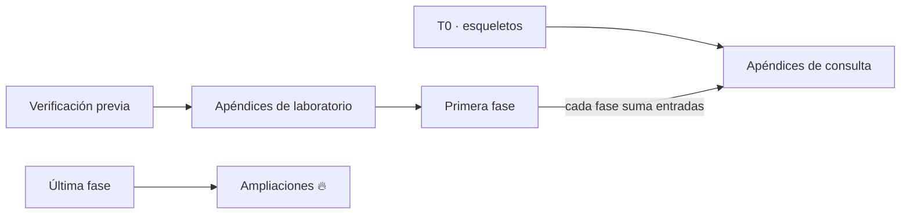

# 📎 Prompts por apéndice
## {{Nombre del curso}} — {{N}} sesiones, {{N}} entregables

> ✏️ **Plantilla:** se escribe en la etapa E5, junto con los prompts de fase. Solo si el curso lleva
> apéndices.

Cada sección es el prompt de un apéndice. Como en los de fase, **el alcance no se copia aquí**: vive
en [`propuesta-apendices-y-alcance.md`](propuesta-apendices-y-alcance.md), y el prompt agrega lo que
esa ficha no dice.

**Una sesión, un archivo.** Los apéndices que crecen se abren con este prompt (esqueleto en `T0`) y
después reciben sus entradas desde las sesiones de fase, sin sesión propia.

> ⚠️ **El orden importa.** {{Los de laboratorio van antes de F00 y dependen de la verificación previa.
> Los de consulta se abren con su esqueleto y crecen. Los 🔥 van al final y ninguna fase los espera.}}



---

## 🧱 El marco común a todos los apéndices

```markdown
## Marco (no lo repitas, aplícalo)

Fuentes de verdad, en orden: `prompts/alcance-del-proyecto.md`,
`prompts/guia-de-estilo-y-convenciones.md`, `prompts/contrato-de-nombres.md`,
`prompts/diccionario-de-terminos.md`, `prompts/propuesta-apendices-y-alcance.md` con la ficha de este
apéndice, `prompts/plantillas-de-capitulo.md` (plantilla D, la laxa), y las fases y apéndices ya
escritos. Los `_desechable-*` no cuentan y no se citan.

Reglas de apéndice:
- **Esto no se lee de corrido.** Índice, secciones cortas que responden a UNA pregunta, ejemplo
  mínimo ejecutable, tabla de "cuándo usar qué" al final.
- **Un apéndice no repite lo que explica una fase: enlaza.**
- **Nada sin ejecutar.** Lo no verificado, con esas palabras.
- **Ninguna versión fuera de su sitio**, salvo en el apéndice donde viven.
- **Los 🔥 declaran lo que suman** (memoria, costo, tiempo), medido, y qué apagar para que entren.
- **Declara qué queda fuera** en el encabezado.
- **No toques ningún `README.md`.**
- Ejercicios: los de la ficha, cortos y de consulta, cada uno con **Criterio:**.

Más las reglas de sesión del marco común de `prompts-de-fase.md`.
```

Y el **protocolo de tres pasos**: (1) preguntas bloqueantes numeradas y lectura de la ficha, sin
redactar; (2) ejecución y redacción cuando yo responda, parando a preguntar si aparece una duda nueva;
(3) autoverificación contra la guía §12, en lista corta.

---

## # a01 — {{Nombre}}

````markdown
Esta es la sesión del **Apéndice a01 — {{emoji}} {{Nombre}}**. Entregable: `a01-{{slug}}.md`{{ más
los archivos de `src/` que deja}}. **{{N}} ejercicios.**

{{marco común}}

## Alcance
La ficha a01, completa.

## Qué vigilar
- {{De dónde sale: los hallazgos H-n de la verificación previa; se vuelven a comprobar el día que se escribe.}}
- {{Si es el único sitio donde vive una versión, decirlo.}}
- {{Cada tarea o comando con lo que corre debajo: el lector tiene que poder prescindir de la herramienta.}}

{{protocolo}} {{Si te descubres explicando lo que enseña una fase, corta y enlaza.}}
````

---

## # Los apéndices 🔥 — {{aNN}} a {{aMM}}

Comparten un prompt, con la ficha y los vigilables de cada uno.

````markdown
Esta es la sesión del **Apéndice {{aNN}} — {{emoji}} {{nombre}}**, ampliación 🔥 del curso. Entregable:
`{{archivo de la propuesta de apéndices §2}}`. **{{N}} ejercicios.**

{{marco común}}

## Alcance
La ficha {{aNN}}, completa.

## Qué vigilar
- **Es opcional y ninguna fase depende de él.** Empieza diciendo qué fase lo señala y qué necesita
  tener corriendo el lector.
- **Lo que suma, medido**, en el encabezado, y qué apagar para que entre.
- **La versión de lo que instala** se agrega a su sitio en la misma sesión, con su fecha.
- {{el vigilable propio, de la lista de abajo}}

{{protocolo}}
````

**Vigilables propios:**

- **{{aNN}} · {{nombre}}:** {{…}}
