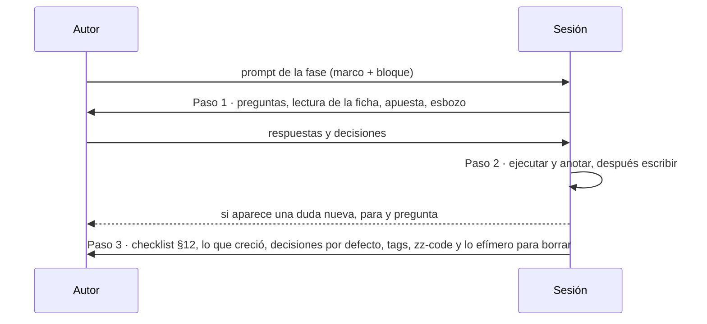

# 🗺️ Prompts por fase
## {{Nombre del curso}} — {{N}} sesiones, {{N}} entregables

> ✏️ **Plantilla:** se escribe en la etapa E5 (tanda P9), cuando la propuesta, la guía, el diccionario,
> el contrato y las plantillas existen. Si el plan agrupa varias fases por tanda, el bloque puede ser
> por tanda (con una subsección "Capítulo por capítulo") en vez de por fase.

Cada sección es el prompt completo de una {{fase | tanda}}, listo para pegar en la sesión que la
redacta. **El alcance de cada fase no se copia aquí**: vive en su ficha de
[`propuesta-fases-y-alcance.md`](propuesta-fases-y-alcance.md) §5, y el prompt la cita. Lo que el
prompt agrega es lo que la ficha no dice: qué vigilar, qué riesgo tiene la fase y qué tiene que estar
hecho antes. Así, si la ficha cambia, el prompt no queda desactualizado.

**Una sesión, un archivo de fase**, más lo que la fase alimenta en la misma tanda: {{su parte del
solucionario | sus incidentes, su medición y su 🪞 en los documentos vivos | sus filas en los apéndices
que crecen}}.

> ⚠️ **Antes de la primera sesión.** Tienen que estar a mano, en este orden: `prompts/alcance-del-proyecto.md`,
> `prompts/guia-de-estilo-y-convenciones.md`, `prompts/diccionario-de-terminos.md`,
> `prompts/contrato-de-nombres.md`, `prompts/propuesta-fases-y-alcance.md`,
> `prompts/plantillas-de-capitulo.md`{{, los formatos propios, la historia}}. **No se usa** ningún
> archivo `_desechable-*`.

> ⚠️ **Antes de {{F00}}.** {{Lo que tiene que estar escrito y verificado: los apéndices de laboratorio,
> la verificación previa, el esqueleto del solucionario.}}

---

## 🧱 El marco común

Va entero en el prompt de la primera fase y se cita en los demás. **No lo repitas en el documento:
aplícalo.**

```markdown
## Marco (no lo repitas, aplícalo)

Fuentes de verdad, en este orden: (1) `prompts/alcance-del-proyecto.md`,
(2) `prompts/guia-de-estilo-y-convenciones.md`, (3) `prompts/contrato-de-nombres.md`,
`prompts/diccionario-de-terminos.md` y `00-convencion-de-git-y-tags.md` (raíz del curso), (4) `prompts/propuesta-fases-y-alcance.md`, con la ficha de
esta fase y su fila de §8, (5) `prompts/plantillas-de-capitulo.md`, (6) {{los formatos propios y la
historia, con la escena de esta fase en la tabla de escenas}}, (7) las fases ya escritas {{y el código
de `src/` en el tag de la fase anterior}}, (8) las decisiones de esta sesión. Los `_desechable-*` no
cuentan y no se citan.

Reglas de contenido que no se negocian:
- **El problema primero; el mecanismo después.** Ningún bloque sin frase antes y desglose después;
  ningún flag sin explicar; ningún beneficio sin su precio.
- **Nada se publica sin haberse ejecutado.** Ningún comando, salida ni número inventado. Lo que no
  se pudo correr lleva {{`[PENDIENTE DE CORRIDA]`}}. Solo se verifica en {{plataforma}}; lo demás se
  marca "no verificado por el autor".
- **Ninguna versión fuera de {{a01 | la guía §5.1}}.** Nunca `latest` ni rangos.
- **Los nombres, del contrato; las palabras, del diccionario.** Si falta uno, se propone agregarlo allí.
- **Los datos de la historia no se inventan.** Si falta uno, se propone agregarlo a la historia.
- **{{Regla de autocontención de D-03}}.**
- **No toques ningún `README.md`** {{ni crees `0-ESTRUCTURA-CURSO.md`}}. Si algo debería constar en
  ellos, déjalo en 📌 Pendientes sugeridos.
- **La plantilla se sigue literal**, sin secciones extra ni reordenadas.
- {{Reglas propias del curso: el piloto primero, YAML antes que Helm, la ficha de garantías…}}

Reglas de sesión que no se negocian:
- Por defecto, todo secuencial y sin subagentes, salvo que yo pida lo contrario.
- No instales nada ni generes cargos; si hace falta algo en mi máquina, dime qué y cómo.
- Docker: inventario inicial a un log; contenedores etiquetados `curso={{slug}}`; en tus pruebas,
  puertos altos y aleatorios ligados a `127.0.0.1`, nunca los de por defecto (el curso sí puede
  publicarlos; si su Compose los fija, usa un override propio); al terminar, borra tus contenedores con
  sus volúmenes (`docker rm -v`, `compose down -v`) y nada que ya existía; nunca `prune` sin filtro.
- Todo el código que escribas va a tu directorio de `zz-code/` (`python3 zz-code/nuevo.py {{slug}}`),
  registrado en el plan §9; lo efímero (logs, salidas, copias), a su `salidas/`. Nada en el scratchpad
  ni en `/tmp`. Los comandos sueltos que producen algo citable se copian a un archivo, y el `README.md`
  del directorio queda al día al cerrar: cómo correr y medir cada prueba, comandos en orden e
  intermedios que amasan la salida. Ningún documento del curso cita `zz-code/`.
- Git lo manejo yo. Borra solo archivos nombrados; nunca directorios ni `rm -rf`.
- Al cerrar, deja el plan al día (§3, §6, §7, §8) con las trampas, los tags y lo que queda por borrar.
```

Y el **protocolo de tres pasos**, que cierra todos los prompts:

```markdown
## Cómo quiero que trabajes

**Paso 1 — Preguntas antes de escribir.** No redactes. Devuélveme: (a) preguntas bloqueantes
numeradas, marcando cuáles puedes asumir con un valor por defecto; (b) tu lectura de la ficha y si el
peso y la cantidad de §8 cuadran con ella; (c) {{la apuesta que propones, en su forma final, y la
rotura o la medición que esperas}}; (d) {{el orden en que vas a ejecutar el laboratorio, con los
comandos}}; (e) un esbozo de la sección más larga; (f) cualquier contradicción con lo ya escrito o con
el contrato: dímela, no la resuelvas.
**Paso 2 — {{Laboratorio y}} redacción**, cuando yo responda. {{Primero se ejecuta y se anota —el
error antes de arreglarlo, literal—; después se escribe.}} Si aparece una duda nueva, **para y
pregunta**.
**Paso 3 — Autoverificación** contra el checklist de la guía §12, reportada en lista corta, más lo que
se agregó a {{el solucionario | los documentos vivos | los apéndices que crecen}}, las decisiones que
tomaste por defecto y los tags para el autor.
```



---

## 🎭 Las escenas de la historia, por fase *(opcional)*

Cada fase abre con una escena de {{`00-historia-de-….md`}}, en la voz de quien tiene el problema. Esta
tabla dice cuál, para que ninguna sesión la invente ni la repita. **La escena es candidata**: la sesión
la puede ajustar en su paso 1, pero los hechos salen de la historia y, si falta uno, se agrega allí
primero.

| Fase | La escena que la abre | La voz | De la historia |
|---|---|---|---|
| {{00}} | {{…}} | {{personaje}} | {{§n}} |

---

## # Fase {{00}} — {{Título}}

````markdown
Esta es la sesión de la **Fase {{00}} — {{emoji}} {{Título}}**, del curso {{nombre}}. Su entregable es
`{{00-slug.md}}`{{, más …}}.

## Marco (no lo repitas, aplícalo)

{{pega aquí el marco común completo}}

## Identidad

- Fase {{00}} de {{total}} · Parte {{0}} · **{{peso}}** · {{N}} {{ejercicios | preguntas}} · plantilla {{A | B}}
- Depende de: {{…}} · Habilita: {{F01}} · Reserva: {{…}}

## Alcance

El de la ficha {{F00}} de la propuesta, completo.

## Qué vigilar

- **{{El riesgo principal de esta fase}}**: {{qué suele salir mal y cómo evitarlo}}.
- **{{Lo que no debe entrar todavía}}**: {{la tentación de profundizar tiene fase de destino}}.
- {{…}}

{{protocolo de tres pasos}}
````

---

## # Fase {{01}} — {{Título}}

````markdown
Esta es la sesión de la **Fase {{01}} — {{emoji}} {{Título}}**. Entregable: `{{01-slug.md}}`.

## Marco
El de {{F00}}, más {{F00}} cerrada.

## Identidad
- Fase {{01}} de {{total}} · Parte {{…}} · **{{peso}}** · {{N}} ejercicios
- Depende de: {{F00}} · Habilita: {{F02}}

## Alcance
El de la ficha {{F01}}, completo.

## Qué vigilar
- {{…}}

{{protocolo}}
````

> ✏️ **Plantilla:** un bloque por fase. Los "Qué vigilar" son lo valioso del documento: el riesgo
> concreto de **esa** fase, no reglas generales que ya están en el marco.

---

## 🧾 Recordatorio de cierre del curso

Cuando la última fase cierra, el curso todavía no está publicado: faltan {{los apéndices 🔥, el cierre
de los que crecen,}} los README y la revisión total. El orden está en el plan de producción.
