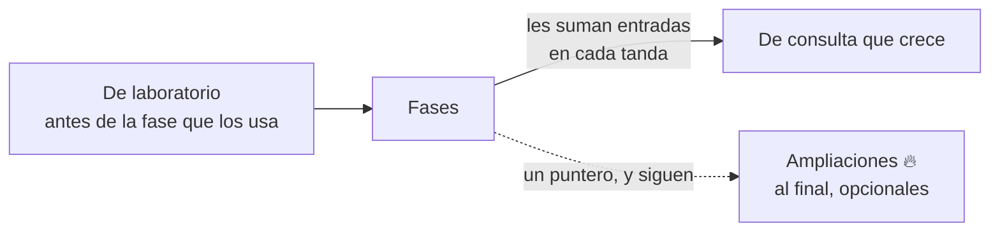

# 📎 Propuesta de apéndices y alcance
## {{Nombre del curso}} — {{N}} apéndices

> ✏️ **Plantilla:** se escribe en la etapa E2, junto con la propuesta de fases. Si el curso no lleva
> apéndices, no se copia: la propuesta de fases §6 lo declara.

> **Qué es este documento:** qué cubre cada apéndice, qué deja fuera, cuándo se escribe y cuántos
> ejercicios lleva. Los prompts de [`prompts-de-apendice.md`](prompts-de-apendice.md) copian de aquí.
> **Precedencia:** debajo del [alcance](alcance-del-proyecto.md), de la
> [guía](guia-de-estilo-y-convenciones.md) y del [contrato de nombres](contrato-de-nombres.md), al
> mismo nivel que la [propuesta de fases](propuesta-fases-y-alcance.md).
> **Fecha:** {{DD/MM/AAAA}}. **Estado:** {{…}}.

---

## 1. 🧭 Qué es un apéndice en este curso

Un apéndice **no se lee de corrido**: se entra por el índice buscando algo concreto y se sale. Es
receta, referencia o ampliación, nunca camino base, y no lleva peso declarado.

Hay tres clases, y cada una tiene su regla:

- **De laboratorio** ({{a01–a0n}}): el curso no funciona sin ellos. Se escriben **antes** de la fase
  que los necesita y quedan verificados en {{la plataforma del autor}}.
- **De consulta que crece** ({{…}}): se abren con su esqueleto en `T0` y cada fase les suma sus
  entradas en la misma tanda.
- **Ampliaciones 🔥** ({{…}}): opcionales. Ninguna fase depende de ellas; las fases las señalan con
  un puntero y siguen.

Cuatro reglas lo mantienen en su sitio:

- **Un apéndice no repite lo que explica una fase: la enlaza.**
- **Nada sin ejecutar.** Lo no verificado se declara con esas palabras.
- **Los nombres técnicos son los del contrato de nombres.**
- **Los 🔥 declaran lo que suman** {{a la memoria del laboratorio, al costo, al tiempo}}, medido, y
  qué apagar para que entren.

---

## 2. 📊 Los {{N}}, de un vistazo

| # | Archivo | Qué es | Clase | Ej. | Cuándo se escribe | Tag |
|---|---|---|---|---|---|---|
| a01 | `a01-{{slug}}.md` | {{…}} | laboratorio | {{8}} | antes de {{F00}} | {{— / `apendice-a01`, opcional}} |

Los nombres de archivo son canónicos y no se renumeran. **Los apéndices no cierran con tag**: un tag
marca un cambio en el repositorio y un apéndice explica lo que ya está ahí. La columna dice solo si el
apéndice deja archivos versionados a los que el lector puede querer volver con un `apendice-aNN`
opcional ([convención de git](convencion-de-git-y-tags.md) §2).

---

## 3. {{emoji}} a01 — {{Nombre}} ({{N}} ejercicios)

- **Alcance:** {{qué cubre}}.
- **Fuera:** {{qué no cubre; si es exclusión del curso, sin decir dónde estaría}}.
- **Depende de:** {{verificación previa, otra pieza}}. **Lo usan:** {{fases}}.
- **Riesgo:** {{lo que más fácil sale mal al escribirlo}}.

> ✏️ **Plantilla:** repite la sección por apéndice. Los 🔥 pueden compartir una sección con una línea
> de vigilables propios por apéndice.

---

## {{N+3}}. 📌 Pendientes de este documento

- {{…}}
