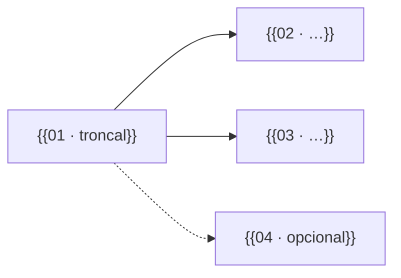
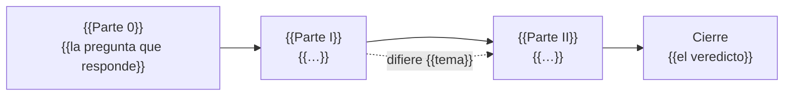

# 🗺️ Propuesta de fases y alcance
## {{Nombre del curso}}

> ✏️ **Plantilla:** se escribe en la etapa E2, en dos vueltas (el arco primero, las fichas después).
> Para un curso repaso, las fichas usan la variante B (§5) y este documento puede llamarse
> `propuesta-fases-y-laboratorio.md`; si las fichas viven en un `prompt-base.md`, aquí quedan solo el
> arco, las horas, el resumen y el registro de decisiones.

Este documento es la **fuente de verdad estructural del curso**: fija el arco, la secuencia numerada
de {{fases | capítulos}}, el encargo de cada una, los apéndices, las convenciones de archivo y de git,
y las decisiones cerradas con su porqué.

> **Precedencia:** debajo del [alcance](alcance-del-proyecto.md), de la
> [guía](guia-de-estilo-y-convenciones.md) y del [contrato de nombres](contrato-de-nombres.md). Si una
> fase de aquí contradice a uno de ellos, gana el otro y esto se corrige. Las plantillas y los prompts
> copian de aquí el peso y los ejercicios (§8).
> **Fecha:** {{DD/MM/AAAA}}. **Estado:** {{arco en discusión | temario cerrado (D-01–D-nn)}}.

Una advertencia que vale para todo el documento: **las apuestas, roturas y mensajes de error escritos
aquí son candidatos**. La fase los reescribe en su paso 1 si el laboratorio sugiere algo mejor, y
publica el que salió.

> 🧭 **La pregunta que ordena el curso:** *{{la del alcance §5}}*

---

## 1. ✅ Decisiones de forma que no se reabren al escribir una fase

> ✏️ **Plantilla:** las decisiones del alcance que afectan a la estructura, dichas en una línea con su
> porqué. Si una fase necesita contradecir alguna, se corrige aquí primero.

**🪦 {{El curso es autocontenido}}.** {{Por qué y qué obliga.}}

**🪦 {{El lector es…}}.** {{…}}

**🪦 {{Método de construcción: oleadas, servicio piloto, un solo src/…}}.** {{…}}

---

## 2. 🧱 El sistema del curso *(opcional)*

{{El dominio, el stack y qué compra cada pieza, si no basta con el alcance §7. Si basta, enlázalo y
borra esta sección.}}

---

## 3. 🪜 El arco

> ✏️ **Plantilla:** primero se decide la **división** (§3.0): una sola secuencia con partes, bloques
> con directorio propio o pistas paralelas. Una **parte** agrupa fases sin directorio y sin reiniciar
> la numeración; un **bloque** es un directorio con sus propios capítulos, su README y su cierre.
> Las reglas están en `zz-instrucciones/01-tipos-de-curso.md` §10.

### 3.0 La división

**{{Una sola secuencia | N bloques | pistas paralelas}}**, porque {{el criterio de 01-tipos §10.1
que se cumple —tamaño, sub-preguntas que se estudian por separado, troncal y ramas, ritmos distintos,
cortes de producción— o "ninguno se cumple"}}.

{{Si hay bloques o pistas, la tabla y el grafo; si es una sola secuencia, borra el resto de §3.0.}}

| Bloque | Directorio | Sub-pregunta que responde | {{Fases / Capítulos}} | Depende de | {{Troncal / Obligatorio / Opcional}} |
|---|---|---|---|---|---|
| **{{01 · Nombre}}** | `{{01-slug/}}` | {{…}} | {{01 – 10}} | — | troncal |
| **{{02 · Nombre}}** | `{{02-slug/}}` | {{…}} | {{01 – 08}} | {{01}} | {{obligatorio}} |



{{Solo con pistas: en qué tramo del eje corre cada bloque de la pista paralela, el reparto de horas
mientras conviven, dónde se cierra y dónde converge con el eje.}}

### 3.1 El arco por {{partes | bloques}}

{{Partes | Bloques}} y la pregunta que responde cada una:

| {{Parte / Bloque}} | Pregunta que responde | {{Fases / Capítulos}} | {{Peso total / Horas}} |
|---|---|---|---|
| **{{0 · Nombre}}** | {{…}} | {{00 – 02}} | {{…}} |



{{Las reglas de método que atraviesan el arco: infra antes que dominio, el piloto primero, qué se
difiere y por qué.}}

### 3.2 Orden de aprendizaje contra orden de urgencia *(opcional)*

{{Si el lector puede tener prisa (una entrevista esta semana, un examen el mes que viene), la ruta
corta: los cinco capítulos que responden las preguntas más frecuentes, con la pregunta al lado.}}

```text
{{NN/NN tema}}   ← "{{la pregunta que responde}}"
```

---

## 4. ⏱️ Esfuerzo

> ✏️ **Plantilla:** elige una de las dos formas según la `D-04` del alcance y borra la otra.

**Por peso** (sin horas): cada {{fase}} declara ligera, media o densa, y ahí termina la promesa. La
longitud y los ejercicios por peso están en la guía §9.

**Por horas:** {{total}} h ÷ {{h semanales}} h ≈ {{N}} semanas; tope {{N}} h. **Cómo salen las
horas:** {{lectura por capítulo + preguntas en voz alta + simulación}}. {{Con bloques, el subtotal de
cada uno, para que quien hace solo el troncal sepa cuánto le toca.}} Se recalibran con lo que tarde
de verdad la primera {{fase}}.

---

## 5. 📋 Las {{N}} {{fases | capítulos}}, en detalle

> ✏️ **Plantilla:** una ficha por unidad. La ficha es **el piso, no el índice**: lo que dice no se
> puede omitir sin declararlo en el propio documento; lo que no dice puede entrar si se justifica.
> Con bloques, las fichas se agrupan por bloque (``### {{01 · Nombre}} — `{{01-slug/}}` ``) y su número
> se reinicia en cada uno; la referencia cruzada es `{{bloque/NN}}`.

### {{Parte 0 · Nombre | Bloque 01 · Nombre — `01-slug/`}}

{{Una línea con la regla propia de la parte o del bloque, si la tiene; en un bloque, también su
cierre: veredicto, simulación y solucionario, o boss.}}

#### Variante A · ficha de curso completo

#### {{emoji}} {{Fase NN}} — {{Título: la promesa concreta}} · *{{ligera | media | densa}}* {{⭐}}

**Construye:** {{qué artefacto queda funcionando al terminar}}.

**Trae:** {{los conceptos, en el orden en que aparecen}}.

**📏 Mide:** {{hipótesis de la medición | —}}. **🧨 Rompe:** {{el experimento que falla a propósito | —}}.
**🪞 Apuesta candidata:** {{la frase falsable | —}}.

**Difiere:** {{lo que no entra todavía}} → {{Fase MM}}.

> {{⚠️ o 📝, solo si la fase tiene un riesgo o una nota propia.}}

#### Variante B · ficha de curso repaso

#### `{{NN/NN}}` — {{Título}}

- **Objetivo** — {{la frase que el lector debe poder decir después de leerlo}}.
- **Cubre** — {{el contenido mínimo obligatorio}}.
- **{{Línea propia del corpus: Garantías, Ejecución, Plataformas…}}** — {{…}}.
- **Desmonta** — {{la sobregeneralización de entrevista que ataca; al menos una}}.
- **Se toca con** — {{los enlaces internos obligatorios}}.

---

## 6. 🎨 Apéndices

{{Resumen en una línea por apéndice y enlace a
[`propuesta-apendices-y-alcance.md`](propuesta-apendices-y-alcance.md). Si el curso no lleva apéndices,
se dice aquí y por qué —"todo lo que sería consulta es una fase"—.}}

---

## 7. 📁 Convención de nombres y de git

- **{{Fases}}:** `NN-slug.md`, dos dígitos, en minúsculas y con guiones. **Apéndices:** `aNN-slug.md`.
  **Tracks opcionales:** `<tt>NN-slug.md`, con sus propios prompts en archivos nuevos.
- **Repasos:** `NN-bloque/NN-tema.md`, `NN-simulacion-de-entrevista.md`, `NN-respuestas.md`.
- **Bloques** *(si §3.0 los decide)*: `NN-slug/` con su `README.md`; dentro, la numeración arranca de
  nuevo donde arranca el tipo (`00-` o `01-`). **Pistas:** `pista-<letra>-<slug>/`, con sus bloques
  dentro. **Apéndices:** {{los de un solo bloque, dentro del bloque desde `a01`; los transversales, en
  la raíz del curso}}.
- **Los slugs son canónicos**: una {{fase}} no se renombra una vez escrita, ni un bloque.
- **Git:** {{tags `fase-NN-slug` al cerrar cada fase —con bloques, `fase-BB-NN-slug`—; commits con
  prefijo `fNN:` —con bloques, `BB/fNN:`—}}. Aquí se decide solo la forma; los nombres se congelan en
  el contrato de nombres §7 y las reglas de uso, en `00-convencion-de-git-y-tags.md`, en la raíz del
  curso (etapa E4).
  {{Si el lector trabaja en más de un repositorio (un track, un curso hermano), cuántos y por qué.}}

---

## 8. 📊 Resumen

> ✏️ **Plantilla:** la tabla que copian las plantillas y los prompts. Si cambia, cambia aquí primero.

| # | Archivo | {{Parte | Bloque}} | {{Peso / Horas}} | {{Ejercicios / Preguntas}} | {{Incidentes · 📏 · Taller}} |
|---|---|---|---|---|---|
| {{00}} | `{{00-slug.md | 01-slug/01-tema.md}}` | {{0 | 01}} | {{media}} | {{20}} | {{…}} |
| | **Total** | | | **{{N}}** | |

{{Con bloques, un subtotal por bloque antes del total.}}

---

## 9. 🚫 Lo que queda fuera

{{Lo que el arco deja fuera y no está ya en el alcance §11. Se declara y el texto se detiene.}}

---

## 10. 📌 Registro de decisiones

Lo que sostiene este temario. Si una decisión cambia, se cambia primero en el documento que manda
sobre ella y después aquí. ✅ cerrada · ⏳ abierta · 🟡 por defecto, a revisar por el autor · 🔄 reabierta.

| ID | Decisión | Valor | Estado | Manda en |
|---|---|---|---|---|
| D-01 | {{…}} | {{…}} | ⏳ | {{alcance §12 / guía §N / contrato §N}} |

### 10.1 Decisiones abiertas, en forma de pregunta

> ✏️ **Plantilla:** cada `D-xx` ⏳ se presenta así para que el autor la cierre de un vistazo. Al
> cerrarse, se borra de aquí y queda solo en la tabla.

**D-{{xx}} · {{La pregunta}}**

- **(a) {{opción recomendada}}** — {{consecuencia en una línea}}. *Recomendada:* {{por qué}}.
- (b) {{…}} — {{…}}
- (c) {{…}} — {{…}}

---

## 11. 📌 Lo que esta propuesta deja pendiente

- {{Lo que se comprueba en la verificación previa (E6): versiones, libros, memoria del laboratorio.}}
- {{Lo que decide una tanda concreta, con su ID.}}
