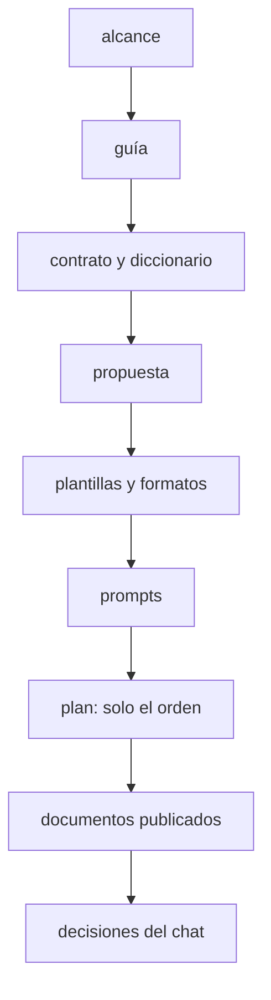

# 🧰 `prompts/` — la maquinaria del curso
## {{Nombre del curso}}

> ✏️ **Plantilla:** el manual de operación del `prompts/` de un curso. Se copia como
> `prompts/README.md` en la etapa E5, cuando ya existen todos los documentos que lista. Al cerrar el
> curso se actualiza para describir lo que queda (solo lo normativo).

Este directorio no es material del curso: es **lo que se usa para escribirlo**. El lector nunca lo
abre. Quien escribe una fase lo lee entero antes de teclear la primera línea.

> **Estado:** {{en preparación | en escritura: T-n | cerrado el DD/MM/AAAA}}.

---

## 📖 Qué hay aquí, y cuándo se lee

| Documento | Qué es | Cuándo se lee |
|---|---|---|
| [`alcance-del-proyecto.md`](alcance-del-proyecto.md) | qué enseña el curso, a quién, con qué límites | antes de escribir cualquier cosa |
| [`guia-de-estilo-y-convenciones.md`](guia-de-estilo-y-convenciones.md) | cómo se escribe; checklist de §12 | en cada sesión, siempre |
| [`diccionario-de-terminos.md`](diccionario-de-terminos.md) | qué palabra para cada concepto; el código del dominio | cada vez que dudes de un término |
| [`contrato-de-nombres.md`](contrato-de-nombres.md) | los identificadores congelados | antes de cada fase, y cada vez que haga falta un nombre |
| [`propuesta-fases-y-alcance.md`](propuesta-fases-y-alcance.md) | la secuencia y la ficha de cada fase; decisiones | en cada sesión de fase |
| [`plantillas-de-capitulo.md`](plantillas-de-capitulo.md) | los esqueletos | al empezar y al cerrar cada documento |
| [`prompts-de-fase.md`](prompts-de-fase.md) | el marco común y un bloque por fase | al abrir cada sesión |
| [`plan-de-produccion.md`](plan-de-produccion.md) | tandas, estado, bitácora, checklist | al empezar y al cerrar cada sesión |
| `verificar-corpus.py` y `verificador_base.py` | las validaciones base y las propias del curso | al cerrar cada tanda |

**Orden de autoridad**, cuando dos se contradicen: (1) el alcance, (2) la guía, (3) el contrato y el
diccionario, (4) la propuesta, (5) las plantillas y los formatos, (6) los prompts, (7) el plan, solo
sobre el orden, (8) los documentos ya publicados, (9) las decisiones del chat actual.

> 🧭 **Si una contradicción aparece al escribir, se arregla en el documento de arriba primero.**
> Parchear la fase y dejar la propuesta desactualizada es como empiezan las divergencias que nadie
> detecta hasta la fase doce.

---

## 🚀 Cómo abrir una sesión de escritura

1. Lee el plan de producción: §3 (estado), §6 (deuda), §7 (la última entrada de la bitácora, con sus
   trampas) y §8 (checklist).
2. Pega el marco común y el bloque de la fase de `prompts-de-fase.md`.
3. Sigue el protocolo de tres pasos: preguntas → redacción → autoverificación.
4. Al cerrar: verificaciones del plan §4 y el plan al día.

**Una sesión, un archivo** (más lo que ese archivo alimenta en la misma tanda). Si una sesión no
produce entregable, sobra o se salió de alcance.

---

## 🪦 Lo que cambió al escribir *(se llena al cerrar)*

{{Las correcciones de maquinaria que se registraron en vez de hacerse en silencio, y las decisiones de
diseño que resultaron equivocadas y quedaron documentadas.}}

---

## ⚠️ Las tres cosas que más se rompen al escribir

{{Se llena con lo que de verdad se coló en las primeras tandas. Valores de partida:}}

- **Explicarle al lector lo que ya sabe.**
- **Afirmar sin medir**: "más rápido", "más liviano", "sale más barato" se escriben solos; cada uno
  necesita su número o desaparece el comparativo.
- **Inventar un nombre o un dato** que debía salir del contrato o de la historia.
